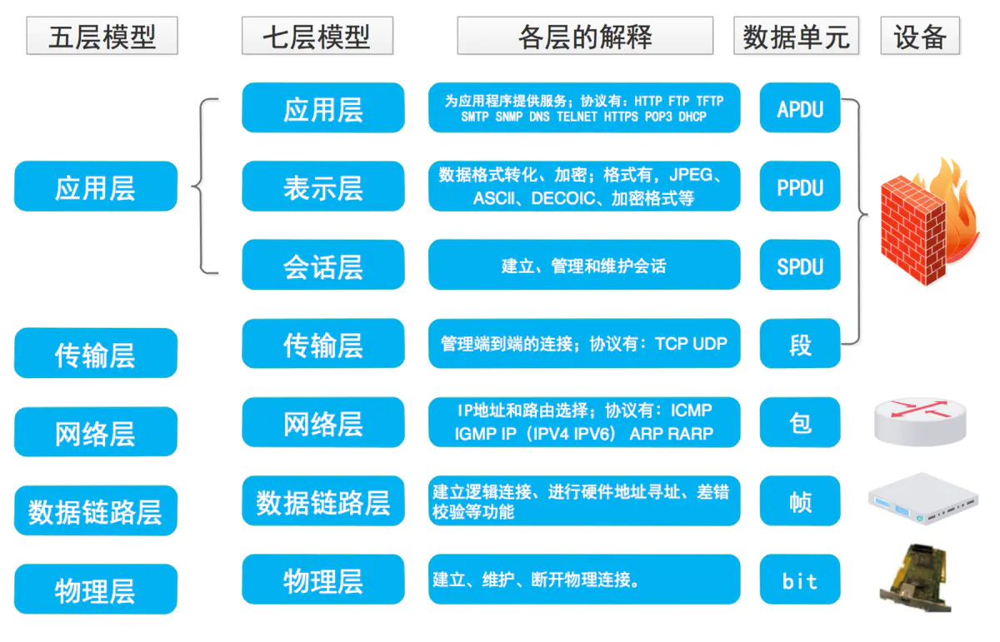
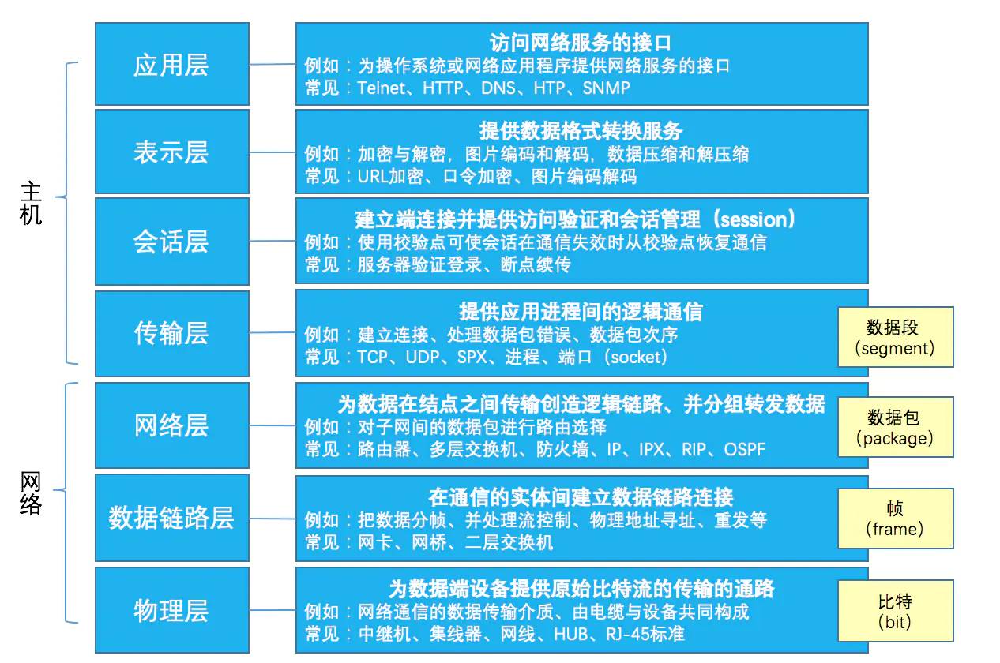
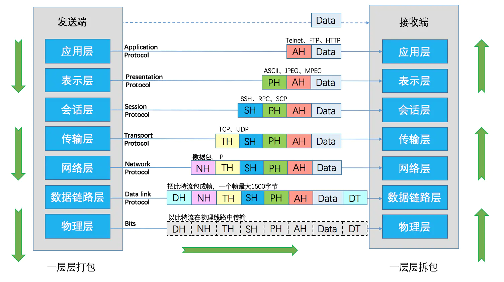
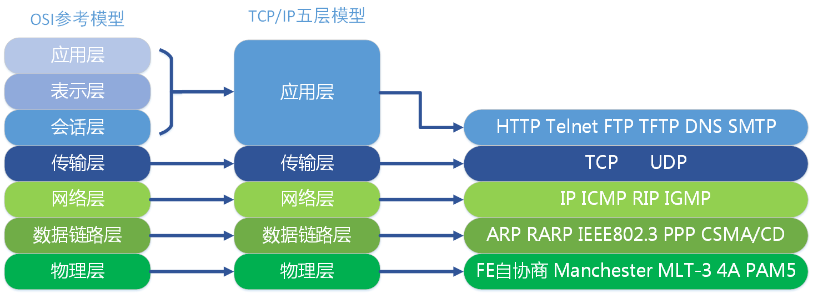
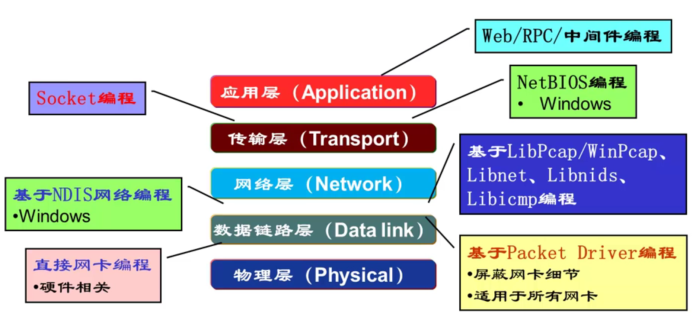

# 网路编程

## 1. 计算机网络

​		计算机网络是一组共享位于网络节点上或由网络节点提供的资源的计算机。这些计算机使用数字互连上的通用通信协议来相互通信。这些互连由电信网络技术组成，基于物理有线、光学和无线射频方法，这些方法可以布置在各种网络拓扑中。

​		计算机网络的节点可以包括个人计算机、服务器、网络硬件或其他专用或通用主机。它们由网络地址标识，并且可能具有主机名。主机名用作节点的难忘标签，在初始分配后很少更改。网络地址用于通过诸如Internet协议之类的通信协议来定位和识别节点。

计算机网络可以按许多标准进行分类，包括用于承载信号的传输介质、带宽、组织网络流量的通信协议、网络规模、拓扑、流量控制机制和组织意图。

​		计算机网络支持许多应用程序和服务，例如访问万维网、数字视频、数字音频、共享使用应用程序和存储服务器、打印机和传真机，以及使用电子邮件和即时消息应用程序。

### 1.1. 网络模型

#### 1.1.1. OSI

​		OSI（Open System Interconnect），即开放式系统互联。 一般都叫OSI参考模型，是ISO（国际标准化组织）组织在1985年研究的网络互连模型。ISO为了更好的使网络应用更为普及，推出了OSI参考模型。其含义就是推荐所有公司使用这个规范来控制网络。这样所有公司都有相同的规范，就能互联了。
OSI定义了网络互连的七层框架（物理层、数据链路层、网络层、传输层、会话层、表示层、应用层），即ISO开放互连系统参考模型。	





**传输过程: **



#### 1.1.2. TCP/IP 

​		Internet 协议套件，通常称为TCP/IP，是Internet和类似计算机网络中使用的一组通信协议。该套件中当前的基础协议是传输控制协议(TCP) 和互联网协议(IP)，以及用户数据报协议(UDP)。

​		在其开发过程中，它的版本被称为国防部( DoD )模型，因为网络方法的开发是由美国国防部通过DARPA 资助的。它的实现是一个协议栈。

​		Internet 协议套件提供端到端数据通信，指定数据应如何打包、寻址、传输、路由和接收。此功能被组织成四个抽象层，它们根据每个协议的网络范围对所有相关协议进行分类。从最低到最高，这些层是链路层，包含保留在单个网段（链路）内的数据的通信方法；互联网层，提供独立网络之间的互联互通；传输层，处理主机到主机的通信；和应用层，为应用程序提供进程到进程的数据交换。

​		Internet 协议套件及其组成协议的技术标准由Internet 工程任务组(IETF) 维护。Internet 协议套件早于OSI 模型，后者是通用网络系统的更全面的参考框架。



##### 1.1.2.1. 建立连接过程

**三次握手：**

1、第一次握手：客户端给服务器发送一个 SYN 报文。

2、第二次握手：服务器收到 SYN 报文之后，会应答一个 SYN+ACK 报文。

3、第三次握手：客户端收到 SYN+ACK 报文之后，会回应一个 ACK 报文。

4、服务器收到 ACK 报文之后，三次握手建立完成。

**四次挥手：**

1、第一次挥手：客户端发送一个 FIN 报文，报文中会指定一个序列号。此时客户端处于FIN_WAIT1状态。

2、第二次握手：服务端收到 FIN 之后，会发送 ACK 报文，且把客户端的序列号值 + 1 作为 ACK 报文的序列号值，表明已经收到客户端的报文了，此时服务端处于 CLOSE_WAIT状态。

3、第三次挥手：如果服务端也想断开连接了，和客户端的第一次挥手一样，发给 FIN 报文，且指定一个序列号。此时服务端处于 LAST_ACK 的状态。

4、第四次挥手：客户端收到 FIN 之后，一样发送一个 ACK 报文作为应答，且把服务端的序列号值 + 1 作为自己 ACK 报文的序列号值，此时客户端处于 TIME_WAIT 状态。需要过一阵子以确保服务端收到自己的 ACK 报文之后才会进入 CLOSED 状态

5、服务端收到 ACK 报文之后，就处于关闭连接了，处于 CLOSED 状态。

### 1.1. HTTP 协议

​		超文本传输协议( HTTP ) 是Internet 协议套件模型中的一个应用层协议，用于分布式、协作、超媒体信息系统。HTTP 是万维网数据通信的基础，其中超文本文档包括指向用户可以轻松访问的其他资源的超链接，例如通过鼠标单击或在 Web 浏览器中点击屏幕。


## 2. Socket

### 2.1. 网络连接

*   面向连接和无连接的通信

    ​		一般地，大多数通信可以分为面向连接的和无连接的。通信是面向连接的还是无连接的，由通信协议定义，而不是由应用程序编程接口(API)定义。面向连接的协议的示例包括传输控制协议(TCP)和顺序分组交换(SPX)，无连接协议的示例包括用户数据报协议(UDP)、“原始 IP”和互联网分组交换(IPX)。

*   客户端和服务器

    ​		对于面向连接的通信，通信方通常具有不同的角色。一方通常在等待传入的连接；该方通常称为“服务器”。另一方是发起连接的一方；该方通常被称为“客户”。

    ​		对于无连接通信，一方（“服务器”）通常在等待传入的数据包，而另一方（“客户端”）通常被理解为向“服务器” 发送未经请求的数据包的一方。


**Socket在 TCP/IP 五层中的位置**



### 2.2. Java Socket

​		java对socket通信的实现主要由Socket对象以及ServerSocket对象完成。Socket类封装了对发送数据以及接受数据的流ObjectOutputStream和ObjectInputStream，ServerSocket可以指定客户端或服务端链接的IP地址以及端口号。

简单实现如下：

Client.java

```java
package com.xxxx.client;

import java.io.ObjectInputStream;
import java.io.ObjectOutputStream;
import java.net.Socket;
import java.util.Scanner;

public class Client {

    
    // 设置共有的Socket对象
    private static Socket socket;

    // Socket实例存在状态标志
    private static Boolean socket_state = false;

    // 主线程开启程序
    public static void main(String[] args) {

        // 封装方法
        connect();

    }

    private static void connect() {
        
        try {
            // 创建Socket对象，并指定接受的服务端IP地址以及端口号
            socket = new Socket("192.168.253.152", 9001);
            // 设置实例为存在状态
            socket_state = true;
            
            // 获取输出流(发送流),使用Socket类的getOutputStream()方法
            ObjectOutputStream objectOutputStream = new ObjectOutputStream(socket.getOutputStream());
             // 获取输入流(发送流),使用Socket类的getInputStream()方法
            ObjectInputStream objectInputStream = new ObjectInputStream(socket.getInputStream());

            // 开启Socket监听线程
            new Thread(new Client_listen(socket, objectInputStream)).start();
            // 开启Socket发送线程
            new Thread(new Client_send(socket, objectOutputStream)).start();

            
            
        } catch (Exception e) {
            e.printStackTrace();
        }
    }

}

// 监听线程
class Client_listen implements Runnable {
    private Socket socket;
    private ObjectInputStream objectInputStream;

    // 初始化
    Client_listen(Socket socket, ObjectInputStream objectInputStream) {
        this.objectInputStream = objectInputStream;
        this.socket = socket;
    }

    @Override
    public void run() {
        try {
            while (true) {
                
                // 将服务端发送的信息输出到控制台
                System.out.println(objectInputStream.readObject());
                
            }
        } catch (Exception e) {
            e.printStackTrace();
        }
    }
}

// 发送线程
class Client_send implements Runnable {

    private Socket socket;
    private ObjectOutputStream objectOutputStream;

    Client_send(Socket socket, ObjectOutputStream objectOutputStream) {
        this.socket = socket;
        this.objectOutputStream = objectOutputStream;
    }

    @Override
    public void run() {
        try {
   
            Scanner scanner = new Scanner(System.in);

            while (true) {
                
                // 打印输入提示信息
                System.out.println("客户端  请输入:  ");
                // 控制台读取字符串
                String str = scanner.nextLine();
                
                // 将控制台字符串写进输出流(发送流)对象
                objectOutputStream.writeObject(str);
                objectOutputStream.flush();
            }
        } catch (Exception e) {
            e.printStackTrace();
        }
    }
}
```

Server.java

```java
package com.xxxx.server;

import java.io.ObjectInputStream;
import java.io.ObjectOutputStream;
import java.net.ServerSocket;
import java.net.Socket;
import java.util.Scanner;

public class Server {

    public static void main(String[] args) {

        // 打印提示信息
        System.out.println("服务器启动");
        
        try {

            // 开启一个端口用于套接字连接
            ServerSocket serverSocket = new ServerSocket(9001); // 端口设置为9001

            while (true) {
                
                // 接受socket请求
                Socket socket = serverSocket.accept();

                // 开启监听线程
                new Thread(new Server_listen(socket)).start();
                // 开启发送线程
                new Thread(new Server_send(socket)).start();

            }

        } catch (Exception e) {

        }
    }

}

// 监听线程
class Server_listen implements Runnable {
    
    private Socket socket;

    Server_listen(Socket socket) {
        this.socket = socket;
    }

    @Override
    public void run() {
        try {
            
           	// 获取输入流对象
            ObjectInputStream objectInputStream = new ObjectInputStream(socket.getInputStream());

            while (true) {
                // 将客户端发送的信息输出到控制台
                System.out.println(objectInputStream.readObject());
            }
        } catch (Exception e) {
            e.printStackTrace();
        }
    }


}

class Server_send implements Runnable {

    private Socket socket;

    Server_send(Socket socket) {
        this.socket = socket;
    }

    @Override
    public void run() {
        try {
            // 获取输出流(发送流)对象
            ObjectOutputStream objectOutputStream = new ObjectOutputStream(socket.getOutputStream());

            Scanner scanner = new Scanner(System.in);
            
            while (true) {
                // 打印输入提示信息
                System.out.println("服务端  请输入:  ");
                // 获取控制台输入字符串
                String str = scanner.nextLine();

                // 将控制台字符串写进输出流(发送流)对象
                objectOutputStream.writeObject(str);
                objectOutputStream.flush();

            }
        } catch (Exception e) {
            e.printStackTrace();
        }
    }
}
```

