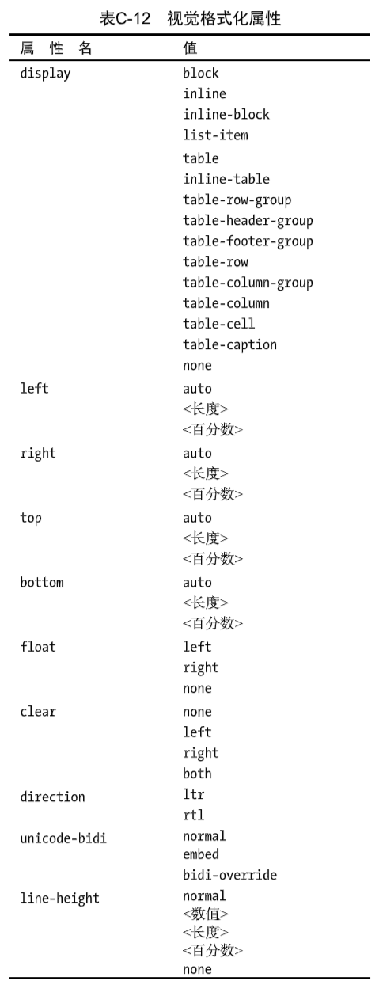

# CSS

​		**层叠样式表**（英语：**C**ascading **S**tyle **S**heets，缩写：**CSS**；又称**串样式列表**、**级联样式表**、**串接样式表**、**阶层式样式表**）是一种用来为结构化文档（如**HTML**文档或**XML**应用）添加样式（字体、间距和颜色等）的计算机语言，由W3C定义和维护。**CSS3**现在已被大部分现代浏览器支持，而下一版的**CSS4**仍在开发中。

## 1.css基本语法

***选择器     {    属性:属性值;    属性:属性值  }***

```CSS
h1   {  color:red;  font-size:14px;  }
```

**注释：/*  注释内容 */**

## 2.在HTML代码中使用

### 2.1.行内样式

​		将样式定义在html标签上的style属性中（耦合度较高）

```HTML
<h1 style="color:red">h1</h1>
```

### 2.2.嵌入样式

​		定义在head标签中的style中

```HTML
<style type="text/css">
</style>
```

### 2.3.外部样式

​		通过link标签引入外部的CSS文件

```HTML
<link rel="stylesheet" type="text/CSS" href="文件路径">
```

***rel：***当前文件与引入文件之间的关系

***type：***类型、CSS类型

***href：***引入文件路径 	(本地路径、网络路径)

### 2.4.三者的优先级

***优先级：就近原则***

## 3.css选择器

### 3.1基本选择器

#### 3.1.1.通用选择器

（通用）

```CSS
 * {
      属性名:属性值;
  }
```

#### 3.1.2.元素/标签选择器

（指定标签）

```CSS
标签名  {
  	   属性名:属性值;
}
```

#### 3.1.3.ID选择器

（选择指定ID属性的标签）

**ID 定义规则：*以字母、数字、下划线、中划线组成。*不要以数字开头。ID值最好唯一。**

```CSS
#id属性值   {
    属性名:属性值;
}
```

#### 3.1.4.class类选择器

（选择指定class属性值的元素）

``` css
.class属性值 {
		 属性名:属性值;
}
```

#### 3.1.5.组合选择器

（选择指定选择器中的元素）选择多个不同元素

```CSS
选择器1，选择器2、选择器3{
 	属性名:属性值;
}
```

#### 3.1.6.优先级

​		**ID 选择器（100）  > class选择器 （10 ）> 元素选择器   （1）> 通用徐选择器**  

***行内样式  style属性中权重是 1000，优先级最高***

### 3.2.组合选择器

#### 3.2.1.后代选择器

   (以空格分隔)		

选择指定元素的所有的***后代元素***

```CSS
 指定元素  指定元素{
 	属性名:属性值;
}
```

#### 3.2.2.子代选择器 

（以大于号分隔）		

选定指定元素的***第一代元素***

```CSS
指定元素 > 指定元素{
 属性名:属性值;
}
```

#### 3.2.3.相邻兄弟选择器  

（以加号分隔）

选择指定元素的相邻的下一个指定元素（只会向下找一个）

```CSS
指定元素 + 指定元素{
 属性名:属性值;
}
```

#### 3.2.4.普通兄弟选择器

（以波浪号分隔）

选择指定元素后的同级元素(只会向下找)

```CSS
指定元素 ~ 指定元素{
 属性名:属性值;
}
```

## 4.常用属性

### 4.1.背景

#### 4.1.1.background-color

```CSS
body {
    background-color:red;  /*元素背景颜色*/
}
```

#### 4.1.2.background-image

***设置元素背景图像，默认情况下，背景图像进行平铺重复显示，覆盖整个实体。***

```CSS
body {
    background-image:url(图片路径);
}
```

#### 4.1.3. background-repeat

***设置图片是否重复***

```CSS
body {
    background-repeat:repeat:
}
```

***no-repeat ：表示不重复***
***repeat-x ：横向重复***

#### 4.1.4. background-size

**设置图片大小**

```CSS
body{
	background-size: 100px;
}
```

### 4.2.文本

#### 4.2.1.color

**字体颜色**

```CSS
#div1{
    color:blue;  /* 16进制、rgb */
}
```

#### 4.2.2.text-align

**对齐方式**

```CSS
#div2 {
    text-align:center;   right
}
```

#### 4.2.3.text-decoration

**文本修饰**

```CSS
#div3{   
	text-decoration:overline;	/*上划线*/
    text-decoration:underline;	/*下划线*/
    text-decoration:line-through;	/*中划线*/
}
```

#### 4.2.4.同时设置上中下划线

```CSS
#div4{
    text-decoration:overline underline line-through;
}
```

#### 4.2.5 去除文本修饰

```CSS
#a1 {
    text-decoration:none;
}
```

#### 4.2.6text-indent

***首行缩进***

```CSS
#p1 {
    text-indent:2em;  /*em表示一个文字高度*/
}
```

### 4.3.字体

#### 4.3.1. font-family

 ***字体风格***

```CSS
#p1 {
    font-family:宋体; 
}
```

注意：

1. 当属性值包含空格或特殊字符时，用引号括起来。

2. font-family有后备机制，可以为元素设置多种字体，当游览器不识别第一种字体是尝试找下一种字体。

3. 当font-family有多个值时，使用逗号隔开。

#### 4.3.2.font-size

***字体大小***

```CSS
#p1 {
    font-size:30px;
}
```

#### 4.3.3.font-style

```CSS
#p1 {
    font-style:italic;
}
```

***normal	正常体***

***italic	斜体***

***oblique	斜体（强制倾斜）***

#### 4.3.4.font-weight

**字体粗细**

```CSS
#p1 {
    font-weight:bold;
}
100-900 值越大字体越粗
400 正常字体
700 粗体 
```

### 4.4.对齐方式

#### 4.4.1.text-align

```CSS
#p1 {
  text-align:center;
}
```

***text-align   设置元素中字体水平方向的对齐方式***

​	**left  默认**

​	**right**

​	**center**

​	**justify   两端对齐**

### 4.5.display

```CSS
#div1 {
    display:block;
}
```

***display  规定元素生成框的类型***

​	**block	元素会被显示，且元素会变成块级元素，元素前后有换行符**

​	**none	元素会被隐藏**

​	**inline    元素会显示为行内元素，元素前后没有换行符**

​	**inline-block  行内块级元素**

***注意：***

**块级元素**

​		**可以设置元素的宽高和边距，元素自动换行**

**行内元素**

​		**不可以设置元素的宽高和边距，元素不自动换行**

**行内块级元素**

​		**可以设置元素的宽高和边距，元素不自动换行**

### 4.6.浮动

**两个元素放在一行，左右浮动**

```CSS
#div1 {
    float:right;
}
```

**清除浮动**

```HTML
<div style="clear:both">
</div>
```

## 5.盒子模型

### 5.1.border

**1. 设置元素边框的宽度、颜色、类型**

```CSS
#div1 {
    boder:2px red dotted;
}
```

**2.单独设置边框的宽度、颜色、类型**

```CSS
#div1 {
    boder-style:dashed;
    boder-color:red;
    boder-width:1px;
}
```

**3.单独设置某一面边框的宽度、颜色、类型**

1. 设置一个属性，表示边框四边效果一致

2. 设置两个属性，表示上下一致，左右一致

3. 设置三个属性，表示上、右、下不一致，左右一致

**顺序上 右 下 左**

```CSS
#div1 {
    boder-style:dashed dotted;
    boder-color:red green;
    boder-width:1px 2px;
}
```

### 5.2.boder-collapse

**设置是否将边框折叠为单一边框**

**属性值：**

​		  **ceparate（默认，单元边框独立）**

```CSS
coolapse（单元格边框合并）
```

```CSS
#table1 {
    boder-collapse:collapse;
}
```

### 5.3.padding

**内边距**

**标签内文本距离边框的距离**

### 5.4.margin

**外边距**

**标签边框距离外元素的距离**

```CSS
#p1 {
    margin:
}
```


# 附录





