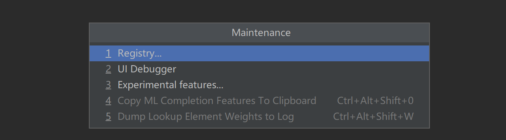
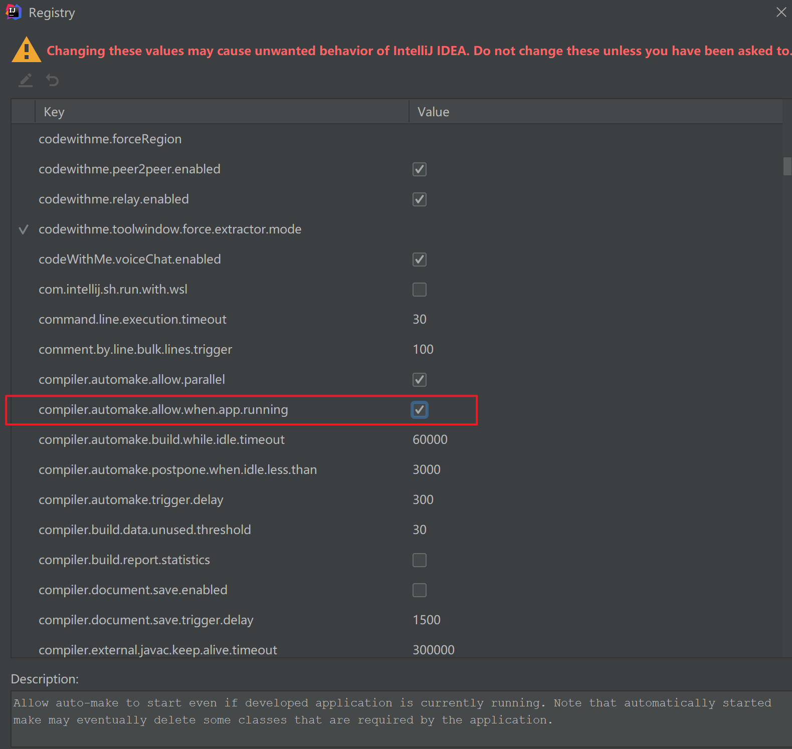
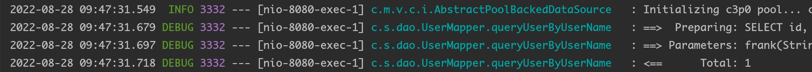
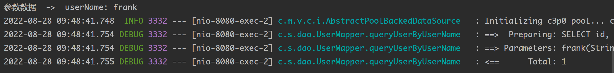
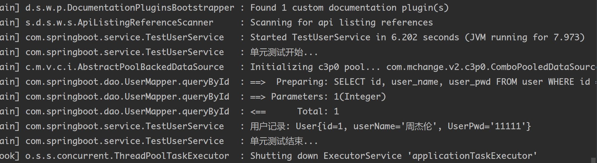
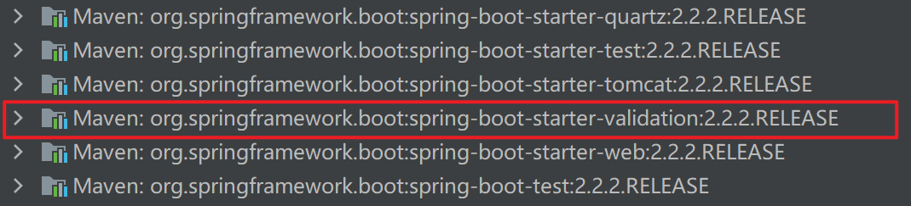
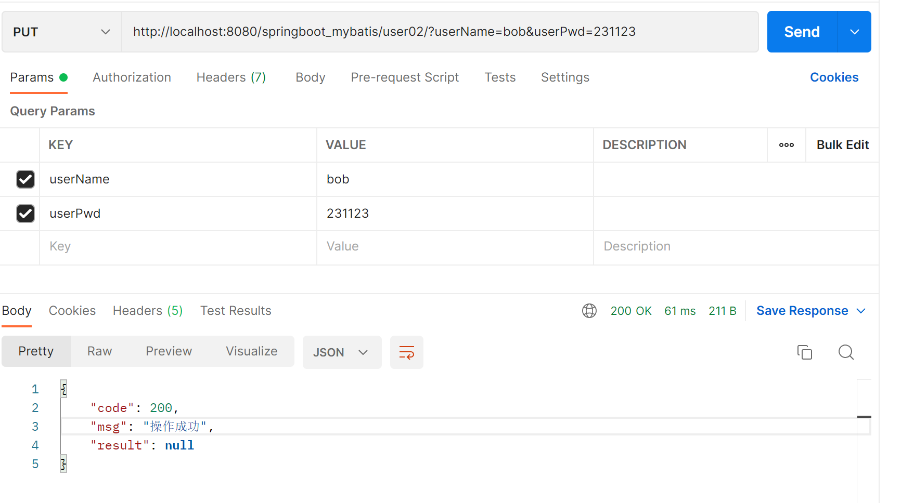

# SpringBoot  one

## 1. Spring 框架发展史

### 1.1. Spring 1.x 时代

​		在 Spring1.x 时代，都是通过xml 文件配置bean，随着项目的不断扩大，需要将xml配置放到不同的文件中，需要频繁的在 java 类和xml配置文件中切换。

### 1.2. Spring 2.x时代

​		随着JDK 1.5带来的注解支持，Spring2.x 可以使用注解对 Bean进行声明和注入，大大的减少了xml配置文件，同时大大简化了项目开发。

究竟应该使用 xml 还是注解呢？

最佳实践：

1.   应用的基本配置用xml，比如：数据源、资源文件等；
2.   业务开发用注解，比如：Service 中注入Bean等；

### 1.3. Spring 3.x 到 Spring 4.x 到Spring 5.x

​		从 Spring 3.x 开始提供了java配置方式，使用 java配置方式可以更好的理解你配置的Bean，现在我们就处于这个时代，并且 Spring4.x 、Spring5.x、和Spring Boot都推荐使用java配置的方式。

## 2. Spring 5.x 应用零配置开发

​		Spring 框架从 5.x 版本推荐使用注解形式对 java 应用程序进行开发与配置，并且可以完全代替原始的 XML + 注解形式的开发，在使用注解形式进行项目开发与环境配置时，Spring 框架提供了针对环境配置与业务bean开发相关注解。

### 2.1. 注解

#### 2.1.1. 声明 Bean 注解

```properties
@Component: 组件 没有明确规定其角色，作用在类级别上声明当前类为一个业务组件被 Spring IOC 容器维护

@Service: 在业务逻辑层（Service 层）类级别声明

@Repository: 在数据访问层（dao 层）类级别声明

@Controller: 在展示层（MVC）使用 标注当前类为一个控制器
```

#### 2.1.2. 注入Bean 注解

```properties
@Autowired: Spring 官方提供注解

@Inject: JSR-330 提供注解（标准制定方）

@Resource: JSR-250 提供注解
```

​		以上三种注解在Set方法或属性上声明，一般情况下通用一般开发中更习惯声明在属性上，代码简洁清晰。基于5.x 注解配置方式简化了 XML 配置，应用程序开发与XML 环境配置均通过相关注解实现。

#### 2.1.3. Spring 5.x 中配置与Bean注解

```properties
@Configuration: 作用于类上，将当前类声明为一个配置类，相当于一个 xml 配置文件

@ComponentScan: 自动扫描指定包下标有@Repository、@Service、@Controller

@Component: 注解的类并有IOC 容器进行实例化和维护

@Bean: 作用与方法上，相当于xml 文件中<bean> 声明当前方法返回值为一个bean

@Value: 获取properties 文件指定key value值
```

### 2.2. 实例1  IOC中Bean的实例化与获取

#### 2.2.1. 创建Spring普通工程并添加坐标相关配置

在pom.xml中添加坐标相关配置

```xml
<dependencies>
    <dependency>
        <groupId>org.springframework</groupId>
        <artifactId>spring-context</artifactId>
        <version>5.3.22</version>
    </dependency>
</dependencies>

<build>
    <plugins>
        <plugin>
            <groupId>org.apache.maven.plugins</groupId>
            <artifactId>maven-compiler-plugin</artifactId>
            <version>3.8.0</version>
            <configuration>
                <!--  源代码使用的JDK版本  -->
                <source>11</source>
                <!--  需要生成的项目class文件的编译版本  -->
                <target>11</target>
                <!--  字符集编码  -->
                <encoding>utf-8</encoding>
            </configuration>
        </plugin>
    </plugins>
</build>
```

#### 2.2.2. 创建Bean对象

UserDao.java

```java
@Repository
public class UserDao {

    public void test() {
        System.out.println("UserDao ...");
    }

}
```

UserService.java

```java
@Service
public class UserService {

    @Autowired
    private UserDao userDao;

    public void test() {
        userDao.test();
        System.out.println("UserService ...");
    }
}
```

#### 2.2.3. 创建 locConfig 配置类

```java
// 将当前类声明为一个配置类
@Configuration
// 设置扫描范围
@ComponentScan("com.bean")
public class IocConfig {

}
```

#### 2.2.4. 测试

```java
public class Test {

    public static void main(String[] args) {
        // 基于java 配置类加载Spring应用的上下文环境
        AnnotationConfigApplicationContext ac = new AnnotationConfigApplicationContext(IocConfig.class);
        // 得到指定bean对象
        UserService userService = ac.getBean(UserService.class);
        userService.test();
    }
}
```

### 2.3. 实例2  @Bean注解的使用

​		使用@Bean 注解声明在方法（注意：方法名一般为bean对象名称）级别用于实例化的Bean对象。

#### 2.3.1.创建 Bean对象

AccountDao.java

```java
/* 注意此类没有添加: @Repository 注解*/
public class AccountDao {

    public void test(){
        System.out.println("AccountDao ...");
    }
}
```

#### 2.3.2. 修改IocConfig 配置类

添加返回AccountDao Bean对象方法

```java
// 将当前类声明为一个配置类
@Configuration
// 设置扫描范围
@ComponentScan("com.bean")
public class IocConfig02 {

    // @Bean注解：通常用于整合第三方的Bean对象，比如：数据源、第三方组件等
    @Bean  // 将方法的返回值交给IOC维护
    public AccountDao accountDao() {
        return new AccountDao();
    }
}
```

#### 2.3.3. 测试

```java
public class Test02 {

    public static void main(String[] args) {
        // 基于java 配置类加载Spring应用的上下文环境
        AnnotationConfigApplicationContext ac = new AnnotationConfigApplicationContext(IocConfig02.class);
        // 得到指定bean对象
        IocConfig02 iocConfig02 = ac.getBean(IocConfig02.class);
        AccountDao accountDao = iocConfig02.accountDao();
        accountDao.test();
    }
}
```

### 2.4. 实例3  读取外部配置文件

​		在开发 java web 应用时，配置文件是比较常见的，如 xml、properties、yml等文件，在Spring 应用中对于配置文件的读取同样提供支持。对于配置文件读取，我们可以通过 @PropertySource 注解声明到类级别来指定读取相关配置。

​		Spring El 表达式语言，支持XML 和注解中使用表达式，类似与 JSP 中的 EL 表达式，Spring 框架借助该表达式实现资源注入，主要通过 @Value 注解来使用表达式，通过 @Value 注解，可是实现普通字符串，表达式运算结果，Bean 属性文件内容，属性文件等参数注入。具体使用如下：

#### 2.4.1. 准备配置文件

```properties
# db.properties
driver=com.mysql.cj.jdbc.Driver
url=jdbc:mysql://localhost:3306/ssm?useUnicode=true&characterEncoding=utf8
user=root
password=123456

#user.properties
user.name=frank
user.password=12345678
```

#### 2.4.2. @PropertySource 加载配置文件

通过@PropertySource 加载properties文件

```java
// 将当前类声明为一个配置类
@Configuration
@PropertySource(value = {"classpath:db.properties", "classpath:user.properties"})
public class IocConfig03 {

    @Value("${driver}")
    private String driver;
    @Value("${url}")
    private String url;
    @Value("${user}")
    private String user;
    @Value("${password}")
    private String password;

    @Value("${user.name}")
    private String userName;
    @Value("${user.password}")
    private String userPwd;

    public void print() {
        System.out.println("driver = " + driver);
        System.out.println("url = " + url);
        System.out.println("user = " + user);
        System.out.println("password = " + password);

        System.out.println("--------------------------");
        System.out.println("userName = " + userName);
        System.out.println("userPwd = " + userPwd);

    }

}
```

#### 2.4.3. 其他Bean对象获取properties文件内容

```java
@Service
@PropertySource(value = {"classpath:db.properties"})
public class UserService {

    @Autowired
    private UserDao userDao;


    @Value("${driver}")
    private String driver;
    @Value("${url}")
    private String url;
    @Value("${user}")
    private String user;
    @Value("${password}")
    private String password;

    public void test() {
        userDao.test();
        System.out.println("UserService ...");

        System.out.println("driver = " + driver);
        System.out.println("url = " + url);
        System.out.println("user = " + user);
        System.out.println("password = " + password);

    }
}
```

#### 2.4.4. 测试

```java
public class Test03 {

    public static void main(String[] args) {
        // 基于java 配置类加载Spring应用的上下文环境
        AnnotationConfigApplicationContext ac = new AnnotationConfigApplicationContext(IocConfig03.class);
        // 得到指定bean对象
        IocConfig03 iocConfig03= ac.getBean(IocConfig03.class);

        iocConfig03.print();
    }
}
```

### 2.5. 组合注解与元注解

​		Spring从 2.x 版本开始引入注解支持（目的是 jdk 1.5 中推出注解功能），通过引入注解来消除大量 xml 配置，Spring 引入注解主要用来注入 bean 以及 aop 切面相关配置，但由于注解大量使用，就会造成大量重复注解代码出现，代码出现了重复，Spring为了消除重复注解，在元注解上引入了组合注解，其实可以理解为代码的重构，拥有 @Component 注解功能，即使配置类本身也是一个被 IOC 维护的单例 Bean。

#### 2.5.1. 自定义组合注解

定义 MyCompScan 注解，拥有 @ComponentScan扫描注解功能

```java
@Configuration
@ComponentScan
public @interface MyCompScan {

    String[] value() default {};
}  
// 同时具有@Configuration、@ComponentScan注解的功能
```

## 3. Spring MVC 零配置创建与部署

​		基于 Spring MVC 5.x 使用maven 搭建 Spring MVC Web项目，通过 Spring 提供的注解与相关配置来对项目进行创建与部署。

### 3.1. 创建Spring MVC Web工程

创建 Maven 的 web 项目

### 3.2. pom.xml

```xml
<dependencies>
    <!--  spring web  -->
    <dependency>
        <groupId>org.springframework</groupId>
        <artifactId>spring-web</artifactId>
        <version>5.3.22</version>
    </dependency>

    <!-- spring mvc  -->
    <dependency>
        <groupId>org.springframework</groupId>
        <artifactId>spring-webmvc</artifactId>
        <version>5.3.22</version>
    </dependency>

    <!--  servlet  -->
    <dependency>
        <groupId>javax.servlet</groupId>
        <artifactId>servlet-api</artifactId>
        <version>2.5</version>
    </dependency>


</dependencies>

<build>
    <finalName>springboot</finalName>
    <plugins>
        <plugin>
            <groupId>org.apache.maven.plugins</groupId>
            <artifactId>maven-compiler-plugin</artifactId>
            <version>3.8.0</version>
            <configuration>
                <!--  源代码使用的JDK版本  -->
                <source>11</source>
                <!--  需要生成的项目class文件的编译版本  -->
                <target>11</target>
                <!--  字符集编码  -->
                <encoding>utf-8</encoding>
            </configuration>
        </plugin>
    </plugins>
</build>
```

### 3.3. 添加源代码

```java
@Controller
public class HelloController {

    @RequestMapping("/index")
    public String index() {
        return "index";
    }

}
```

### 3.4. 添加视图

在 WEB-INF/views 目录下创建index.jsp

```html
<body>
    <h2>
        hello springboot
    </h2>
</body>
```

### 3.5. Spring MVC 配置类添加

​		Spring MVC 配置信息 MvcConfig 文件添加，作为MVC框架环境，原来是通过 xml 来进行配置（视图解析器、JSON转化器、文件上传解析器等），这里基于注解通过继承 WebMvcConfigurerAdapter 类并重写相关方法来进行配置（注意通过 @EnableWebMvc 注解来启动 MVC 环境）。

```java
/* 配置类 */
@Configuration
/* 在@Configuration 注解的配置类中添加，用于为该应用程序添加SpringMVC 的功能 */
@EnableWebMvc
/* 扫描包范围 */
@ComponentScan("com.springboot")
public class MvcConfig {


    /***
     * 配置 JSP 视图解析器
     */
    @Bean
    public InternalResourceViewResolver viewResolver() {
        // 获取视图解析器
        InternalResourceViewResolver viewResolver = new InternalResourceViewResolver();
        // 设置前缀
        viewResolver.setPrefix("/WEB-INF/views/");
        // 设置后缀
        viewResolver.setSuffix(".jsp");

        return viewResolver;
    }

}
```

### 3.6. 入口文件代码添加

```java
public class WebInitializer implements WebApplicationInitializer {
    @Override
    public void onStartup(ServletContext servletContext) throws ServletException {
        // 得到Spring应用的上下文环境
        AnnotationConfigWebApplicationContext act = new AnnotationConfigWebApplicationContext();
        // 注册 MVC 配置类
        act.register(MvcConfig.class);
        // 设置ServletContext的上下文环境信息
        act.setServletContext(servletContext);
        // 配置转发器 Dispatcher
        ServletRegistration.Dynamic servlet = servletContext.addServlet("dispatcher", new DispatcherServlet(act));
        // 设置映射路径
        servlet.addMapping("/");
        // 启动是实例化Bean
        servlet.setLoadOnStartup(1);

    }
}
```

### 3.7. 部署与测试

在项目中添加Tomcat并访问

配置拦截器：在配置类实现WebMvcConfigurationSupport


## 4. SpringBoot 概念与特点

### 4.1. 框架概念

​		随着动态语言的流行(Ruby、Scala、Nodejs等)，java 开发变得相对笨重，配置繁琐，开发效率低下，部署流程复杂，以及第三方集成难度也相对较大，针对该环境，Spring Boot 被开发出来，其实用“习惯大于配置目标”，借助Spring Boot 能够让项目快速运行起来，同时借助 Spring Boot可以创建 web 应用并独立进行部署（jar包 war包方式，内嵌 Servlet 容器），同时借助 Spring Boot 在开发应用是可以不用或很少去进行相关 xml 环境配置，简化了开发，大大提高项目开发效率。

​		Spring Boot 是由 Pivotal 团队提供的全新框架，其设计目的是用来简化 Spring 应用的初始搭建以及开发过程，该框架使用了特定的方式来进行配置，从而使开发人员不需要定义样板化的配置。通过这种方式，让Spring Boot 在快速开发领域（rapid application development）成为领导者。

### 4.2. 框架特点

​		创建独立 Spring 应用程序、嵌入式Tomcat、jetty容器、无需部署 WAR 包、简化 Maven 以及 Gradle 配置、尽可能自动化配置 Spring、直接植入产品环境下的实用功能，比如度量指标、健康检查及扩展配置、无需代码生成及XML 配置等，同时 Spring Boot 不仅对web 应用程序做了简化，还提供了一系列的依赖包来把其他一些工作做成开箱即用。

### 4.3. Spring Boot 快速入门

#### 4.3.1. 环境准备

 **IDEA、Maven、JDK 1.8+、Spring Boot 2.x**

#### 4.3.2. 添加依赖坐标

```xml
<parent>
    <groupId>org.springframework.boot</groupId>
    <artifactId>spring-boot-starter-parent</artifactId>
    <version>2.2.2.RELEASE</version>
</parent>
```

#### 4.3.3. 导入 SpringBoot 的web坐标与相关插件

```xml
<!-- web支持，SpringMVC， Servlet支持等 -->
<dependency>
    <groupId>org.springframework.boot</groupId>
    <artifactId>spring-boot-starter-web</artifactId>
</dependency>
```

#### 4.3.4. 添加源代码

```java
@Controller
public class HelloController {

    @RequestMapping("/hello")
    @ResponseBody
    public String hello(){
        return "hello spring-boot";
    }

}
```

#### 4.3.5. 启动程序

```java
@SpringBootApplication
public class Starter {

    public static void main(String[] args) {
        SpringApplication.run(Starter.class);
    }
}
```

#### 4.3.6. 测试

  在浏览器输入请求地址http://localhost:8080/hello


## 5. Spring Boot 核心配置

### 5.1. 设置 Banner 图标


​		在搭建 Spring Boot 项目环境时，程序启动后会在控制台打印SpringBoot 图标，图标描述了SpringBoot 的版本信息，这是 Spring Boot项目与Sping 项目启动区别较大的地方， Spring Boot默认 Banner 在程序启动时显示应用图标，当然图标也可以自定义。

#### 5.1.1. Banner 图标自定义

​		Spring Boot 项目启动时默认加载 **src/main/resources目录下的banner.txt 图标文件**，如果该目录文件未提供，则默认使用Spring 图标。

**图标风格生成网站：patorjk.com**

#### 5.1.2. Banner图标关闭

​		如果启动时不想看到启动图标，可以通过代码进行关闭操作，修改 StarterApplication 设置BannerMode 值为Banner.Mode.OFF，启动Spring Boot 应用关闭图标输出功能即可。

```java
@SpringBootApplication
public class Starter {

    public static void main(String[] args) {

        SpringApplication springApplication = new SpringApplication(Starter.class);
        springApplication.setBannerMode(Banner.Mode.OFF);
        springApplication.run();
    }
}
```

### 5.2. Spring Boot 配置文件

​		**Spring Boot 默认会读取全局配置文件**，配置文件名固定为：**application.properties** 或 **application.yml**，放在 src/main/resources 资源目录下，使用配置文件来修改 SpringBoot 自动配置的默认值。

在 resources 资源目录下添加 application.properties 文件，配置信息如下：

```properties
## 项目启动端口配置
server.port=8080
## 项目访问上下文路径
server.servlet.context-path=/mvc

## 数据源配置
spring.datasource.driver-class-name=com.mysql.cj.jdbc.Driver
spring.datasource.url=jdbc
spring.dataource.username=root
spring.dataource.password=root
```

或者 application.yml 文件

```yml
server:
  # 端口
  port: 8999
  servlet:
    # 上下文访问路径
    context-path: /mvc01
```

### 5.3. Starter坐标与自动化配置

#### 5.3.1. Starter坐标配置

​		Spring Boot 引入了全新的Starter坐标体系，简化企业项目开发大部分场景的 Starter pom，应用程序引入指定场景的 Start pom 相关配置就可以消除，通过 Spring Boot 就可以得到自动化配置的 Bean。

##### 5.3.1.1. Web starter

使用 Spring MVC 来构建 RestFul Web 应用，并使用Tomcat 作为默认内嵌容器。

```xml
<dependency>
    <groupId>org.springframework.boot</groupId>
    <artifactId>spring-boot-starter-web</artifactId>
</dependency>
```

##### 5.3.1.2. Freemarker Starter  &  Thymeleaf starter

集成视图技术，引入 Freemarker Sharter， Thymeleaf starter

```xml
<dependency>
    <groupId>org.springframework.boot</groupId>
    <artifactId>spring-boot-starter-freemarker</artifactId>
</dependency>
<dependency>
    <groupId>org.springframework.boot</groupId>
    <artifactId>spring-boot-starter-thymeleaf</artifactId>
</dependency>
```

##### 5.3.1.3. JavaMail邮件发送 Starter

```xml
<dependency>
    <groupId>org.springframework.boot</groupId>
    <artifactId>spring-boot-starter-mailf</artifactId>
</dependency>
```

##### 5.3.1.4. aop

```xml
<dependency>
    <groupId>org.springframework.boot</groupId>
    <artifactId>spring-boot-starter-aop</artifactId>
</dependency>
```

相关starter系列坐标参考：

| 名称                                   | 描述                                                         |
| -------------------------------------- | ------------------------------------------------------------ |
| spring-boot-starter                    | 核心Spring Boot starter，包括自动化支持，日志和YAML          |
| spring-boot-starter-actuator           | 生产准备的特性，用于帮我们监控和管理应用                     |
| spring-boot-starter-amqp               | 对“高级消息队列协议”的支持，通过spring-rabbit实现            |
| spring-boot-starter-aop                | 对面向切面编程的支持，包括spring-aop和AspectJ                |
| spring-boot-starter-batch              | 对Spring Batch的支持，包括HSQLDB数库                         |
| spring-boot-starter-cloud-connectors   | 对Spring Cloud Connectors的支持，简化在云平台下（例如，Cloud Foundry和Heroku）服务的连接 |
| spring-boot-starter-data-elasticsearch | 对Elasticsearch搜索和分析引擎的支持，包括spring-data-elasticsearch |
| spring-boot-starter-data-gemfire       | 对GemFire分布式数据存储的支持，包括spring-data-gemfire       |
| spring-boot-starter-data-jpa           | 对java持久化API的支持，包括spring-data-jpa，spring-orm和Hibernate |
| spring-boot-starter-data-mongodb       | 对MongoDB NOSQL数据库的支持，包括spring-data-mongodb         |
|                                        |                                                              |
|                                        |                                                              |
|                                        |                                                              |
|                                        |                                                              |
|                                        |                                                              |
|                                        |                                                              |
|                                        |                                                              |
|                                        |                                                              |

#### 5.3.2. 自动化配置


### 5.4. Profile 配置

​		Profile 是 Spring 用来针对不同环境对不同配置提供的全局 Profile 配置使用 **application-{profile}.yml**，比如 application-dev.yml，application-test.yml。

通过在 aplication.yml 中设置 spring.profiles.active=test|dev|prod 来动态切换不同环境，具体配置如下：

*   application-dev.yml  开发环境配置

```yml
server:
	port: 8989
```

*   application-test.yml  开发环境配置

```yml
server:
	port: 9999
```

*   application-prod  开发环境配置

```yml
server:
	port: 9999
```

*   application.yml   主配置文件

```yml
# 切换环境配置
spring: 
  profiles:
    active: test  #不同环境
```

### 5.5. 日志配置

​		在开发企业项目式，日志的输出对于系统 bug 定位无疑是一种比较有效的方式，也是项目后续进入生产环境后快速发现错误的一种有效手段，所以日志的使用对于项目也是比较重要的一块功能。

​		Spring Boot 默认使用 LogBack 日志系统，如果不需要更改为其他日志系统如 Log4j2 等，则无需多余的配置，LogBack 默认将日志打印到控制台上。如果要使用 LogBack ，原则上是需要添加 dependency 依赖的。

```xml
<dependency>
    <groupId>org.springframework.boot</groupId>
    <artifactId>spring-boot-starter-logging</artifactId>
</dependency>
```

​		因为新建的 Spring Boot 项目一般都会引用`spring-boot-starter`或者`spring-boot-starter-web`，而这两个起步依赖中都已经包含了对于`spring-boot-starter-logging`的依赖，所以，无需额外添加依赖。

#### 5.5.1. 项目中日志信息输出

Starter 启动类中添加 Log 日志类，控制台打印日志信息。

```java
@SpringBootApplication
public class Starter {

    private static Logger logger = LoggerFactory.getLogger(Starter.class);


    public static void main(String[] args) {
        // 使用日志
        logger.info("in loading.... ");

        SpringApplication springApplication = new SpringApplication(Starter.class);
        springApplication.setBannerMode(Banner.Mode.LOG);
        springApplication.run();
    }

}
```

####  5.5.2. 日志输出格式配置

​		修改 application.yml 文件添加日志输出格式信息配置，可以修改 application.yml 文件控制控制台日志输出格式，同时可以设置日志信息输出到外部文件。

```yml
logging:
  pattern:
    console: "%d{yyyy-MM-dd HH:mm:ss} [%thread] %-5level %logger- %msg%n"
    level: debug
  file:
    path: "."
    name: "springboot02.log"
```

详细配置请官网查看


## 6. Freemarker & Thymeleaf 视图技术集成

### 6.1. Freemarker 视图集成

​		SpringBoot 内部支持 Freemarker 视图技术的集成，并提供了自动化配置类

FreemarkerAutoConfiguration，借助自动化配置可以很方便的集成 Freemarker 基础到 SpringBoot 环境中。这里借助入门项目引入 Freemarker 环境配置。

*   Starter 坐标引入

```xml
<dependency>
    <groupId>org.springframework.boot</groupId>
    <artifactId>spring-boot-starter-freemarker</artifactId>
</dependency>
```

*   添加Freemarker 配置信息

​		Freemarker 默认默认视图路径 resources/templates 目录（有自动化配置类 FreemarkerProperties决定），该目录可以在application.yml 中修改。

 ```yml
 spring:
 # freemarker 配置
   freemarker:
     suffix: .ftl
     content-type: text/html
     charset: UTF-8
     template-loader-path: classpath:/views/
 ```

*   添加控制器

```java
@Controller
public class IndexController {


    @RequestMapping("/index")
    public String index() {
        return "index";
    }

}
```

*   在resources目录下添加views目录添加index.ftl文件

```ftl
Hello SpringBoot
```

*   启动Starter 访问浏览器


### 6.2. Thymeleaf 视图集成

​		SpringBoot 支持多种视图集成，并且 SpringBoot 官网推荐使用 Thymeleaf 作为前端视图页面，这里实现Thymeleaf 视图集成，借助入门项目引入 Thymeleaf 环境配置。

*   starter坐标引入

```xml
<dependency>    
    <groupId>org.springframework.boot</groupId>  
    <artifactId>spring-boot-starter-thymeleaf</artifactId>
</dependency>
```

*   添加Thymeleaf 配置信息

​		Thymeleaf 默认默认视图路径 resources/templates 目录 (由自动化配置类 ThymeleafProperties 类决定)，该目录可以在applicatioin.yml 中进行修改。

```yml
spring:
  # thymeleaf 配置
  thymeleaf:
    prefix: classpath/html/
    # 关闭页面缓存
    cache: false
```

*   编写 Indexcontroller 控制器

    ```java
    @Controller
    public class IndexController02 {
    
        @RequestMapping("/index02")
        public String index(Model model) {
            model.addAttribute("msg","Hello SpringBoot 02 ");
            return "index";
        }
    
    }
    ```
    
*   html 目录下添加 index.html 视图

​		修改 Thymeleaf 模板默认存放路径 (在 resources 目录下的 html 文件夹)

```html
<!DOCTYPE html>
<html lang="en" xmlns:th="http://www.thymeleaf.org">
    <head>
        <meta charset="UTF-8">
        <title>Thymeleaf</title>
    </head>
    <body>
        <!-- 获取请求域的值 -->
        <h2 th:text="${msg}"></h2>
    </body>
</html>
```

*   启动Starter 访问浏览器


## 7. SpringBoot 静态资源访问

​	从入门项目中可以看到：对于 Spring MVC 请求拦截规则 '/' ，Spring Boot   默认静态资源路径如下：

​                                           

```java
"classpath:/META-INF/resources/", 
"classpath:/resources/", 
"classpath:/static/", 
"classpath:/public/"
```

即：我们可以在 resources 资源目录下存放 web 应用静态资源文件。

### 7.1. 默认静态资源路径

在 resources 目录下创建 static 或者 public 目录，存放images、js、css等静态资源文件


浏览器访问：


### 7.2. 自定义静态资源路径

在spring.resources.static-locations 后追加一个配置 classpath:/path_name/

```yml
spring:
    # 设置静态资源的默认访问路径 多个路径之间用逗号隔开
    resources:
  	  static-locations: classpath:/os/,clsspath/static/
```


## 8. SpringBoot 应用打包与部署

### 8.1. jar 包部署

#### 8.1.1. 配置打包命令

idea 下配置

```mvn
maven clean compile package -Dmaven.test.skip=true
```

执行打包命令，target 目录得到待部署的项目文件。


#### 8.1.2. 部署并访问

​		打开本地 dos 窗口，执行 java-jar 命令 部署已经打包好的 jar 文件。

​		命令如下：java  -jar  jar包所在目录


访问：


### 8.2. war 包部署

​		War 包形式部署 Web 项目在生产环境中是比较常见的部署方式，也是目前大多数 web 应用部署的方案，这里对于 Spring Boot Web 项目进行打包部署步骤如下：

#### 8.2.1. pom.xml 修改

*   应用类型修改

    由于入门项目构造项目默认为 jar 应用，所以这里打 war 修要做如下修改

     

*   忽略内嵌 Tomcat

    构建 SpringBoot 应用时，引入的 spring-boot-starter-web 默认引入了 Tomcat 容器，这里忽略内容 Tomcat

    ```xml
    <dependency>
        <groupId>org.springframework.boot</groupId>
        <artifactId>spring-boot-starter-tomcat</artifactId>
        <scope>provided</scope>
    </dependency>
    
    <build>
    
        <!--  配置生成的项目名  -->
        <finalName>springboot02</finalName>
    
        <plugins>
            <plugin>
                <groupId>org.springframework.boot</groupId>
                <artifactId>spring-boot-maven-plugin</artifactId>
            </plugin>
        </plugins>
    </build>
    ```

#### 8.2.2. Starter 修改

​		添加容器启动加载文件（类似于读取 web.xml），这里通过继承 SpringBootServletInitializer 类并重写configure 方法来实现，在部署项目时指定外部 Tomcat 读取项目入口方法。

```java
@Override
protected SpringApplicationBuilder configure(SpringApplicationBuilder builder) {
    return builder.sources(Starter.class);
}
```

#### 8.2.3. 打包操作

将war包放在tomcat的webapps目录下，并启动tomcat。

访问：


<hr style="background-color:red"/>

# SpringBoot  two

## 1. Mybatis 整合 & 数据访问

​		使用 SpringBoot 开发企业，持久层数据访问是前端页面数据展示的基础，SpingBoot支持市面上常见的关系库产品（Oracle、Mysql、SqlServer、BD2等）对应的相关持久层框架，当然除了对于关系库访问的支持，也支持当下众多非关系库（Redis、Solr、MongoDB等）数据访问操作，这里主要介绍SpringBoot集成Mybatis并实现持久层数据基本增删改查操作。

### 1.1. SpringBoot 整合 Mybatis

#### 1.1.1. 环境配置

*   idea创建Maven普通项目

*   pom.xml配置

    ```xml
    <parent>
        <groupId>org.springframework.boot</groupId>
        <artifactId>spring-boot-starter-parent</artifactId>
        <version>2.2.2.RELEASE</version>
    </parent>
    
    <dependencies>
    
        <!-- web支持，SpringMVC， Servlet支持等 -->
        <dependency>
            <groupId>org.springframework.boot</groupId>
            <artifactId>spring-boot-starter-web</artifactId>
        </dependency>
    
        <!-- mybatis 与 springboot 整合 -->
        <dependency>
            <groupId>org.mybatis.spring.boot</groupId>
            <artifactId>mybatis-spring-boot-starter</artifactId>
            <version>2.2.2</version>
        </dependency>
    
        <!-- 分页插件  -->
        <dependency>
            <groupId>com.github.pagehelper</groupId>
            <artifactId>pagehelper-spring-boot-starter</artifactId>
            <version>1.4.1</version>
        </dependency>
    
        <!--  MySQL 数据库  -->
        <dependency>
            <groupId>mysql</groupId>
            <artifactId>mysql-connector-java</artifactId>
        </dependency>
    
        <!--  C3P0 数据源  -->
        <dependency>
            <groupId>com.mchange</groupId>
            <artifactId>c3p0</artifactId>
            <version>0.9.5.5</version>
        </dependency>
    
    </dependencies>
    
    <build>
    
        <plugins>
            <plugin>
                <groupId>org.springframework.boot</groupId>
                <artifactId>spring-boot-maven-plugin</artifactId>
                <version>2.2.2.RELEASE</version>
            </plugin>
        </plugins>
    
    </build>
    </project>
    ```

*   application.yml整合配置

    ```yml
    server:
      port: 8080
      # 设置项目的访问路径（上下文路径）
      servlet:
        context-path: /springboot_mybatis
    
    ## 数据源配置
    spring:
      datasource:
        type: com.mchange.v2.c3p0.ComboPooledDataSource
        driver-class-name: com.mysql.cj.jdbc.Driver
        url: jdbc:mysql://localhost:3306/springboot_mybatis?useUnicode=true&characterEncoding=utf8&useSSL=false&serverTimezone=GMT%2B8
        username: root
        password: 123456
    
    ## mybatis 配置
    mybatis:
      mapper-locations: classpath:/mappers/*.xml
      type-aliases-package: com.springboot.po
      configuration:
        ## 下划线转驼峰配置
        map-underscore-to-camel-case: true
    
    ## pageHelper
    pagehelper:
      helper-dialect: mysql
    
    ## 显示 dao 执行sql语句
    logging:
      level:
        com:
          springboot:
            dao: debug
    ```
    

#### 1.1.2. 源代码添加

*   JavaBean 对象定义

    ```java
    public class User {
    
        private Integer id;
        private String userName;
        private String UserPwd;
        
        /* get set 方法省略*/
    
    }
    ```

*   Dao 层接口方法定义

    com.springboot.dao 包下创建UserMapper.java 接口声明查询方法

    ```java
    package com.springboot.dao;
    
    import com.springboot.po.User;
    
    public interface UserMapper {
    
        // 根据用户名查询记录
        User queryUserByUserName(String UserName);
    
    }
    ```

*   SQL映射文件添加

    resources/mappers 目录下添加 UserMapper.xml 配置

    ```xml
    <?xml version="1.0" encoding="UTF-8" ?>
    <!DOCTYPE mapper PUBLIC "-//mybatis.org//DTD Mapper 3.0//EN" "http://mybatis.org/dtd/mybatis-3-mapper.dtd">
    <mapper namespace="com.springboot.dao.UserMapper">
        <select id="queryUserByUserName" parameterType="String" resultType="com.springboot.po.User">
            SELECT
            id,
            user_name,
            user_pwd
            FROM user
            WHERE user_name = #{userName}
        </select>
    </mapper>
    ```

*   添加service、controller 对应代码

    UserService.java

    ```java
    @Service
    public class UserService {
    
        @Resource
        private UserMapper mapper;
    
        public User queryUserByUserName(String userName) {
            return mapper.queryUserByUserName(userName);
        }
    
    }
    ```

    UserController.java

    ```java
    @RestController
    public class UserController {
    
        @Resource
        UserService userService;
    
        @GetMapping("/user/{userName}")
        public User queryByUserName(@PathVariable String userName) {
            return userService.queryUserByUserName(userName);
        }
    
    }
    ```

*   添加应用启动入口

    ```java
    @SpringBootApplication
    @MapperScan("com.springboot.dao")
    public class Starter {
    
        public static void main(String[] args) {
            SpringApplication.run(Starter.class);
        }
    
    }
    ```

#### 1.1.3. 测试

运行Starter main 方法，启动应用浏览器测试查询

...


### 1.2. SpringBoot 数据访问操作

​		完成 SpringBoot 与 Mybatis 集成后，接下来以用户表为例实现一套用户模块基本数据维护。

#### 1.2.1. 查询操作

##### 1.2.1.1. 接口方法定义

UserMapper 接口添加查询方法

```java
// 根据用户ID查询记录
User queryById(Integer id);
```

##### 1.2.1.2. 添加xml 映射

```xml
<select id="queryById" parameterType="Integer" resultType="com.springboot.po.User">
    SELECT
    id,
    user_name,
    user_pwd
    FROM user
    WHERE id = #{id,jdbcType=INTEGER}
</select>
```

##### 1.2.1.3. service、controller添加方法

UserService.java

```java
public User queryById(Integer id) {
    return mapper.queryById(id);
}
```

UserController.java

```java
@GetMapping("/user/id/{id}")
public User queryById(@PathVariable Integer id) {
    return userService.queryById(id);
}
```

#### 1.2.2. 添加操作

##### 1.2.2.1. 接口方法定义

```java
// 添加对象
int save(User user);
```

##### 1.2.2.2. 添加xml 映射

```xml
<insert id="save" parameterType="com.springboot.po.User">
    insert into user
    (user_name, user_pwd)
    values (#{userName}, #{userPwd})
</insert>
```

##### 1.2.2.3. 添加 commons-lang3 依赖

如果需要使用StringUtils工具类，需要引入 commons-lang3 依赖。

```xml
<!--  StringUtils  -->
<dependency>
    <groupId>org.apache.commons</groupId>
    <artifactId>commons-lang3</artifactId>
</dependency>
```

##### 1.2.2.4. AssertUtil 工具类

```java
package com.springboot.utils;

import com.springboot.exceptions.ParamsException;

public class AssertUtil {

    /**
     * 判断结果是否为true
     * 如果为true，抛出异常
     *
     * @param flag
     * @param msg
     */
    public static void isTrue(Boolean flag, String msg) {

        if (flag) {
            throw new ParamsException(msg);
        }

    }
}
```

##### 1.2.2.5. ParamsException 自定义异常

```java
package com.springboot.exceptions;

/**
 * 自定义参数异常
 */
public class ParamsException extends RuntimeException {

    private Integer code = 300;
    private String msg = "参数异常!";

    public ParamsException() {
        super("参数异常!");
    }

    public ParamsException(String msg) {
        super(msg);
        this.msg = msg;
    }

    public ParamsException(Integer code) {
        super("参数异常!");
        this.code = code;
    }

    public ParamsException(Integer code, String msg) {
        super(msg);
        this.code = code;
        this.msg = msg;
    }

    public Integer getCode() {
        return code;
    }

    public void setCode(Integer code) {
        this.code = code;
    }

    public String getMsg() {
        return msg;
    }

    public void setMsg(String msg) {
        this.msg = msg;
    }
}
```

##### 1.2.2.6. UserService

```java
//   添加用户
public void saveUser(User user) {
    AssertUtil.isTrue(StringUtils.isBlank(user.getUserName()), "用户名不能为空!");
    AssertUtil.isTrue(StringUtils.isBlank(user.getUserPwd()), "密码不能为空!");

    // 通过用户名查询用户对象是否存在
    User real = mapper.queryUserByUserName(user.getUserName());
    AssertUtil.isTrue(null != real, "该用户已存在!");
    AssertUtil.isTrue(mapper.save(user) < 1, "添加用户失败!");

}
```

##### 1.2.2.7. Resultlnfo

```java
package com.springboot.po.vo;

public class ResultInfo {
    private Integer code = 200;
    private String msg = "操作成功";
    private Object result;

    public Integer getCode() {
        return code;
    }

    public void setCode(Integer code) {
        this.code = code;
    }

    public String getMsg() {
        return msg;
    }

    public void setMsg(String msg) {
        this.msg = msg;
    }

    public Object getResult() {
        return result;
    }

    public void setResult(Object result) {
        this.result = result;
    }
}
```

##### 1.2.2.8. UserController

```java
/**
  *  添加操作
  * @param user
  * @return
  */
@PutMapping("/user")
public ResultInfo saveUser(User user) {
    ResultInfo resultInfo = new ResultInfo();

    try {
        userService.saveUser(user);
    } catch (ParamsException e) {
        resultInfo.setCode(e.getCode());
        resultInfo.setMsg(e.getMsg());
        e.printStackTrace();
    } catch (Exception e) {
        resultInfo.setCode(300);
        resultInfo.setMsg("添加失败");
        e.printStackTrace();
    }

    return resultInfo;
}
```

#### 1.2.3. 修改操作

##### 1.2.3.1. 接口方法定义

```java
// 修改方法
int update(User user);
```

##### 1.2.3.2. 添加xml 映射

```xml
<update id="update" parameterType="com.springboot.po.User">
    update
 	   user
    set
 	   user_name = #{userName},
 	   user_pwd = #{userPwd}
    where 
  	  id = #{id}
</update>
```

##### 1.2.3.3. UserService

```java
//   修改用户
@PostMapping("/update")
public void updateUser(User user) {
    AssertUtil.isTrue(StringUtils.isBlank(user.getUserName()), "用户名不能为空!");
    AssertUtil.isTrue(StringUtils.isBlank(user.getUserPwd()), "密码不能为空!");

    // 通过用户名查询用户对象是否存在
    User real = mapper.queryUserByUserName(user.getUserName());
    // 如果用户对象存在，且不是当前修改对象
    AssertUtil.isTrue(null != real && !(user.getId().equals(real.getId())), "该用户名已经存在!");
    AssertUtil.isTrue(mapper.update(user) < 1,"修改用户失败!");

}
```

##### 1.2.3.4. UserController

```java
/**
  *  修改操作
  * @param user
  * @return
  */
@PostMapping("/update")
public ResultInfo updateUser(User user) {
    ResultInfo resultInfo = new ResultInfo();

    try {
        userService.updateUser(user);
    } catch (ParamsException e) {
        resultInfo.setCode(e.getCode());
        resultInfo.setMsg(e.getMsg());
        e.printStackTrace();
    } catch (Exception e) {
        resultInfo.setCode(300);
        resultInfo.setMsg("修改失败");
        e.printStackTrace();
    }

    return resultInfo;
}
```

#### 1.2.4. 删除操作

##### 1.2.4.1. 接口方法定义

```java
// 删除用户
int delete(Integer id);
```

##### 1.2.4.2. 添加xml 映射

```xml
<delete id="delete" parameterType="Integer">
    delete from
   		 user
    where
  	  id = #{id}
</delete>
```

##### 1.2.4.3. UserService

```java
// 删除用户
public void deleteUser(Integer id) {
    AssertUtil.isTrue(null == id || null == mapper.queryById(id), "待删除用户不存在!");
    AssertUtil.isTrue(mapper.delete(id) < 1, "删除用户失败!");

}
```

##### 1.2.4.4. UserController

```java
@DeleteMapping("/user/{id}")
public ResultInfo deleteUser(@PathVariable Integer id){
    ResultInfo resultInfo = new ResultInfo();

    try {
        userService.deleteUser(id);
    } catch (ParamsException e) {
        resultInfo.setCode(e.getCode());
        resultInfo.setMsg(e.getMsg());
        e.printStackTrace();
    } catch (Exception e) {
        resultInfo.setCode(300);
        resultInfo.setMsg("删除失败");
        e.printStackTrace();
    }

    return resultInfo;
}
```

#### 1.2.5. 分页条件查询操作

##### 1.2.5.1. UserQuery

```java
package com.springboot.query;

public class UserQuery {

    private Integer pageNum = 1; // 当前页
    private Integer pageSize = 10; // 每页显示的数量
    private String userName;  // 查询条件：用户名

	/* get set 方法省略 */
}
```

##### 1.2.5.2. 接口方法定义

```java
// 通过条件分页查询用户类表
List<User> selectUserByParams(UserQuery userQuery);
```

##### 1.2.5.3. 添加 xml 映射

```xml
<select id="selectUserByParams" parameterType="com.springboot.query.UserQuery" resultType="com.springboot.po.User">
    select
    *
    from
    user
    <where>
        <if test="null != userName and  userName != '' ">
            and user_name like concat('%',#{userName},'%')
        </if>
    </where>
</select>
```

##### 1.2.5.4. UserService

```java
public PageInfo<User> queryUserByParams(UserQuery userQuery) {
    PageHelper.startPage(userQuery.getPageNum(), userQuery.getPageSize());
    return new PageInfo<User>(mapper.selectUserByParams(userQuery));
}
```

##### 1.2.5.5. UserController

```java
@GetMapping("/user/list")
public PageInfo<User> queryUserByParams(UserQuery userQuery) {
    return userService.queryUserByParams(userQuery);
}
```

#### 1.2.6. 使用PostMan测试

​		测试接口


## 2. API 文档构建工具 - Swagger2

​		由于 Spring Boot 能够快速开发、便携部署等特性，通常在使用 Spring Boot 构建 Restful 接口应用时考虑到多终端的原因，这些终端会共有很多底层业务逻辑，因此我们会抽象出这样一层来同时服务于多个移动端或者Web 前端。对于不同的终端公用一套接口 API 时，对于联调测试的时候就需要知道后端提供的接口 API 列表文档，对于服务端开发人员来说就需要编写接口文档，描述接口的调用地址、参数结果等，这里借助第三方构建工具Swagger2 来实现 API 文档生成功能。

### 2.1. 环境整合配置

*   pom.xml 依赖添加

    ```xml
    <dependency>
        <groupId>io.springfox</groupId>
        <artifactId>springfox-swagger2</artifactId>
        <version>2.9.2</version>
    </dependency>
    <dependency>
        <groupId>io.springfox</groupId>
        <artifactId>springfox-swagger-ui</artifactId>
        <version>2.9.2</version>
    </dependency>
    ```

*   配置类添加

    ```java
    @Configuration
    @EnableSwagger2
    public class Swagger2 {
        public Docket createRestApi() {
            return new Docket(DocumentationType.SWAGGER_2)
                .apiInfo(apiInfo())
                .select()
                .apis(RequestHandlerSelectors.basePackage("com.springboot.controller"))
                .paths(PathSelectors.any())
                .build();
        }
    
        public ApiInfo apiInfo() {
            return new ApiInfoBuilder()
                .title("用户管理接口API文档")
                .version("1.0")
                .build();
        }
    
    }
    ```

### 2.2. Swagger2 常用注解

#### 2.2.1. @Api

```java
@Api：作用在请求的类上，说明该类的作用
    tags="说明该类的作用"
```

```java
@Api(tags="APP用户注册Controller")
```

#### 2.2.2. @ApiOperation

```java
@ApiOperation："用在请求的方法上，说明方法的作用"
    value="说明方法的作用"
    notes="方法的备注说明"
```

```java
@ApiOperation(value="用户注册",notes="手机、密码是必填项，年龄是选填项，但必须是数字")
```

#### 2.2.3. @ApiImplicitParams

```dart
@ApiImlicitParams: 用在请求的方法上，包含一组参数说明
    @ApiImlicitParam: 用在 @ApiImlicitParams 注解中，指定一个请求参数的配置信息
        name: 参数名
        value: 参数的汉字说明、解释
        required: 参数是否必须传
        paramType: 参数放在哪个地方
            . header -->  请求参数的获取: @RequestHeader
			. query --> 请求参数的获取: @RequestParam
			. path (用于restful) --> 请求参数的获取: @PathVariable
			. body (不常用)
            . form (不常用)
        dataType: 参数类型，默认String，其他值dataType="Integer"
        defaultvalue: 参数的默认值  
```

```java
@ApiImplicitParam(name = "userName", value = "用户名称", required = true, paramType = "path")
```

#### 2.2.4. @ApiResponses

```java
@ApiResponses: 用于请求的方法上，表示一组响应
    @ApiResponse: 用在@ApiReqsponses中，一般用于表达一个错误的响应信息
        code: 数字，例如400
        message: 信息，例如"请求参数没填好"
        response: 抛出异常的类
```

```java
 @ApiResponse(code = 404, message = "路径不正确或访问资源未找到")
```

#### 2.2.5. @ApiModel

```dart
@ApiModel: 用于响应类上，表示一个返回响应数据的信息
    (这种一般用在post创建的时候，使用@RequestBody这样的场景，请求参数无法使用@ApiImlicitParam注解进行描述的时候)
    @ApiModelProperty: 用在属性上，描述响应类的属性
```

```java
@ApiModel(description = "用户实体类")
```

### 2.3. 用户模块注解配置

#### 2.3.1. Controller 使用注解

```java
@Api(tags = "用户模块 UserController")
@RestController
public class UserController {

    @Resource
    UserService userService;


    @ApiOperation(value = "根据用户名查询用户对象", notes = "用户名不能为空")
    @ApiImplicitParam(name = "userName", value = "用户名称", required = true, paramType = "path")
    @ApiResponse(code = 404, message = "路径不正确或访问资源未找到")
    @GetMapping("/user/{userName}")
    public User queryByUserName(@PathVariable String userName) {
        return userService.queryUserByUserName(userName);
    }

    @ApiOperation(value = "根据用户ID查询用户对象")
    @ApiImplicitParam(name = "id", value = "用户主键ID", required = true, paramType = "path")
    @GetMapping("/user/id/{id}")
    public User queryById(@PathVariable Integer id) {
        return userService.queryById(id);
    }


    /**
     * 添加操作
     *
     * @param user
     * @return
     */
    @ApiOperation(value = "添加用户")
    @ApiImplicitParam(name = "user", value = "用户实体")
    @PutMapping("/user")
    public ResultInfo saveUser(@RequestBody User user) {
        ResultInfo resultInfo = new ResultInfo();

        try {
            userService.saveUser(user);
        } catch (ParamsException e) {
            resultInfo.setCode(e.getCode());
            resultInfo.setMsg(e.getMsg());
            e.printStackTrace();
        } catch (Exception e) {
            resultInfo.setCode(300);
            resultInfo.setMsg("添加失败");
            e.printStackTrace();
        }

        return resultInfo;
    }


    /**
     * 修改操作
     *
     * @param user
     * @return
     */
    @ApiOperation(value = "修改用户")
    @ApiImplicitParam(name = "user", value = "用户实体")
    @PostMapping("/user")
    public ResultInfo updateUser(@RequestBody User user) {
        ResultInfo resultInfo = new ResultInfo();

        try {
            userService.updateUser(user);
        } catch (ParamsException e) {
            resultInfo.setCode(e.getCode());
            resultInfo.setMsg(e.getMsg());
            e.printStackTrace();
        } catch (Exception e) {
            resultInfo.setCode(300);
            resultInfo.setMsg("修改失败");
            e.printStackTrace();
        }

        return resultInfo;
    }

    @ApiOperation(value = "删除用户")
    @ApiImplicitParam(name = "id", value = "用户id")
    @DeleteMapping("/user/{id}")
    public ResultInfo deleteUser(@PathVariable Integer id) {
        ResultInfo resultInfo = new ResultInfo();

        try {
            userService.deleteUser(id);
        } catch (ParamsException e) {
            resultInfo.setCode(e.getCode());
            resultInfo.setMsg(e.getMsg());
            e.printStackTrace();
        } catch (Exception e) {
            resultInfo.setCode(300);
            resultInfo.setMsg("删除失败");
            e.printStackTrace();
        }

        return resultInfo;
    }


    @ApiOperation(value = "多条件分页查询用户列表")
    @ApiImplicitParam(name = "userQuery", value = "用户查询对象")
    @GetMapping("/user/list")
    public PageInfo<User> queryUserByParams(UserQuery userQuery) {
        return userService.queryUserByParams(userQuery);
    }


}
```

#### 2.3.2. JavaBean 使用注解

```java
@ApiModel(description = "用户实体类")
public class User {

    @ApiModelProperty(value = "用户ID",example = "0")
    private Integer id;
    @ApiModelProperty(value = "用户名")
    private String userName;
    @ApiModelProperty(value = "用户密码")
    private String userPwd;
    
}
```

### 2.4. Swagger2 接口文档访问

启动项目，访问http://localhost:8080/springboot_mybatis/swagger-ui.html#/


## 3. SpringBoot 应用热部署

### 3.1. 什么是热部署？

​		热部署，就是在应用正在运行的时候升级 软件(增加业务/修改bug)，却不需要重新启动应用。

​		在项目开发过程中，常常会改动页面数据或者修改数据结构，为了显示改动效果，往往需要重启应用查看改变的效果，其实就是重新编译生成了新的Class 文件，这个文件记里录着和代码等对应的各种信息，然后Class 文件将被虚拟机的ClassLoader 加载。

​		而热部署正是利用了这个特点，它监听到如果有Class 文件改动了，就会创建一个新的 ClassLoader 进行加载该文件，经过一系列的过程，最终将结果呈现在我们眼前，Spring Boot 通过配置 DevTools 工具来达到热部署效果。

​		在原理上是使用了两个 ClassLoader，一个 ClassLoader 加载那些不会改变的类（第三方 Jar 包），另一个 ClassLoader 加载会改变的类，称为 restart ClassLoader，这样在有代码更改的时候，原来的 restart ClassLoader 被丢弃，重新创建一个 restart ClassLoader，由于需要加载的类相对比较少，所以实现了比较快的重启事件。

### 3.2. 热部署环境配置与测试

#### 4.2.1. 配置 DevTools 环境

*   修改 pom 文件，添加 DevTools 依赖

    ```xml
    <!--  DevTools  -->
    <dependency>
        <groupId>org.springframework.boot</groupId>
        <artifactId>spring-boot-devtools</artifactId>
        <!--  当前这个项目被继承之后，这个不向下传递 -->
        <optional>true</optional>
    </dependency>
    ```

    同时在plugin 中添加 devtools 生效标志

    ```xml
    <plugin>
        <groupId>org.springframework.boot</groupId>
        <artifactId>spring-boot-maven-plugin</artifactId>
        <version>2.2.2.RELEASE</version>
        <configuration>
            <fork>true</fork>  <!-- 如果没有该配置，热部署的devtools不生效 -->
        </configuration>
    </plugin>
    ```

    ​		devtools 可以实现页面热部署（即页面修改后立即生效，这个可以直接在 application.properties 文件中配置 spring.thymeleaf.cache=false 来实现），实现类文件热部署（类文件修改后不会立即生效），实现对属性文件的热部署。即 devtools 会监听 classpath 下的文件变动，并且会立即重启应用（发生在保存时机），注意：因为其采用的虚拟机机制，该项重启是很快的。配置了后在修改 java 文件后就支持了热启动，不过这种方式是属于项目重启（速度比较快的项目重启），会清空 session 中的值，也就是如果有用户登录的话，项目重启后需要重新登录。

    ​		默认情况下，/META-INF/maven，/META-INF/resources，/resources，/static，/templates，/public这些文件夹下的文件修改不会使应用重启，但是会重新加载 ( devtools 内嵌了一个 LiveReload server，当资源发生改变时，浏览器刷新)

#### 3.2.2. 全局配置文件配置

​		在 application.yml 中配置 spring.devtools.restart.enabled=false，此时 restart 类加载器还会初始化，但不会监听文件更新。

```yml
spring:
 ## 热部署配置
  devtools:
    restart:
      enabled: true
      # 设置重启的目录，添加目录的文件需要restart
      additional-paths: src/main/java
      # 解决项目自动重新编译后接口包404的问题
      poll-interval: 3000
      quiet-period: 1000
```

#### 3.2.3. IDEA配置

​		当我们修改了java类后，IDEA 默认是不会自动编译的，而 spring-boot-devtools 又是监听 classpath 下的文件变化才会重新启动应用，所以需要设置 IDEA 的自动编译。

*   自动编译配置

    File -> Settings -> Compiler -> Build Project automatically

    

*   Regisrty s属性修改

    ctrl + shift + alt + / ，选择Registry，勾选 Compiler autoMake allow when app runing

    

    

#### 3.2.4. 热部署效果测试

*   第一次访问 user/{userName} 接口

    ```java
    @ApiOperation(value = "根据用户名查询用户对象", notes = "用户名不能为空")
    @ApiImplicitParam(name = "userName", value = "用户名称", required = true, paramType = "path")
    @ApiResponse(code = 404, message = "路径不正确或访问资源未找到")
    @GetMapping("/user/{userName}")
    public User queryByUserName(@PathVariable String userName) {
        return userService.queryUserByUserName(userName);
    }
    ```

    控制台打印

    

*   第二次访问 user/{userName} 接口

    ```java
    @ApiOperation(value = "根据用户名查询用户对象", notes = "用户名不能为空")
    @ApiImplicitParam(name = "userName", value = "用户名称", required = true, paramType = "path")
    @ApiResponse(code = 404, message = "路径不正确或访问资源未找到")
    @GetMapping("/user/{userName}")
    public User queryByUserName(@PathVariable String userName) {
        System.out.println("参数数据  ->  userName: "+ userName);   // 添加改动
        return userService.queryUserByUserName(userName);
    }
    ```

    控制台打印

    


## 4. SpringBoot 单元测试

### 4.1. pom.xml 测试依赖添加

```xml
<!-- 单元测试 -->
<dependency>
    <groupId>org.springframework.boot</groupId>
    <artifactId>spring-boot-starter-test</artifactId>
</dependency>
```

### 4.2. Service 业务方法测试

这里以 UserService为例，src/test/java 目录下添加测试包 com.spring.service 定义测试类代码如下:

```java
@RunWith(SpringRunner.class)
@SpringBootTest(classes = {Starter.class})
public class TestUserService {
    private Logger log = LoggerFactory.getLogger(TestUserService.class);

    @Autowired
    private UserService userService;

    @Before
    public void before() {
        log.info("单元测试开始...");
    }

    @Test
    public void test01() {
        log.info("用户记录: {}", userService.queryById(1).toString());
    }


    @Test
    public void test02() {
        log.info("用户记录: {}", userService.queryUserByParams(new UserQuery()).toString());
    }


    @After
    public void after() {
        log.info("单元测试结束...");
    }

}
```



### 4.3. 控制层接口方法测试

​		视图层代码使用 MockMvc 进行测试，这里以 UserController 为例，src/test/java 目录下添加测试包 com.springboot.controller 定义测试类代码如下:

```java
@RunWith(SpringRunner.class)
@SpringBootTest(classes = {Starter.class})
@AutoConfigureMockMvc
public class TestUserController {

    // 使用日志
    private Logger log = LoggerFactory.getLogger(TestUserController.class);

    @Autowired
    private MockMvc mockMvc;

    /**
     * 用户列表查询
     */
    @Test
    public void apiTest01() throws Exception {
        // 构建请求
        MockHttpServletRequestBuilder requestBuilder = MockMvcRequestBuilders
            .get("/user/list")
            .contentType("text/html")       // 设置请求头信息
            .accept(MediaType.APPLICATION_JSON);  // 设置请求 Accept 头信息

        // 发送请求
        ResultActions perform = mockMvc.perform(requestBuilder);

        // 校验请求结果
        perform.andExpect(MockMvcResultMatchers.status().isOk());

        // 获取执行返回的结果
        MvcResult mvcResult = perform.andReturn();

        // 得到执行后的响应
        MockHttpServletResponse response = mvcResult.getResponse();
        response.setCharacterEncoding("utf-8");

        // 打印结果
        log.info("用户状态：{}", response.getStatus());
        log.info("用户信息：{}", response.getContentAsString());

    }


    /**
     * 通过用户名查询用户对象
     */
    @Test
    public void apiTest02() throws Exception {
        MvcResult mvcResult = mockMvc.perform(MockMvcRequestBuilders.get("/user/frank"))
            .andExpect(MockMvcResultMatchers.status().isOk())
            .andReturn();


        MockHttpServletResponse response = mvcResult.getResponse();
        response.setCharacterEncoding("utf-8");

        // 打印结果
        log.info("用户状态：{}", response.getStatus());
        log.info("用户信息：{}", response.getContentAsString());
    }

}
```


## 5. 分布式缓存 Ehcache 整合

​		EhCache 是一个比较成熟的 Java 缓存框架，最早从 Hiberate 发展而来，是进程中的缓存系统，它提供用内存，磁盘文件存储，以及分布式存储方式等多种灵活的 cache 管理方案，快速简单。

​		SpringBoot 对 Ehcahe 的使用提供支持，所以在 Spring Boot 中只需要简单配置即可使用 EhCache 实现数据缓存处理。

### 5.1. Spring Cache 相关注解说明

​		SpringBoot 缓存实现内部使用 SpringCache 实现缓存控制，这里集成 EhCache 实际上是对 SpringCache 抽象的其中一种实现，这里在使用 Ehcache 实现缓存控制时的相关注解说明如下：

#### 5.1.1. @CacheConfig

用于标注在类上，可以存放该类中所有缓存的公有属性，比如设置缓存的名字。

```java
```

​		配置了该类数据访问对象中返回的内容将存储于名为users的缓存对象中，我们也可以用使用该注解，直接通过@Cacheable自己配置缓存集的名字来定义。

#### 5.1.2. @Cacheable

​		应用到读取数据的方法上，即可缓存的方法，如查找方法，先从缓存中读取，如果没有在调用相应的方法获取数据，然后把数据添加到缓存中。

该注解主要有下面几个参数：

*   **value、cacheNames：**两个等同的参数（cacheNames 为 Spring4 新增，作为 value 的别名），用于指定缓存存储的集合名。由于 Spring 4 中新增了 @CacheConfig，因此在 Spring 3 中原本必须有的 value 属性，也成为非必须项了。
*   **key：**缓存对象存储在Map集合中的 key 值，非必需，缺省按照函数的所有参数组合作为 key 值，若自己配置需要使用 SpEL 表达式，比如：@Cacheable(key = "#p0")：使用函数第一个参数作为缓存的 key 值，更多关于SpEL 表达式的详细内容可参照官方文档。
*   **condition：**缓存对象的条件，非必须，也需要使用SpEL表达式，只有满足表达式条件的内容才会被缓存，比如：@Cacheable(key = "#p0"，condition = "#p0.length() < 3")，表示只有当第一个参数的长度小于3的时候才会被缓存。
*   **unless：**另外一个缓存条件参数，非必需，需要使用 SpEL 表达式。它不同于 condition 参数的地方在于它的判断时机，该条件是函数被调用之后才会做判断的，所以它可以通过对 result 进行判断。
*   **keyGenerator：**用于指定 key 生成器，非必须。若需要指定一个自定义的 key 生成器，我们需要去实现org.springframework.cache.interceptor.KeyGenerator 接口，并使用参数来指定。需要注意的是：该参数与 key 是互斥的。
*   **cacheManager：**用于指定使用那个缓存管理器，非必需。只有当有多个时需要使用
*   **cacheResolver：**用于指定使用那个缓存解析器，非必需。需通过org.springframework.cache.interceptor.CacheResolver 接口来实现自己的缓存解析器，并用该参数指定。

```java

```

#### 5.1.3. @CachePut

应用到写数据的方法上，如新增/修改方法，调用方法时会自动把相应的数据放入缓存，@CachePut 的参数与@Cacheable 类似，示例如下：

```java

```

#### 5.1.4. @CacheEvict

应用到移除数据的方法上，如删除方法，调用方法会从缓存中移除相应的数据，示例如下：

```java
```

除了同 @Cacheable 一样的参数之外，@CacheEvict 还有下面两个参数：

*   **allEntries：**非必需，默认为 false 。当为true 时，会移除所有数据
*   **beforeInvocation：**非必需，默认为 false ，会在调用方法之后移除数据，当为 true 时，会在调用方法之前移除数据。

#### 5.1.5. @Caching

组合多个 Cache 注解使用。示例：

```java
@Caching(
	put = {
    @CachePut(value = "user", key = "#user.id"),
	}
)
```

将 id ---> user；username ---> user；age --->user 进行缓存。


### 5.2. 环境配置

#### 5.2.1. pom.xml 依赖添加

```xml
<!--  Ehcache  -->
<dependency>
    <groupId>org.springframework.boot</groupId>
    <artifactId>spring-boot-starter-cache</artifactId>
</dependency>
<dependency>
    <groupId>net.sf.ehcache</groupId>
    <artifactId>ehcache</artifactId>
</dependency>
```

#### 5.2.2. ehcache.xml 文件添加

src/main/resources 目录下添加 ehcache.xml 为文件，内容如下：

```xml
<ehcache name="mycache">

    <!--  磁盘路径  -->
    <diskStore path="C:\java\cache"/>

    <defaultCache
                  maxElementsInMemory="10000"
                  eternal="false"
                  timeToIdleSeconds="120"
                  timeToLiveSeconds="120"
                  maxElementsOnDisk="10000000"
                  diskExpiryThreadIntervalSeconds="120"
                  memoryStoreEvictionPolicy="LRU">
    </defaultCache>

    <cache
           name="users"
           maxElementsInMemory="100"
           eternal="false"
           overflowToDisk="false"
           diskPersistent="false"
           timeToIdleSeconds="0"
           timeToLiveSeconds="300"
           memoryStoreEvictionPolicy="LRU">

    </cache>
</ehcache>
```

#### 5.2.3. application.yml 缓存配置

```yml
spring:
## 缓存配置
  cache:
    cache:
      config: classpath:ehcache.xml
```

#### 5.2.4. 启动缓存

在 Starter 启动入口类中，添加 @EnableCaching 注解，启动缓存

```java
@SpringBootApplication
@EnableCaching
@MapperScan("com.springboot.dao")
public class Starter {

    public static void main(String[] args) {
        SpringApplication.run(Starter.class);
    }

}
```

#### 5.2.5. JavaBean 对象实现序列化接口

```java
@ApiModel(description = "用户实体类")
public class User implements Serializable {

    @ApiModelProperty(value = "用户ID",example = "0")
    private Integer id;
    @ApiModelProperty(value = "用户名")
    private String userName;
    @ApiModelProperty(value = "用户密码")
    private String userPwd;
    
    
}
```

### 5.3. 缓存实现

这里以 UserService 方法为例

#### 5.3.1. 用户详情查询缓存添加

```java
@Cacheable(value = "users",key = "#userName")
public User queryUserByUserName(String userName) {
    return mapper.queryUserByUserName(userName);
}
```

#### 5.3.2. 用户列表查询缓存

```java
@Cacheable(value = "users", key = "#userQuery.userName+'-'+#userQuery.pageNum+'-'+#userQuery.pageSize")
public PageInfo<User> queryUserByParams(UserQuery userQuery) {
    PageHelper.startPage(userQuery.getPageNum(), userQuery.getPageSize());
    return new PageInfo<User>(mapper.selectUserByParams(userQuery));
}
```

#### 5.3.3. 用户更新 & 删除缓存

```java
//   修改用户
@CacheEvict(value = "users", key = "#user.id")
public User updateUser(User user) {
    AssertUtil.isTrue(StringUtils.isBlank(user.getUserName()), "用户名不能为空!");
    AssertUtil.isTrue(StringUtils.isBlank(user.getUserPwd()), "密码不能为空!");

    // 通过用户名查询用户对象是否存在
    User real = mapper.queryUserByUserName(user.getUserName());
    // 如果用户对象存在，且不是当前修改对象
    AssertUtil.isTrue(null != real && !(user.getId().equals(real.getId())), "该用户名已经存在!");
    AssertUtil.isTrue(mapper.update(user) < 1, "修改用户失败!");

    return user;
}

// 删除用户
@CacheEvict(value = "users", key = "#user.id")
public void deleteUser(Integer id) {
    AssertUtil.isTrue(null == id || null == mapper.queryById(id), "待删除用户不存在!");
    AssertUtil.isTrue(mapper.delete(id) < 1, "删除用户失败!");
}

```


## 6. 定时调度集成 - Quartz

​		在日常项目运行中，我们总会有需求在某一时间段周期性的执行某个动作。比如每天在某个时间段导出报表，或者每个多久统计一次现在在线的用户量等。

​		在 Spring Boot 中有 java 自带的 java.util.Timer 类，也有强大的调度器 Quartz，还有 SpringBoot 自带的Scheduled 来实现。Scheduled 在 Spring3.x 引入，默认 SpringBoot 自带该功能，使用起来也很简单，在启动类级别添加 @EnableScheduling 注解即可引入定时任务环境。但遗憾的是 Scheduled 默认不支持分布式环境，这里主要讲解 Quartz 时钟调度框架与 Spring Boot 集成。

### 6.1. 环境整合配置

```xml
<!-- Quartz -->
<dependency>
    <groupId>org.springframework.boot</groupId>
    <artifactId>spring-boot-starter-quartz</artifactId>
</dependency>
```

### 6.2. 源代码添加

#### 6.2.1. 定义 job

com.springboot 下添加` jobs` 包，定义待执行 job 任务。实现` Job` 接口，并且在`execute`方法中实现自己的业务逻辑。

```java

public class MyFirstJob implements Job {

    private Logger log = LoggerFactory.getLogger(MyFirstJob.class);

    @Override
    public void execute(JobExecutionContext jobExecutionContext) throws JobExecutionException {
        SimpleDateFormat sdf = new SimpleDateFormat("yyyy-MM-dd HH:mm:ss");
        TriggerKey triggerKey = jobExecutionContext.getTrigger().getKey();
        log.info("触发器："+triggerKey.getName()+", 所数组："+triggerKey.getGroup()+" ---- "+sdf.format(new Date()) + "->" +"Hello Spring Boot Quartz...");
    }
}
```

#### 6.2.2. 构建调度配置类

创建`JobDetail`实例并定义`Trigger`注册到`scheduler`，启动`scheduler`开启调度。

```java
package com.springboot.conf;

@Configuration
public class QuartzConfig {

    @Bean
    public JobDetail jobDetail() {
        return JobBuilder.newJob(MyFirstJob.class).storeDurably().build();
    }

    @Bean
    public Trigger trigger01() {
        SimpleScheduleBuilder simpleScheduleBuilder = SimpleScheduleBuilder.simpleSchedule()
            // 每一秒执行一次
            .withIntervalInSeconds(1)
            // 永久重复，一直执行下去
            .repeatForever();

        return TriggerBuilder.newTrigger()
            .withIdentity("trigger01", "group1")
            .withSchedule(simpleScheduleBuilder)
            .forJob(jobDetail())
            .build();
    }

    @Bean
    // 每5秒执行一次
    public Trigger trigger02() {

        return TriggerBuilder.newTrigger()
            .withIdentity("trigger02", "group1")
            .withSchedule(CronScheduleBuilder.cronSchedule("0/5 * * * * ? *"))
            .forJob(jobDetail())
            .build();
    }

}
```


## 7. 全局异常与事务控制

### 7.1. Spring Boot 事务支持

​		在使用 JDBC 作为数据库访问技术时，Spring Boot 框架定义了基于 jdbc 的 PlatformTranssactionManager 接口实现 DataSourceTransactionManager，并在 Spring Boot应用启动时自动进行配置。如果使用 jpa 的话Spring Boot 同样提供了对应的实现。

|  数据访问  |             实现             |
| :--------: | :--------------------------: |
|    JDBC    | DataSourceTransactionManager |
|    JPA     |    JpaTransactionManager     |
| Hibernate  | HibernateTransactionManager  |
|    JDO     |    JdoTransactionManager     |
| 分布式事务 |    JtaTransactionManager     |

​		这里 Spring Boot 集成了 Mybatis 框架，mybatis 底层数据访问层实现基于 jdbc 来实现，所以在 Spring Boot 环境下对事务进行控制，事务实现由 Spring Boot 实现并自动配置，在使用 时通过注解方式标注相关方法加如事务控制即可。

*   声明式事务配置

```java
//   修改用户
@CachePut(value = "users", key = "#user.id")
@Transactional(propagation = Propagation.REQUIRED)
public User updateUser(User user) {
    AssertUtil.isTrue(StringUtils.isBlank(user.getUserName()), "用户名不能为空!");
    AssertUtil.isTrue(StringUtils.isBlank(user.getUserPwd()), "密码不能为空!");

    // 通过用户名查询用户对象是否存在
    User real = mapper.queryUserByUserName(user.getUserName());
    // 如果用户对象存在，且不是当前修改对象
    AssertUtil.isTrue(null != real && !(user.getId().equals(real.getId())), "该用户名已经存在!");
    AssertUtil.isTrue(mapper.update(user) < 1, "修改用户失败!");


    // TODO 出现异常
    int i = 1 / 0;

    return user;
}
```

### 7.2. Spring Boot 全局异常处理

​		SpringMvc 中对异常统一处理提供了相关处理方式，推荐大家使用的时实现接口 HandlerExceptionResolver 的方式，对代码入侵性较小。

​		在SpringBoot应用中同样提供了对应的全局性处理，相关注解如下：

#### 7.2.1. @ControllerAdvice

​		该注解组合了 @Component 注解功能，最常用的就是作为全局异常处理的切面类，同样通过该注解可以指定包的扫描的范围。@ControllerAdivce 约定了几种可行的放回值，如果直接返回 model 类的话，需要使用 @ResponseBody 进行 json 转换。

#### 7.2.2. @ExceptionHandler

​		该注解在 Spring 3.X 版本引入，在处理异常时标注在方法级别，代表当前方法处理的异常类型有那些具体用于 Restful 接口为例，测试保存用户接口。

#### 7.2.3. 全局异常应用

##### 7.2.3.1. 异常抛出与全局捕获

*   UserController 查询接口

```java
@ApiOperation(value = "根据用户ID查询用户对象")
@ApiImplicitParam(name = "id", value = "用户主键ID", required = true, paramType = "path")
@GetMapping("/user/id/{id}")
public User queryById(@PathVariable Integer id) {
    return userService.queryById(id);
}
```

*   UserService 查询业务方法，抛出 ParamsException 异常

```java
@Cacheable(value = "users", key = "#id")
public User queryById(Integer id) {

    // 抛出自定义异常
    AssertUtil.isTrue(true,"异常测试...");

    return mapper.queryById(id);
}
```

*   全局异常处理类

```java
@ControllerAdvice
public class GlobalExceptionHandler {
    /**
     * 全局异常处理，返回JSON
     */
    @ExceptionHandler(value = Exception.class)
    @ResponseBody
    public ResultInfo exceptionHandler(Exception e) {
        ResultInfo resultInfo = new ResultInfo();

        resultInfo.setCode(300);
        resultInfo.setMsg("操作异常!");

        //        // 判断异常类型
        //        if (e instanceof ParamsException) {
        //            ParamsException p = (ParamsException) e;
        //            resultInfo.setCode(p.getCode());
        //            resultInfo.setMsg(p.getMsg());
        //        }

        return resultInfo;
    }


    /**
     * 参数异常处理，返回JSON
     */
    @ExceptionHandler(value = ParamsException.class)
    @ResponseBody
    public ResultInfo ParamsExceptionHandler(ParamsException p) {
        ResultInfo resultInfo = new ResultInfo();
        resultInfo.setCode(p.getCode());
        resultInfo.setMsg(p.getMsg());

        return resultInfo;
    }
}
```

##### 7.2.3.2. 特定异常处理

*   通过 @ExceptionHandler 标注方法处理特定异常，这里以用户未登录异常为例，通过全局异常进行统一处理

```java
/**
  * 用户未登录异常处理，返回JSON
  */
@ExceptionHandler(value = NoLoginException.class)
@ResponseBody
public ResultInfo noLoginExceptionHandler(NoLoginException e) {
    System.out.println("用户未登录异常处理...");
    ResultInfo resultInfo = new ResultInfo();
    resultInfo.setCode(e.getCode());
    resultInfo.setMsg(e.getMsg());

    return resultInfo;
}
```

*   在用户修改接口中抛出未登录为例进行测试

```java
@ApiOperation(value = "添加用户")
@ApiImplicitParam(name = "user", value = "用户实体")
@PutMapping("/user")
public ResultInfo saveUser(@RequestBody User user) {

    // ###########################
    // 抛出异常
    if (1 == 1) {
        throw new NoLoginException();
    }
    // ###########################

    ResultInfo resultInfo = new ResultInfo();
    userService.saveUser(user);

    return resultInfo;
}
```


## 8. SpringBoot 数据校验 - Validation

​		日常项目开发中，对于签单提交的表单，后台 接口接受到表单数据后，为了程序的严谨性，通常后端会加入业务参数的合法校验操作来避免程序的非技术性 bug ，这里对于客户端提交的数据校验，Spring Boot通过 spring-boot-starter-validation 模块包含了数据校验的工作。

​		这里主要介绍 Spring Boot 中对请求数据进行校验，相关概念如下：

*   JSR303：JSR303 是一项标准，只提供规范不提供实现，规定一些校验规范即校验注解，如 @Null，@NotNull，@Pattern，位于 javax.validation.constaints 包下。JSR-349 是其升级版本，添加了一些新特性。
*   Hibernate Validation ：Hibernate Validation 是对这个规法的实现，并增加了一些其他校验注解，如@Email，@Length，@Range 等等。
*   Spring Validation：Spring Validation 对 Hibernate Validation 进行了二次封装，在 Spring MVC 模块中添加了自动校验，并将校验信息封装进了特殊的类中。

### 8.1. 环境配置

​		实现参数校验，程序必须引入 spring-boot-starter-validation 依赖，只是在引入 spring-boot-starter-web 依赖时，该模块会自定依赖 spring-boot-starter-validation ，所以程序中引入 spring-boot-starter-web 会一并依赖 spring-boot-starter-validation 到项目中。



### 8.2. 校验相关注解

| 注解         | 功能                                                         |
| ------------ | ------------------------------------------------------------ |
| @AssertFalse | 可以为null，如果不为null的话必须为false                      |
| @AssertTrue  | 可以为null，如果不为null的话必须为true                       |
| @DecimalMax  | 设置不能超过最大值                                           |
| @DecimalMin  | 设置不能超过最小值                                           |
| @Digits      | 设置必须是数字且数字整数和小数的位数必须在指定范围内         |
| @Future      | 日期必须在当日期的未来                                       |
| @Past        | 日期必须在当日期的过去                                       |
| @Max         | 最大不得超过此最大值                                         |
| @Min         | 最小不得小于此最小值                                         |
| @NotNull     | 不能为null，可以是空                                         |
| @Pattern     | 必须满足指定的正则表达式                                     |
| @Size        | 集合、数组、map等size()值必须在指定范围内                    |
| @Email       | 必须是email格式                                              |
| @Length      | 长度必须在指定范围内                                         |
| @NotBlank    | 字符串不能为null，字符串trin() 后不等于""                    |
| @NotEmpty    | 不能为null，集合、数组、map等size()值不能为0；字符串 trin() 后不等于"" |
| @Range       | 值必须在指定范围内                                           |
| @URL         | 必须是一个URL                                                |

### 8.3. 校验注解使用

*   User 实体类参数校验注解

```java
@ApiModel(description = "用户实体类")
public class User implements Serializable {

    private Integer id;
    
    @NotBlank(message = "用户名不能为空！")
    private String userName;
    
    @NotBlank(message = "用户密码不能为空！")
    @Length(min = 4,max = 10,message = "密码长度至少6位但不能超过10位！")
    private String userPwd;
    
    /* get set 省略 */
    
}
```

*   接口方法形参 @Valid 注解添加

```java
@PutMapping("/user")
public ResultInfo saveUser02(@Valid @RequestBody User user) {

    ResultInfo resultInfo = new ResultInfo();
    userService.saveUser(user);

    return resultInfo;
}
```

*   全局异常错误信息捕捉

```java
/**
  * 用户未登录异常处理
  */
@ExceptionHandler(value = BindException.class)
@ResponseBody
public ResultInfo bindExceptionHandler(BindException e) {
    ResultInfo resultInfo = new ResultInfo();
    resultInfo.setCode(500);
    resultInfo.setMsg(e.getBindingResult().getFieldError().getDefaultMessage());

    return resultInfo;
}
```

*   postman测试




