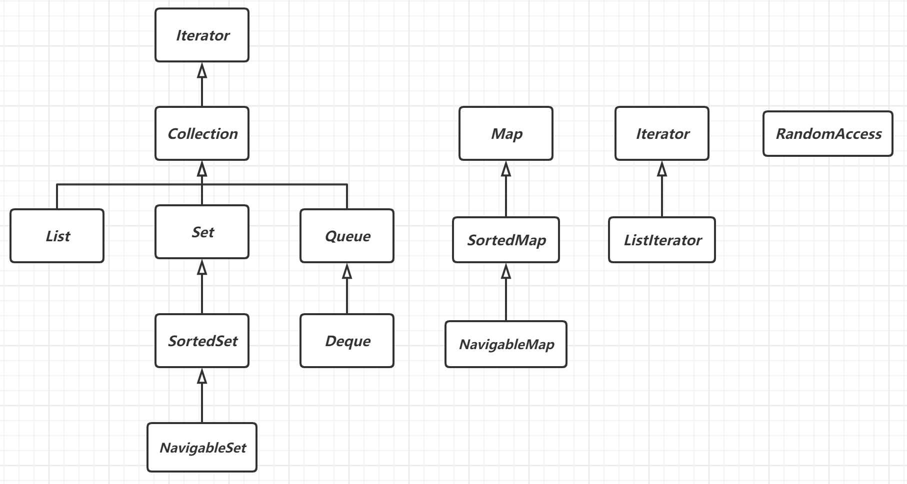

# Java核心技术1

## 主体内容


## 第一章

### **1.发展**

* 1996(sun)--->Java 1.0

* 1998(sun)--->Java 1.2

* 2004(sun)--->Java 5.0            (引入Java **泛型**（generics))

* 2006(sun)--->Java 6

* 2009(Oracle)--->收购

* 2011(Oracle)--->Java 7

* 2014(Oracle)--->Java 8         (引入的一个核心概念是**函数式接口**)

### **2.Java术语**

**JDK (Java Development Kit)--->Java开发工具包**

**JRE (Java Runtime Environment)--->Java运行时环境（含虚拟机）**

**JVM (Java Virtual Machine)--->Java虚拟机**

**Java SE (Java的标准版)**


## 第二章

### 配置java环境

#### 1.下载JDK

<a href="https://www.oracle.com/java/technologies/downloads/#license-lightbox">Windows   64位      JDK11</a>

#### 2.配置环境变量

1. win + i   打开设置
2. 点击系统------>点击关于----->点击高级系统设置
3. 点击环境变量
4. 点击系统变量的新建
5. 变量名写%JAVA_HOME%         变量值写安装jdk的目录
6. 然后在系统变量中找到Pat9h 双击进入 ---->点击新建----->找到jdk下面的bin目录，然后点击确定

#### 3.查看

打开终端输入

```shell
java -vserion
```


## 第三章

### 1. "Hello World"

```java
public class FirstSample {
    public static void main(String[] args) {
        System.out.println("Hello World");
    }
}
```

**java区分大小写**

`main`方法必须是`public`

源代码的文件名必须与公共类的名字相同，并用 .java 作为扩展名。类名的命名必须为驼峰命名法。


编译过程

```bash
$ javac Tesrt.java    # javac将Test.java文件转换成字节码（.class 文件）

$ java Test           #  字节码文件由jvm执行
```


### 2. 注释

```java
// ...    行注释  


/* ...  段落注释  */     


/**
  *		方法注释/类注释
  *
  */
```

### 3. 数据类型

java整型

| 类型  | 存储需求 | 取值范围                                              |
| ----- | -------- | ----------------------------------------------------- |
| int   | 4字节    | -2 147 483 648 ~ 2 147 483 647                        |
| short | 2字节    | -32 786 ~ 32 767                                      |
| long  | 8字节    | -9 223 372 036 854 775 808 ~9 223 372 036 854 775 807 |
| byte  | 1字节    | -128 ~ 127                                            |

长整数有一个后缀L或l。十六进制数有一个前缀0x或者0X。八进制有一个前缀0。从java7开始加上前缀0b或者0B表示二进制数。还可以位数值加下划线如(100_000_000)，方便辨认位数。

java没有任何无符号(unsigned)的int、short、long、byte。


java浮点

| 类型   | 存储需求 | 取值范围                                                     |
| ------ | -------- | ------------------------------------------------------------ |
| float  | 4字节    | 大约 ${\pm}$ 3.402 823 47E + 38F（有效位数6 ~ 7位）          |
| double | 8字节    | 大约 ${\pm}$ 1.797 693 134 862 315 70E + 308 （有效位数15位） |

float类型的数值有一个后缀F或f。没有后缀F的浮点数值默认为double类型。也可以用后缀D或d表示double类型。


char类型表示单个字符，有些Unicode字符需要两个char值。

boolean类型有两个值：false和true，用来判定逻辑条件。整数与布尔值之间不能进行转换。


### 4. 变量

java中每一个变量都有一个类型（Type）。

final修饰的变量表示常量，表示这个变量只能被赋值一次。

```java
public class Test{
    
    public static final int LENG = 3;
    
    public static void main(String[] args){
        
         final double PI = 3.141592;
    }
}
```

Math类

```java
// 三角函数
Math.sin()
Math.cos()  
Math.tan()
Math.atan()  
Math.log(以e为底)   
Math.exp(e指数)  
    
// 常量    
Math.PI   Math.E
    
// Math类的常见方法
Math.sqrt(x)    // 开根
Math.pow(x,a)   // 幂运算  x的a次幂
Math.round(x)   // 舍入运算  
```


### 5. 类型转换

>   数值之间的合法转换

实线表示无信息丢失的转换，虚箭头表示可能有精度损失的转换。


>    强制类型转换

double类型转int

```java
double x = 9.997;  

int n = (int)x;    // 直接舍弃小数部分，n = 9

int n2 = (int) Math.round(x);   // 舍入运算，n2 = 10  round方法返回long类型
```


boolean类型不与任何类型进行强制类型转换。


如果试图将一个数值从一种类型强制转换为另一种类型，而又超出了目标类型的表示范围，结果就会截取成一个完全不同的值。

```java
int a = 300;
byte b = (byte)a;   //  b为44
```


### 6. 运算符

1.   二元赋值运算符

```java
x += 4 ;  // 等价于 x = x + 4
```

2.   自增与自减

```java
int m = 7;
int n = 7;
int a = 2 * ++m;  // a=16, m=8
int b = 2 * n++;  // b=14, n=7
```

3.   关系运算符

| 运算符 | 举例       | 描述       |
| ------ | ---------- | ---------- |
| ==     | 3 == 7     | 检测相等性 |
| !=     | 3 != 7     | 检测不等性 |
| <      | 3  <  7    | 小于       |
| >      | 3  >  7    | 大于       |
| <=     | 3   <=  7  | 小于等于   |
| >=     | 3   >=   7 | 大于等于   |

4.   逻辑运算符

| 运算符 | 描述   |
| ------ | ------ |
| &&     | 条件与 |
| \|\|   | 条件或 |

5.   三元运算符

```java
x < y ? x : y;   // 返回x，y中较小者
```

6.   位运算符

处理整数类型时，可以直接对整型数值的各个位完成操作。

| 运算符 | 描述                                                 |
| ------ | ---------------------------------------------------- |
| &      | 位与                                                 |
| \|     | 位或                                                 |
| ^      | 如果相对应位值相同，则结果为0，否则为1               |
| ~      | 位取反                                               |
| >>     | 按位右移运算符。左操作数按位右移右操作数指定的位数。 |
| <<     | 按位左移运算符。左操作数按位左移右操作数指定的位数。 |


### 7. String类

java 为字符串操作专门设计了一个类String。String不属于基本类型。


1.   声明并赋值字符串变量

```java
String str = "hello";            // 字符串拼接直接用"+"号 
String str1 = new String("hello");
```

2.   String类的常用方法

     1.   返回字符长度   length()
     2.   大小写转化     toLowerCase()   toUpperCase()
     3.   去除字符串两端的空格   trim()  
     4.   截取字符串     subString(int  beginIndex)        subString(int  beginIndex, int endIndex)
     5.   ....

3.   String类的静态方法

     1.    join方法:  用定界符分隔多个字符串

          ```java
          String[] arr = {"Frank", "Tim", "Alan", "Aim"};
          System.out.println(String.join("-->", arr));
          // Frank-->Tim-->Alan-->Aim  
          ```

4.    equals方法

     检测两个字符串是否相等```s.equals(t)``` ，s 和 t 可以是字符串变量，也可以是字面量

     ```java
     "".equals(null);   // false
     ```

     

###  8. 输入输出

1.标准输入流

```java
Scanner in = new Scanner(System.in);   // Scanner类位于java.util包
String in1 = in.nextLine();    // nextLine 读取整行内容，包含空格
String in2 = in.next();    // next 读取一个单词，以空格分隔
```

2.标准输出流

```java
System.out.prinln();
```

3.格式化输出

```java
System.out.prinf();
```


用于prinf的转化符

| 转换符 | 类型           | 举例       |
| ------ | -------------- | ---------- |
| d      | 十进制整数     | 159        |
| x      | 十六进制整数   | 9f         |
| o      | 八进制整数     | 237        |
| f      | 定点浮点数     | 15.9       |
| e      | 指数浮点数     | 1.59e+01   |
| g      | 通用浮点数     | ——         |
| a      | 十六进制浮点数 | 0x1.fccdp3 |
| s      | 字符串         | Hello      |
| c      | 字符           | H          |
| b      | 布尔           | True       |
| h      | 散列码         | 42628b2    |
| %      | 百分号         | %          |
| n      | 换行           | ——         |


用于printf的标志

| 标志               | 目的                                                         | 举例         |
| ------------------ | ------------------------------------------------------------ | ------------ |
| +                  | 打印正数和负数的符号                                         | +3333.33     |
| 空格               | 在整数之前添加空格                                           | \| 3333.33\| |
| 0                  | 数字前面补0                                                  | 003333.33    |
| -                  | 左对齐                                                       | \|3333.33 \| |
| (                  | 将负数括在括号内                                             | (3333.33)    |
| ,                  | 添加分组分隔符                                               | 3,333.33     |
| #  (对于f格式)     | 包含小数点                                                   | 3,333.       |
| # （对于x或o格式） | 添加前缀 0x 或 0                                             | 0xcafe       |
| $                  | 给定被格式化的参数索引。例如，%1$d，%1\$x将以十进制和十六进制格式打印第一个参数 | 159    9F    |
| <                  | 格式化前面说明的数值。例如，%d%<x以十进制和十六进制打印同一个数值 | 159    9F    |


日期和时间的转换符（日期的转换符要在前加t，如：System.out.printf("%tc",new Date());） 

| 转换符 | 类型                                          | 举例                           |
| ------ | --------------------------------------------- | ------------------------------ |
| c      | 完整的日期和时间                              | 周六 10月 29 09:24:05 CST 2022 |
| F      | ISO 8601 日期                                 | 2022-10-29                     |
| D      | 美国格式日期（月/日/年）                      | 10/29/22                       |
| T      | 24小时时间                                    | 09:28:16                       |
| r      | 12小时时间                                    | 09:28:39 上午                  |
| R      | 24小时时间没有秒                              | 09:29                          |
| Y      | 4位数字的年（前面补0）                        | 2022                           |
| y      | 年的后两位数字（前面补0）                     | 22                             |
| C      | 年的前两位数字（前面补0）                     | 20                             |
| B      | 月的完整拼写                                  | 十月                           |
| b或h   | 月的缩写                                      | 10月                           |
| m      | 两位数字的月（前面补0）                       | 10                             |
| d      | 两位数字的日（前面补0）                       | 09                             |
| e      | 两位数字的日（前面不补0）                     | 9                              |
| A      | 星期几的完整拼写                              | 星期六                         |
| a      | 星期几的缩写                                  | 周六                           |
| j      | 三位数的年中的日子（前面补0），在001到366之间 | 302                            |
| H      | 两位数字的小时（前面补0），在0到23之间        | 18                             |
| k      | 两位数字的小时（前面不补0），在0到23之间      | 18                             |
| I      | 两位数字的小时（前面补0），在0到12之间        | 09                             |
| l      | 两位数字的小时（前面不补0），在0到12之间      | 9                              |
| M      | 两位数字的分钟（前面补0）                     | 41                             |
| S      | 两位数字的秒（前面补0）                       | 52                             |
| L      | 三位数字的毫秒（前面补0）                     | 308                            |
| N      | 九位数的毫微秒（前面补0）                     | 923000000                      |
| p      | 上下午的标志                                  | 上午      pm                   |
| z      | 从GMT起，RFC822数字位移                       | +0800                          |
| Z      | 时区                                          | CST                            |
| s      | 从格林威治时间 1970-01-01 00:00:00 起的秒数   | 1667007969                     |
| Q      | 从格林威治时间 1970-01-01 00:00:00 起的毫秒数 | 1667008009322                  |


在printf中使用索引，索引必须紧跟%后，并以$终止。从1开始。

```java
System.out.printf("%1$tr %1$tA", new Date());   // 09:51:34 上午 星期六
```

打印发票单

```java
Map<String, Double> map = new HashMap<>();
map.put("IPhone 14pro max", 12000.0);
map.put("Huawei mate40 pro", 11000.0);
map.put("xiaomi 12 pro", 12000.0);

System.out.printf("%-20s%18s", "商品名", "价格");
System.out.print("\n------------------------------------------\n");
map.forEach((k, v) -> {
    System.out.printf("%-20s% 20.2f元\n", k, v);
});
```

String.format方法创建一个格式化字符串，而不打印输出。

```java
String message = String.format("hello, my name is %s price is %.2f$", "Tom",33.5);
```


4.文件输入输出

对文件的读取需要一个用File对象构造一个Scanner对象。

```java
Scanner in = new Scanner(Paths.get("D:\\note\\Test_Study\\src\\file.txt"), "utf8");
```

如果文件名中包含反斜杠符号，就必须在每个反斜杠符之前再加一个反斜杠符："D:\\\note\\\Test_Study\\\src\\\file.txt"；


如果要写入文件，就要构造一个PrintWriter 对象。在构造器中只需提供文件名。

```java
// PrintWriter 可以使用和System.out一样的print，printf，println方法，会覆盖文件内容写入
PrintWriter pw = new PrintWriter("D:\\note\\Test_Study\\src\\file.txt", "utf8");
pw.printf("%1$tr %1$tA", new Date());
pw.close();

// FileWriter 可以实现文件内容的追加写入
FileWriter fw = new FileWriter("D:\\note\\Test_Study\\src\\file.txt", true);
fw.write(String.format("%1$tr %1$tA", new Date()));
fw.close();
```

### 9. 控制流程

1.块(block)作用域  {}

```java
class Test{

	static
    {
          //  ...
    }
    
	public void test()
    {
      	  // ...
    }
    
}
```

2.条件语句

if

```java
if(){
    
    // ...
    
} else() {
    
    // ...
    
    if(){
        
        // ...
    }
} 
```

for

```java
for(表达式1;表达式2;表达式3){
    	
    表达式4;         	// 执行顺序
    				  //  表达式1 --> 表达式2 --> 表达式4 --> 表达式3
}
```

while

```java
int a = 0; // 表达式1
while(表达式2){

    // 表达式4            
    					 // 执行顺序
    				     //  表达式1 --> 表达式2 --> 表达式4 --> 表达式3
	a++;  // 表达式3
}
```

do-while 的第一次循环不用进行比较

```java
int b = 10;  // 表达式1
do {
    System.out.println(b); // 表达式4
                          		       // 执行顺序
    				  				   //  表达式1 --> 表达式2 --> 表达式4 --> 表达式3
    b--;  // 表达式3
} while (b > 0);   // 表达式2
```

swith

```java
switch(choice){
        
    case 1:
        // ...
        break;
    case 2:
        // ...
        break;
    default:
        // ...
        break;
}
```

switch语句中的case标签可以是：

1.   类型为char、byte、short或int的常量表达式
2.   枚举常量
3.   从java7开始支持字符串字面量

**增强循环------```for  each```**

```java
// 把字符串拆分多个字符输出
String name="String";
for (char i:name.toCharArray()         // for  each
     ) {
    System.out.println(i);
}
```

**中断控制流程语句**

break   直接跳出，结束循环

```java
for (int a = 0; ; a++) {

    System.out.println("a = " + a);

    if (a > 2) break;
}
```

continue   跳出当次循环，下次循环继续执行

```java
for (int a = 0; a < 10; a++) {

    if (a == 2) continue;        // 不输出2

    System.out.println("a = " + a);
}
```

### 10. 大数据

​		如果基本的整数和浮点数精度不能够满足需求，那么可以使用java.math包中的两个很有用的类：BigInteger和BigDecimal。这两个类可以处理任意长度数字序列的数值。BigInteger类实现了任意精度的整数运算，BigDecimal实现了任意精度的浮点数运算。

#### 10.1. 大整数

```java
BigInteger a = new BigInteger("2342342342234234");   // 创建一个大数值整数

BigInteger b =  BigInteger.valueOf(123);     // 静态方法valueOf()可以将普通数值装换为大数值

BigInteger c = a.add(b);                   // 加法
```

>   API  java.math.BigInteger 1.1

*   BigInteger  add(BigInteger  other)                 加法

*   BigInteger  subtract(BigInteger  other)          减法

*   BigInteger  multiply(BigInteger  other)         乘法

*   BigInteger divide(BigInteger  other)              除法

*   BigInteger  mod(BigInteger  other)                取余

*   int  compareTo(BigIneger  other)

    比较，相等返回0，大于返回负数，小于返回整数

#### 10.2. 大实数

```java
BigDecimal a1 = new BigDecimal("2342342342234234.2");
BigDecimal b1 = BigDecimal.valueOf(123.2);

BigDecimal c1 = a1.add(b1);
System.out.println("c = " + c1);
```

>   API  java.math.BigDecimal  1.1

*   BigDecimal  add(BigDecimal  other)                 加法

*   BigDecimal  subtract(BigDecimal  other)          减法

*   BigDecimal  multiply(BigDecimal  other)         乘法

*   BigDecimal  divide(BigDecimal  other)              除法

*   BigDecimal  mod(BigDecimal  other)                取余

*   int  compareTo(BigDecimal  other)

    比较，相等返回0，大于返回负数，小于返回整数


### 11. 数组

数组是一种数据结构，存储同一类型的值的集合。

```JAVA
int[] arr = new int[5];
int[] arr1 = {1, 2, 3, 4};
```

创建一个数字数组，所有元素初始化为 0，boolean 数组元素初始化为 false。对象数组初始化值为 null。


数组拷贝（Arrays.copyOf() ）

```java
int[] arry = new int[]{1, 2, 3, 4, 5};
int[] ints = Arrays.copyOf(arry, arry.length);   // 重新为数据分配空间存储
```


>   API    java.util.Arrays  1.2

*   static String toString(type[]  a)       5.0

*   static typr copyOf(typr[] a,  int  length)   6

*   static typr copyOf(typr[] a,  int  start,  int  end)   6

*   static  void  sort(type[]  a)

    快速排序数组

*   static  int  binarySearch(type[]  a, type   v)

*   static typr binarySearch((typr[] a,  int  start,  int  end,  type   v)   6

    使用二分查找在a数组中查找v，start为起始下标，end为结束下标，如果查找成功返回对应下标值，反之返回负数。

*   static  void  fill(type[]  a, type  v)

    将数组的所有元素值都设置为v。

*   static boolean equals(type[] a, type[] b)

    如果两个数组大小相等，并且下标相同的元素都对应相等，返回true。


### 12. 多维数组

二维数组

```java
int[][] arr = {{1, 2, 4}, {4, 5, 6}, {7, 8, 9}};

int[][] arr = new int[][]{{1, 2, 4}, {4, 5, 6}, {7, 8, 9}};
```


遍历每一个元素

```java
for (int[] ints : arr) {
    for (int anInt : ints) {
        System.out.println("anInt = " + anInt);
    }
}
```

快速打印一个二维数组

```java
System.out.println(Arrays.deepToString(arr));
```


>   不规则数组

​	java实际上没有多维数组，只有一维数组。多维数组被解释为数组的数组。

```java
int[][] arr = {{1}, {2, 2}, {3, 3, 3}};

for (int[] ints : arr) {
    for (int a : ints) {
        System.out.print(a +" ");
    }
    System.out.println();
}
/*  输出结果
1 
2 2 
3 3 3 
*/
```


### 13. 注意

1. NaN不是一个数字。计算0/0或负数的平方根时结果是NaN。
2. char表示单个字符
3. boolen类型。整型值与布尔值之间不能互相转换。
4. 变量名必须是一个以字母开头并由字母或数字构成的序列。
5. 强制类型转换通过截断小数部分将浮点数值转换为整型。
6. java没有内置字符串类型，在标准java类库中提供了一个String类。
7. 字符串不能用==做判断，而用str.equals(otherStr)方法判断。
8. 空串""，指长度为0的字符串。
9. null指空对象。
10. jdk提供Arrays.sort()方法用于排序数组。源码实现为快速排序。


## 第四章

### 1. oop编程

**面向对象程序设计**（英语：Object-oriented programming，缩写：OOP）是种具有对象概念的编程典范，同时也是一种程序开发的抽象方针。它可能包含数据、特性、代码与方法。对象则指的是类（class）的实例。它将对象作为程序的基本单元，将程序和数据封装其中，以提高软件的重用性、灵活性和扩展性，对象里的程序可以访问及经常修改对象相关连的数据。在面向对象程序编程里，计算机程序会被设计成彼此相关的对象。

面向对象程序设计可以看作一种在程序中包含各种独立而又互相调用的对象的思想，这与传统的思想刚好相反：传统的程序设计主张将程序看作一系列函数的集合，或者直接就是一系列对电脑下达的指令。面向对象程序设计中的每一个对象都应该能够接受数据、处理数据并将数据传达给其它对象，因此它们都可以被看作一个小型的“机器”，即对象。目前已经被证实的是，面向对象程序设计推广了程序的灵活性和可维护性，并且在大型项目设计中广为应用。此外，支持者声称面向对象程序设计要比以往的做法更加便于学习，因为它能够让人们更简单地设计并维护程序，使得程序更加便于分析、设计、理解。反对者在某些领域对此予以否认。


面向过程与面向对象程序设计的比较


### 2. class (类)

​		类（class）是构造对象的版图或蓝图。由类构造（construct）对象的过程称为创建类的实例（instance）。封装（encapsulation，有时称为数据隐藏），指将数据和行为组合在一个包中，并对对象的使用者隐藏了数据和实现方法。对象中的数据称为实例域（instance field）。操纵数据的过程称为方法（method）。对于每个特定的类实例（对象）都有一组特定的实例域值。这些值的集合就是这个对象的当前状态（state）。

java中所有的类都源于Object类。通过扩展一个类来建立另外一个类的过程称为继承（inheritance）。


### 2. 对象的三个特性

* 行为(behavior)

  可以对对象施加那些操作，或可以对对象施加哪些方法？

* 状态(state)

  当施加哪些方法时，对象如何响应？

* 标识(identity)

  如何辨别具有相同行为与状态不同的对象？

<u>如果不经过方法调用就可以改变类的状态，就说明封装性遭到了破坏。</u>

### 3. 类与类之间的关系

* 依赖("uses-a")

    如一个类的方法操纵另一个类的对象。

    ```java
    // A 依赖 B
    class A {            
        public void fun1(B b) {
            // ...
        }
        public B fun2() {
            // ...
            return new B();
        }
    }
    class B { }
    ```
* 聚合("has-a")

    类A的对象包含类B的对象。

    ```java
    // A 聚合 B 
    class A {            
        private B b;     
    }
    
    class B { }
    ```

* 继承("is-a")

    ```java
    // B 继承 A
    class A {
      
    }
    
    class B extends A {      
    
    }
    ```

<u>减少"依赖"关系的类，从而降低代码耦合度。</u>


表达类关系的UML符号

| 关系     | UML链接符             |
| -------- | --------------------- |
| 继承     | ——————\|>             |
| 接口实现 | ------------------\|> |
| 依赖     | ------------------>   |
| 聚合     | <>—————               |
| 关联     | ———————               |
| 直接关联 | ———————>              |


### 4. 创建对象

要想使用对象，就必须首先构造对象，指定其初始状态。在java中使用构造器（constructor）构造新实例。

```JAVA
new Date();		// new 关键字用于创建对象
```

new 操作符调用构造器返回一个实例。

```JAVA
Date today = new Date();   // today为对象引用
```


java标准类库分别包含了两个类

1.   Date                用来表示时间点
2.   LocalDate       用来表示日历

```java
// 创建一个日历类
LocalDate.now();

// 构造一个指定日期的日历类
LocalDate.of(1999, 12, 31);

// plusDays()方法
LocalDate now = LocalDate.now();
LocalDate after100 = now.plusDays(100);   // plusDays() 返回指定天数后的一个新的LocalDate实例
```

>   设计一个日历的打印程序

```java
package test.com.javaSE1.fourthUnit;

import java.time.DayOfWeek;
import java.time.LocalDate;

public class LocalDateTest {

    public static void main(String[] args) {

        LocalDate date = LocalDate.now();
        int month = date.getMonthValue();
        int today = date.getDayOfMonth();

        date = date.minusDays(today - 1);
        DayOfWeek weekday = date.getDayOfWeek();
        int value = weekday.getValue();

        System.out.println("Mon Tue Wed Thu Fri Sat Sun");
        for (int i = 1; i < value; i++)
            System.out.print("    ");

        while (date.getMonthValue() == month) {
            System.out.printf("%3d", date.getDayOfMonth());
            if (date.getDayOfMonth() == today) {
                System.out.print("*");
            } else
                System.out.print(" ");
            date = date.plusDays(1);
            if (date.getDayOfWeek().getValue() == 1) System.out.println();

        }
        if (date.getDayOfWeek().getValue() != 1) System.out.println();
    }
}
```

>   API    java.time.LocalDate    8

*    static LocalTime now()

*   static LocalTime of(int  year, int  month, int  day)

*   int  getYear()

*   int  getMonthvalue()  

*   int  getDayOfMonth()

    获得当前日期的年、月、日

*   DayOfWeek  getDayOfWeek

    得到当前日期是星期几，作为DayOfWeek类的一个实例返回。调用 getValue 来得到 1 ~ 7 之间的一个数，表示这是星期几，1 表示星期一，7 表示星期日。

*   LocalDate  plusDays(int  n)

*   LocalDate  minusDays(int  n)

    生成当前日期之后前 n 天的日期。

#### 4.1. 构造器

构造器是特殊的方法，构造器用来构造新实例，可以用来初始化实例。**构造器名与类名必须相同，无返回值。**

```JAVA
new Student();   // 无参构造器

new Student("frank", 12, "男");   // 有参构造器
```

***对象引用不包含一个对象，而仅仅引用一个对象。***

```JAVA
Date today;      // 创建一个对象引用   frank引用null
```

构造器调用构造器：

```JAVA
public Student(String id, String name){
    this(id);	// 调用已有构造
    this.name = name;
}
```


>   关于构造器

*   构造器与类同名
*   每个类可以有一个以上的构造器
*   构造器可以有0个、1个或多个参数
*   构造器没有返回值
*   构造器总是伴随  new 操作一起调用


#### 4.2. 访问器

**只访问而不修改对象的方法称为访问器。**

get方法

**获取当前年月日**

```JAVA
LocalDate date = LocalDate.now();
int year = date.getYear();
int month = date.getMonthValue();
int day = date.getDayOfMonth();
```

#### 4.3.  更改器

改变实例状态的方法称为更改器。

set方法

#### 4.4. 隐式参数与显示参数

```JAVA
public void setName(String name) {
      this.name = name;
}
```

this为隐式参数，name为显示参数。


>    设计原则

*   一个私有的数据域
*   一个公有的域访问器方法       （get）
*   一个公有的域更改器方法       （set）


### 5. 基于类访问权限

一个方法可以访问所属类的所有私有数据。

```java
public class Test2 {

    private String t1 = "t1";

}
```

私有方法不会被外部的其他类调用，私有方法通常做辅助方法。

private 修饰的私有方法不会被外部调用，只能在被本类的其他任意方法调用。


| 访问修饰符 | 作用对象 | 可见性                                                     |
| ---------- | -------- | ---------------------------------------------------------- |
| private    | 变量     | 创建的实例无法直接访问                                     |
|            | 实例方法 | 创建的实例无法直接调用                                     |
|            | 静态变量 | 类外无法直接访问                                           |
|            | 静态方法 | 类外无法直接调用                                           |
| public     | 变量     | 创建的实例可以直接访问                                     |
|            | 实例方法 | 创建的实例可以直接调用                                     |
|            | 静态变量 | 类外可以直接访问                                           |
|            | 静态方法 | 类外可以直接调用                                           |
| protected  | 变量     | 创建的实例可以直接访问（同一包下）、继承类可见（同一包下） |
|            | 实例方法 | 创建的实例可以直接调用（同一包下）、继承类可见（同一包下） |
|            | 静态变量 | 类外可以直接访问（同一包下）、继承类可见（同一包下）       |
|            | 静态方法 | 类外可以直接调用（同一包下）、继承类可见（同一包下）       |
| default    | 变量     | 创建的实例可以直接访问（同一包下）、继承类可见             |
|            | 实例方法 | 创建的实例可以直接调用（同一包下）、继承类可见             |
|            | 静态变量 | 类外可以直接访问（同一包下）、继承类可见                   |
|            | 静态方法 | 类外可以直接调用（同一包下）、继承类可见                   |


### 6. final实例域

<u>final修饰实例域时，必须确保在每一个构造器执行之后，这个域被实例化。</u>

```JAVA
final double PI = 3.1415926;
```

final域必须在构建对象是初始化。final修饰符大都应用于基本类型域，或不可变类的域。

**不可变类：类中的每个方法都不会改变其对象。**


### 7. 静态域与静态方法

```JAVA
static final double PT = 3.1415926;
```

静态域属于类，不属于任何独立的实例。

静态方法是一种不能向对象实施操作的方法。

使用场景：

* 一个方法不需要访问对象状态，其所需的参数都是通过显示参数提供的。
* 一个方法只需访问类的静态域。
* 工厂方法

**工厂方法：不使用构造器创建对象**

```JAVA
LocalDate date = LocalDate.now();   // LocalDate的实例有静态now()方法创建。
```


### 8. 方法参数

​		java语言总是采用按值调用。方法得到的所有参数都是一个参数值的拷贝，方法不能修改传递给它的任何参数变量的内容。


方法参数有两种：

* 基本数据类型
* 对象引用 


java语言对对象采用的不是引用调用。


### 9. 静态初始化块

```JAVA
// 静态常量域  (未初始化)
private static final String url;
private static final String user;
private static final String password;

// 静态代码读取 db.properties 配置文件
static {
    try {
        
        InputStream inputStream = ClassLoader.getSystemResourceAsStream("db.properties");
        Properties properties = new Properties();  // Properties类用于读取.properties文件，它需要一个InputStream实例
        properties.load(inputStream);

        url = properties.getProperty("url");
        user = properties.getProperty("user");
        password = properties.getProperty("password");

        } catch (Exception e) {
            e.printStackTrace();
        }
}
```


### 10. 对象析构与finallize方法

java有自动垃圾回收器（jvm），java不支持析构器。

finallize方法将在垃圾回收器清除对象之前调用。


### 11. package

java通过包（package）组织类。使用包的主要原因是确保类名的唯一性。

import语句用来引入包。

```JAVA
import java.time.LocalDate;
import java.time.*;
```

import语句用来引入静态域和静态方法。

```JAVA
import static java.lang.System.*;
public class Test {
    public static void main(String[] args) throws Exception {
        out.println("hello");
    }
}
```

类的路径必须唯一。

​	

### 12. 注意

1. 在java中，所有的类都由object扩展来。
2. 一个源文件中，只能有一个公有类，但可以有任意数目的非公有类。
3. 类设计技巧
   1. 一定保证数据的私有
   2. 一定要对数据初始化
   3. 不要在类中使用过多的基本类型
   4. 不是所有的域都需要独立的get和set方法
   5. 将职责过多的类分解
   6. 类名和方法名做到见名知意
   7. 优先使用不可变类


## 第五章

​		继承（inheritance）是基于已经存在的类构造一个新类，继承已经存在的类的方法和域。java使用关键字extends指示继承。子类比超类拥有的功能更加丰富。

### 1.  定义子类

```JAVA
class Manager extends Employee{
    
    // ...   添加方法和域
    
}   
```

### 2. @Override (覆盖)

想要重写从父类哪里继承的方法时，又要调用原先的父类方法可以使用super关键字来调用。

```JAVA
class Manager extends Employee {
    
    @Override
    public double getSalay() {
        return bouns + super.getSalay();
    }

}
// 子类不能直接访问超类的私有域，必须提供访问接口。
```

​	除此之外spuer()表示调用父类构造器

```JAVA
class Manager extends Employee {

    Manager(String name,String sex,String stuID){
        super(name,sex);			//  默认调用super();
        this.stuID = stuID;
    }

}
```

<u>如果子类的构造器没有显示地调用超类的构造器，则默认调用超类的无参构造器。</u>

***在覆盖一个方法时，子类方法不能低于超类的方法的可见性。***

### 3. 多态（polymorphism）

一个对象变量可以指示多种实际类型的现象称为多态（polymorphism）。在运行时能够自动选择调用哪个方法的现象称为动态绑定（dynamic binding）。

```JAVA
Employee boss = new Manager(); // 超类引用变量可以引用任意一个子类对象。
```

不能将一个超类的引用赋给子类变量。（必须进行类型转换）

类型转换的唯一原因：在暂时忽略对象的实际类型后，使用对象的全部功能。

```JAVA
Manager frank = new Employee();      // Error 
```

```JAVA
Manager feank = (Manager) new Employee();  
```


### 4. 继承层次

由一个公共类派生出来的所有类的集合称为继承层次，从某个特定的类到其祖先的路径称为该类的继承链。

>   图为AbstractCollection集合继承链：


**java不支持多继承。**


### 5. 方法调用过程

>   方法的<u>名字</u>和<u>参数列表</u>称为方法的签名。<u>返回值</u>不是签名的一部分。

调用过程：

1.   编译器查看对象的声明类型和方法名。编译器会一一列举所有实例的方法名和超类中的public方法。

     至此，编译器已获得所有可能被调用的方法。

2.   接下来，编译器将查看调用方法是提供的参数类型。这个过程称为重载解析（overloading resolution）。

     至此，编译器已获得需要调用的方法名和参数类型。

3.   如果是private方法、static方法、final方法或者构造器，那么编译器将准确的知道应该调用那个方法，这种调用方法称为静态绑定（static binding）。

4.   当程序运行时，并且采用动态绑定调用方法时，虚拟器一定调用与变量所引用的实际对象最合适的那个类的方法。

​		每次调用方法都要进行搜索，时间开销相当大。因此，虚拟器预先为每个类创建了一个方法表（method table），其中列出所有方法的签名和实际调用的方法。

​		动态绑定的特性：无需对现存的代码进行修改，就可以对程序进行扩展。

### 6. 阻断继承：final类和方法

​		不允许扩展的类称为**final**类。如果将一个类中的方法声明为final，子类就不能覆盖这个方法。（**final类中的所有方法自动成为final**，不包括域。）

```JAVA
public final class String
    implements java.io.Serializable, Comparable<String>, CharSequence {

    // ...
};
```

**将方法或类声明为final主要目的是：确保它们不会在子类中改变语义。**


### 7. instanceof

在将超类转换成子类之前，应当用instanceof运算符检查是否可以进行类型转换。

```JAVA
Person p= new Person();
boolean b = p instanceof Student;  // b值为Error
```

应该尽量少用类型转换和instanceof运算符。


### 8. 抽象类

在继承层次上层的类更具有通用性，可以更加抽象。


**包含一个或多个抽象方法的类必须声明为抽象类。**

```JAVA
abstract class Person{ 
    public void getDesc();   // 抽象方法不需要实现
};
```

1.   类即使不含抽象方法，也可以将类声明为抽象类。

2.   抽象类不能实例化。但是可以定义一个抽象类的对象引用，而它只能引用非抽象子类的对象。

     

>   扩展抽象类的选择

1.   在抽象类中定义部分抽象类方法或不定义抽象类方法，子类声明为抽象类。
2.   定义全部的抽象方法，子类全部实现父类的抽象方法。


### 9. 受保护访问

#### 9.1. 构造方法前的访问修饰符

| **public**    | **所有类可以 new**      |
| :------------ | :---------------------- |
| **private**   | **自己可new(单类模式)** |
| **default**   | **同一包内可new**       |
| **protected** | **对同一包内的类**      |

#### 9.2. 访问修饰符

| **public**    | **所有类**                   | 类、变量、方法、接口     |
| :------------ | :--------------------------- | ------------------------ |
| **private**   | **自己**                     | **变量、方法**           |
| **default**   | **同一包内**                 | **类、变量、方法、接口** |
| **protected** | **对同一包内的类和所有子类** | **变量、方法**           |


### 10. Object

​		Object是所有类的超类。Object类型的变量可以引用任何类型的对象。在java中，只有基本类型（primittive types）不是对象，例如，数值、字符和布尔类型的值都不是对象。所有的<u>数组类型</u>，不管是对象数组还是基本类型的数组都扩展了Object类。

>    Object类的所有方法

```java
package java.lang;

import jdk.internal.HotSpotIntrinsicCandidate;

/**
 * Class {@code Object} is the root of the class hierarchy.
 * Every class has {@code Object} as a superclass. All objects,
 * including arrays, implement the methods of this class.
 *
 * @author  unascribed
 * @see     java.lang.Class
 * @since   1.0
 */
public class Object {

    private static native void registerNatives();
    static {
        registerNatives();
    }

    /**
     * Constructs a new object.
     */
    @HotSpotIntrinsicCandidate
    public Object() {}

    
    // native 关键字修饰的方法由本地方法实现
    @HotSpotIntrinsicCandidate
    public final native Class<?> getClass();

    @HotSpotIntrinsicCandidate
    public native int hashCode();

    public boolean equals(Object obj) {
        return (this == obj);
    }

    @HotSpotIntrinsicCandidate
    protected native Object clone() throws CloneNotSupportedException;

    public String toString() {
        return getClass().getName() + "@" + Integer.toHexString(hashCode());
    }

    @HotSpotIntrinsicCandidate
    public final native void notify();

    @HotSpotIntrinsicCandidate
    public final native void notifyAll();

    public final void wait() throws InterruptedException {
        wait(0L);
    }

    public final native void wait(long timeoutMillis) throws InterruptedException;
    
    public final void wait(long timeoutMillis, int nanos) throws InterruptedException {
        if (timeoutMillis < 0) {
            throw new IllegalArgumentException("timeoutMillis value is negative");
        }

        if (nanos < 0 || nanos > 999999) {
            throw new IllegalArgumentException(
                                "nanosecond timeout value out of range");
        }

        if (nanos > 0) {
            timeoutMillis++;
        }

        wait(timeoutMillis);
    }

    @Deprecated(since="9")
    protected void finalize() throws Throwable { }

}
```

getclass()方法返回对象的完全限定名。

#### 10.1. equals方法

Object中的equals方法。用于检测一个对象是否等于另一个对象。

特性：

1. 自反性

   ```JAVA
   x.equals(x); // 返回true
   ```

2. 对称性

   ```JAVA
   x.equals(y);
   y.equals(x);      // 返回值相同
   ```

3. 传递性

   ```JAVA
   x.equals(y);    // true
   y.equals(z);    // true
   
   x.equals(z);    // 应当返回true
   ```

4. 一致性

   如果x和y的引用对象未发生变化，反复调用equals方法返回值应当相同。

5. 对于任意的对象，x.equals(null)返回false。

***Arrays 类提供的 equals 方法用于检测两个数组是否相等。***

```JAVA
static Boolean equals(type[] a,type[] b);    // 如果两个数组长度相同，并且对应位置上的元素也均相同，将返回true
```


>   关于equals方法实现的建议

1.   显示参数命令为otherObject，稍后需要将它转换成另一个叫做other的变量。

2.   检测 this 与 otherObject 是否引用同一个对象。

     ```java
     if (this == otherObject)  return true;
     ```

3.   检测 otherObject 是否为 null ，如果为null 返回 false 。

     ```java
     if (otherObject == null)  return false;
     ```

4.   比较 otherObject 与 this 是否属于同一个类。

     如果 equals 的语义在每个子类中有所改变，就使用 getClass检测：

     ```java
     if (getClass() != otherObject.getClass())  return false;
     ```

     如果所有的子类都拥有统一的语义，就用 instanceof 检测：

     ```java
     if (!(otherObject instanceof ClassName)) return false;
     ```

5.   将 otherObject 转化为相应的类类型变量：
     ```java
     ClassName other = (ClassName)otherObject;
     ```

6.   对域进行比较时，使用 == 比较基本类型域，使用 equals 比较对象域。如果在子类中重写 equals ，就要调用 super.equals(other);


#### 10.2. hashCode方法

​		散列码（hash code）是对象导出的一个整型值。每个对象都有一个默认的散列码，字符串的散列码是由内容导出的。

```JAVA
// String 类的hashCode计算算法，字符串的散列码由内容导出
int hash = 0;
for (int i = 0;i<length();i++){
    hash = 31*hash + charAt(i);
}
```

**如果重新定义 equals 方法，就必须重新定义 hashCode 方法。**

#### 10.3. toString方法

返回表示对象值的字符串

```JAVA
@Override
public String toString() {
    
}
```


### 11. 泛型数组列表

java提供ArrayList类用于动态创建泛型数组。可以动态的增加或减少数组容量。

ArrayList采用了类型参数（type parameter）的泛型类（generic class）。

```java
ArrayList<String> al = new ArrayList<>();     // 类型参数必须是对象，基本数据类型使用其包装类
```

```java
ArrayList<String> al = new ArrayList<>(100);   // 指定初始容量
```


>   API   java.util.ArrayList\<E\>   1.2

*   ArrayList\<E>()

*   ArrayList\<E>(int  initialCapacity)

*   boolean  add(E  obj)

    在数组列表尾端添加一个元素。永远返回true。

*   int  size()

    返回数组列表中当前元素的数量。（小于等于数组容量）

*   void  ensureCapacity(int  capacity)

    确保数组列表在不重新分配存储空间的情况下就能够保存给定数量的元素。

*   void  trimToSize()

    将数组列表的存储容量消减到当前尺寸。

*   void  set(int  index, E  obj )

    设置数组列表指定位置的元素值，覆盖这个位置的原有内容。

*   E  get(int  index)

    获取指定位置的元素

*   void   add(int  index, E obj)

    向后移动元素，以便插入元素。

*   E remove(int  index)

    删除一个元素，并将后面的元素向前移动。


### 12. 包装器与自动装箱

包装器类为final类。在作用算时自动拆箱或自动装箱（autoboxing）。

包装类对象可以与 基本数据类型直接用运算符进行运算，运算时自动拆箱为基本数据类型。

| 基本类型 | 包装器类  |
| -------- | --------- |
| int      | Integer   |
| boolean  | Boolean   |
| long     | Long      |
| float    | Float     |
| short    | Short     |
| double   | Double    |
| byte     | Byte      |
| char     | Character |

**当Integer中存储的数位于-128到127之间的short和int被包装到固定的对象中。如果通过自动装箱并且是范围在-128到127之间得到的Integer对象指向该固定的对象。通过 `new` 运算符一定是新建立的对象。**

包装器对象使用equals方法进行比较。


### 13. 参数可变的方法

这里的参数实际上是一个数组。

```java
// out.println 方法是一个可变参数方法
System.out.printf("%d",number);
System.out.printf("%d %f",number,number2);
```

使用可变参数设计一个筛选名字长度大于5字符的姓名。

```java
public class Test {

    // 可变参数格式：	类型...
    public static List<String> of(String... strings) {
        return Arrays.stream(strings)   	        // 将数组转换为Stream对象 
            		 .filter(s -> s.length() > 5)   // stream的filter通过给定条件过滤流中数据
            		 .collect(Collectors.toList()); // 将流转换为List集合
    }

    public static void main(String[] args) {

        List<String> list = Test.of("Turing", "Flank", "Bob", "Aim", "Alexander");
        list.forEach(System.out::println);
    }
}
```


### 14. 反射

能够分析类能力的程序称为反射（reflective）。

>    反射机制可以用来

* 在运行时分析类的能力
* 在运行时查看对象
* 实现通用的数组操作代码
* 利用Method对象

**java.lang.reflect**包中有三个类**Field**、**Method**和**Constructor**分别用于描述类的**public**域、方法和构造器。

#### 14.1. Class

 java运行时系统为所有的对象维护一个被称为运行时的类型标识，java的Class保存了每个类型的信息。

Object的get.Class()方法返回一个Class实例。

获取Class对象的三种方法：

1.   通过已经创建的实例

```java
Print p = new Print("print1");   // Print是一个普通类
Class<?> cls1 = p.getClass();
```

2.   通过Class静态方法*forName()*

```java
String classString = "test.com.javaSE1.fifthUnit.Print";   // classString为类的完全限定名
Class<?> cls2 = Class.forName(classString);
```

3.   通过T.Class

```java
Class<?> cls3 = Print.class;
```


> API   java.lang.Class 1.0

* Filed[]   getFields()

    返回一个包含Field对象的数组，每个对象记录了这个类或超类的共有域。

* Field[]   getDeclaredFields()

    返回一个包含Field对象的数组，每个对象记录了这个类的全部域。

* Method[]  getMethods()

    返回包含Method对象的数组，包含所有公有方法，包括从超类继承的公有方法。

* Method[]  getDeclaredMethods()

    包含这个类或接口的全部方法，不包括由超类继承的方法。

* Constructor[]  getConstructors()

    返回包含Constructor的数组，包含了Class对象描述类的所有公有构造器。

* Constructor[]  getDeclaredConstructor()

    返回所有构造器。


#### 14.2. Field

getName会返回属性名

getType会返回属性类型（完全限定名）

```java
Class<?> cls1 = Double.class;

Field[] fields = cls1.getFields();   // 获取Field数组
for (Field field : fields) {
    System.out.printf("Name: %-20s", field.getName());
    System.out.printf("Type: %-20s", field.getType());
    System.out.println();
}
```

#### 14.3. Method

getName返回方法名

getParameters返回方法的参数列表

```java
Class<?> cls1 = Double.class;

Method[] methods = cls1.getMethods();
for (Method method : methods) {
    System.out.printf("Name: %-22s", method.getName());
    Parameter[] parameters = method.getParameters();
    AnnotatedType annotatedReturnType = method.getAnnotatedReturnType();
    for (Parameter p : parameters) {
        System.out.printf("Parameter: %-22s ", p);
    }
    System.out.printf("ReturnType: %44s", annotatedReturnType);
    System.out.println();
}
```

#### 14.4. Constructor

构造一个对象

```java
Class<Print> printClass = Print.class;
Print print = printClass
    .getDeclaredConstructor(String.class)
    .newInstance("print1");

print.print();
```

Print类

```java
public class Print {
    private String name;
    
    public Print(String name) {
        this.name = name;
    }

    public void print() {
        System.out.println(name + " ...");
    }
}
```


反射机制的默认行为受限于 java 的访问控制。覆盖访问控制需要调用Filed、Method或Constructor 对象的setAccessible 方法：

```java
declaredConstructor.setAccessible(true);
```

setAccessible 方法是 AccessibleObject 类中的一个方法，它是 Filed、Method或Constructor 类的公共超类。这个特性是为调试、持久存储和相似机制提供的。


#### 14.5. Modifier

Field、Method、Constructor三个类有一个getModifiers的方法，它返回一个整数值。Modifier类的静态方法用来判断修饰符的类型。

> API   java.lang.reflect.Modifier 1.1

* static String toString(int  modifiers)

    返回对应modifiers中对应的修饰符的字符串表示

* static boolean isAbstract(int  modifiers)

* static boolean isFinal(int  modifiers)

* static boolean isInterface(int  modifiers)

* static boolean isNative(int  modifiers)

* static boolean isPrivate(int  modifiers)

* static boolean isPublic(int  modifiers)

* static boolean isProtected(int  modifiers)

* static boolean isStatic(int  modifiers)

* static boolean isStrict(int  modifiers)

* static boolean isSynchronized(int  modifiers)

* static boolean isVolatile(int  modifiers)

对包装类Double方法的修饰符显示

```java
Method[] methods = Double.class.getMethods();
for (Method m :
     methods) {
    System.out.printf("Name: %-22s",m.getName());
    System.out.printf("Modifier: %-22s",Modifier.toString(m.getModifiers()));
    System.out.println();
}
```


>   使用反射对（任意类型）数组进行扩容

```java
public class Test {

    public static Object copyOf(Object a, int newLength) {
        Class<?> aClass = a.getClass();
        if (!aClass.isArray()) return null;
        Class<?> componentType = aClass.getComponentType();
        int length = Array.getLength(a);
        Object newArray = Array.newInstance(componentType, newLength);
        System.arraycopy(a, 0, newArray, 0, Math.min(length, newLength));
        return newArray;
    }

    public static void main(String[] args){

        String[] list = {"1", "2", "3", "4", "5"};
        list = (String[]) copyOf(list, 10);     // 扩容成功

    }
}
```

#### 14.6. Reflection

>   通过反射获取一个类的所有信息 

  <a download="download" href="./util/Reflection.java">Reflection.java</a>

```java
package test.com.javaSE1.fifthUnit;

import java.lang.reflect.Constructor;
import java.lang.reflect.Field;
import java.lang.reflect.Method;
import java.lang.reflect.Modifier;
import java.util.Scanner;

public class Reflection {

    public static void main(String[] args) {
        String name;
        if (args.length > 0) name = args[0];
        else {
            Scanner in = new Scanner(System.in);
            System.out.println("Enter class name (e.g  java.util.Date):  ");
            name = in.next();       // 控制台输入类的全路径名
        }
        try {
            Class cl = Class.forName(name);
            Class superCl = cl.getSuperclass();
            String modifiers = Modifier.toString(cl.getModifiers());
            if (modifiers.length() > 0) System.out.print(modifiers + " ");
            System.out.print("class " + cl.getSimpleName());
            if (superCl != null && superCl != Object.class) System.out.print(" extends " + superCl.getSimpleName());

            System.out.print("\n{\n");
            printFields(cl);
            System.out.println();
            printConstructors(cl);
            System.out.println();
            printMethods(cl);
            System.out.println("}");
        } catch (ClassNotFoundException e) {
            e.printStackTrace();
        }
        System.exit(0);
    }

    /**
     * 获取所有构造器
     *
     * @param cl
     */
    public static void printConstructors(Class cl) {
        Constructor[] constructors = cl.getDeclaredConstructors();
        for (Constructor c : constructors) {
            String name = cl.getSimpleName();
            System.out.print("  ");
            String modifiers = Modifier.toString(c.getModifiers());
            if (modifiers.length() > 0) System.out.print(modifiers + " ");
            System.out.print(name + "(");

            // print parameter types
            Class[] paramTypes = c.getParameterTypes();
            for (int i = 0; i < paramTypes.length; i++) {
                if (i > 0) System.out.print(", ");
                System.out.print(paramTypes[i].getName());
            }
            System.out.println(");");
        }
    }

    /**
     * Print all methods of a class
     *
     * @param cl
     */
    public static void printMethods(Class cl) {
        Method[] methods = cl.getDeclaredMethods();

        for (Method m : methods) {
            Class retType = m.getReturnType();
            String name = m.getName();

            System.out.print("  ");
            String modifiers = Modifier.toString(m.getModifiers());
            if (modifiers.length() > 0) System.out.print(modifiers + " ");
            System.out.print(retType.getName() + " " + name + "(");

            Class[] paramTypes = m.getParameterTypes();
            for (int i = 0; i < paramTypes.length; i++) {
                if (i > 0) System.out.print(", ");
                System.out.print(paramTypes[i].getName());
            }
            System.out.println(");");
        }
    }

    /**
     * Prints all fields of a class
     */
    public static void printFields(Class cl) {
        Field[] fields = cl.getDeclaredFields();

        for (Field f : fields) {
            Class type = f.getType();
            String name = f.getName();
            System.out.print("  ");
            String modifiers = Modifier.toString(f.getModifiers());
            if (modifiers.length() > 0) System.out.print(modifiers + " ");
            System.out.println(type.getName() + " " + name + ";");
        }
    }
}
```


### 15. 枚举类

枚举类都继承自Enum类，每个枚举值都是一个实例。

```java
public enum Size{ SMALL, MEDIUM, LARGE, EXTRA, EXTRA_LARGE};
```

枚举的比较用==号。

Enum 类的 toString 方法可以将实例的类名转换为 String。

```java
System.out.println(Size.SMALL.toString);
```

使用 Enum 类的 valueOf 反向生成枚举实例。

```java
Size size = Size.valueOf(Size.class, "SMALL");
```

枚举类型静态的values方法返回一个包含全部枚举值的数组。

```java
Size[] values = Size.values();
```

> API   java.lang.Enum\<E> 5.0

* static Enum valueOf(Class enumClass, String name)

    返回指定名字、给定类的枚举常量

* String toString()

    返回枚举常量值

* int  ordinal()

    返回枚举常量在enum声明中的位置，位置从0开始计数

* int compareTo(E  other)

    如果枚举常量出现在other之前，则返回一个负值；如果this==other，则返回0；否则，返回正值。枚举常量的出现次序在enum声明中给出。


### 16. 继承设计技巧

1. 将公共操作和域放在超类
2. 不要使用受保护的域
3. 使用继承实现“is-a”关系
4. 除非所有继承的方法都有意义，否则不要使用继承
5. 在覆盖方法时，不要改变预期的行为
6. 使用多态，而非类型信息
7. 不要过多的使用反射

 


## 第六章

### 1. 接口概念

<u>接口不是<font color="red">类</font>，而是对类的一组需求的描述。</u>

一个类可以实现一个或多个接口。implements表示实现某个接口。

```JAVA
// Student类实现 Desc、Comparable 接口
interface Desc{
    String desc();
}

class Student implements Desc,Comparable{
    @Override
    public String desc() {
        return null;
    }

    @Override
    public int compareTo(Object o) {
        return 0;
    }
}
```

<u>接口中的所有方法自动地都属于public，不需用提供public关键字。</u>

接口不能含有实例域。接口没有实例。

### 2. 比较器接口

#### 2.1. Comparable

```java
public interface Comparable<T> {
  
    public int compareTo(T o);   
    
}
```

​		Comparable接口的compareTo方法返回一个整型数值。如果两个对象不相等，则返回一个正值或负值。在想使用Arrays类的数组排序方法时，必须要实现Comparable接口。排序的规则可以通过对象的属性来指定。

```JAVA
// 通过实现compareTo方法实现以学生学号比较两个学生
class Student implements Comparable{
    @Override
     public int compareTo(Object o) {
         Student other = (Student) o;
         return getId() - other.getId();
     }
}
```

#### 2.2. Comparator

​		Comparable是排序接口，若一个类实现了Comparable接口，就意味着“该类支持排序”。而Comparator是比较器，我们若需要控制某个类的次序，可以建立一个“该类的比较器”来进行排序。

Comparable相当于“内部比较器”，而Comparator相当于“外部比较器”。

 比较器较灵活，可以提供不同的比较器对对象实现比较逻辑。

```JAVA
//实现比较器接口以学生ID排序
new Comparator<Student>() {  
    @Override
    public int compare(Student o1, Student o2) {
        return o1.getId() - o2.getId();
    }
}
```

### 3. 接口特性

1. 不能实例化一个接口
2. 可以声明接口变量
3. 接口变量必须引用实现了接口的类对象
4. 接口中的域自动设为 public static final
5. 每个类只能继承一个超类，却可以实现多个接口


可以使用instanceof检查一个对象是否实现了某个特定接口

```java
new Student() instanceof Comparable
```

<u>接口可以提供多重继承的大多数好处，同时还能避免多重继承的复杂性和低效性。</u>

接口的静态方法

javaSE 8中，允许在接口中增加静态方法。

```java
interface Comter {
    
    String A = "hello";        // public static final

    void getA();			   // public

    static void hello() {	   // 静态实现方法
        System.out.println(A);
    }

}
```


### 5. 默认方法

可以为接口提供一个默认实现，必须用default修饰符修饰。

```JAVA
interface Comparable<T>{
    default int compareTo(T other){
        return 0;
    }
}
```

java API 中很多接口都有相应的伴随类，伴随类实现了部分或全部方法，如 Colletion/AbstractCollection或 MouseListener/MouseAdapter。

<hr>

>   问题的产生

​		在原先的接口中添加新方法的定义，会导致项目中已实现的类编译错误，解决此问题的方法是在接口中将定义的方法提供默认实现。

#### 5.1. 解决默认方法的冲突

​		当类继承了两个接口，两个接口中都定义了相同的方法并且都提供了默认实现，或者继承的超类中也有与接口相同的方法实现，这种情况下解决冲突的方式：

1.   超类优先。超类的方法会覆盖接口的默认方法。
2.   接口冲突。在实现类中覆盖方法即可。

```java
interface Hello{
    default void hello(){
          System.out.println("hello");
    }
}

interface Hello2{
    default void hello(){
          System.out.println("hello2");
    }
}

public class Test  implements Hello,Hello2{

    public void hello() {
            Hello2.super.hello();   // 可以指定某个接口的默认实现
    }

    public static void main(String[] args) {
        new Test().hello();         // 控制台打印hello2
    }

}
```

#### 5.2. 接口回调

​		回调接口ActionListener。实现该接口的actionPerformed方法。

```java
public interface ActionListener extends EventListener {

    /**
     * Invoked when an action occurs.
     * @param e the event to be processed
     */
    public void actionPerformed(ActionEvent e);

}
```

​		Timer 类的构造器传入一个时间（毫秒）和一个 ActionListener 引用，表示每隔多少秒执行 ActionListener 的  actionPerformed 方法。

```java
public class Test {

    public static void main(String[] args) {

        ActionListener listener = new TimerPrinter();
        Timer timer = new Timer(1,listener);   // 构造一个计时器类
        timer.start();
 
        JOptionPane.showMessageDialog(null, "Quit program?");  // 弹出一个提示框
        Toolkit.getDefaultToolkit().beep();					  // 发出一声系统响铃
        System.exit(0); 		// 退出程序

    }
}

class TimerPrinter implements ActionListener {

    @Override
    public void actionPerformed(ActionEvent e) {
        System.out.println(new Date());

    }
}
```

>   API    javax.swing.Timer   1.2  

*   Timer( int interval，ActionLisener listener)
*   void start()
*   void stop()


### 6. 对象克隆

​		如果希望建议一个新对象，它的初始状态与已经创建的某个对象相同，但之后会有各自的状态，就可以使用clone方法。

Object类提供了浅拷贝的protected T clone方法。

#### 6.1. 浅拷贝

只拷贝基本类型的数据域，**<u>不会拷贝引用的对象</u>**。

```JAVA
protected Test clone() throws CloneNotSupportedException {
    return this;
}
```

#### 6.2. 深拷贝（需自己实现）

```JAVA
protected Test clone() throws CloneNotSupportedException {
    return new Test(this.id, this.name);
}
```


对于每一个类，需要定义：

1.   默认的clone方法是否满足要求
2.   是否可以在可变的子对象上调用clone来修补默认的clone方法
3.   是否不该使用clone

上面第三个选项是默认选项。如果选择1和2，类必须：

1.   实现 Cloneable 接口
2.   重新定义 clone 方法，并指定 public 访问修饰符


### 7. lamba表达式

lambda 表达式是一个可以传递的代码块，可以在以后执行一次或多次。

>   形式

```java
() -> {          // () 里可以有参数，也可以没有参数
    
    //  do thing ...                
	//  return   如果函数式接口有返回值，必须提供return语句
}
```

无需指定lambda表达式的返回类型，lambda表达式总是会由上下文推导得出。

#### 7.1. 函数式接口

​		对于只有一个抽象方法的接口，需要这种接口的对象时，就可以提供一个lambda表达式。这种接口称为函数式接口。如 ActionListener 或 Comparator。

​		最好把lambda表达式看作是一个函数，而不是一个对象，另外要接受lambda表达式可以传递到函数式接口。


lambda表达式可以转化为接口：

```java
Timer t = new Timer(1000, event -> {
    
    System.out.println("time is " + new Date());
    Toolkit.getDefaultToolkit().beep(); 
});
```


#### 7.2. 常用函数式接口

>    java API 在java.util.function 包中定义了很多非常有用通用的函数式接口。

*   BiFuction\<T,U,R>   描述参数类型为T和U而且返回类型为R的函数。

    ```java
    BiFunction<String, String, Integer> comp = (first, second) ->
        first.length() - second.length();
    ```

*   Predicate  接口

    ```java
    @FunctionalInterface
    public interface Predicate<T> {
    
        boolean test(T t);
    }
    ```
    
    ArrayList类有一个 removeIf方法，他的参数是一个 Predicate 
    
    ```java
    // list删除其中的null值
    list.removeIf(e -> e == null);
    ```

#### 7.3. 方法引用

有时，可能已经有现成的方法可以完成代码块的某个动作。如：

```java
Timer t = new Timer(1000, e -> System.out.println(e));
```

方法引用模式

```java
Timer t = new Timer(1000, System.out::prinln);
```

对字符串排序，而不考虑字母的大小写。

```java
Arrays.sort(strings, String::compareToIgnoreCase);
```

>Test

```java
@FunctionalInterface
interface Lambda3 {         
    double first(int a, int b);  // 声明一个函数式接口
}

public class Test {
    
    public static void main(String[] args) {

        new Test3(3, 2, Math::pow);       // 实现函数功能为计算a的b次方，输出为9.0
    }
}

class Test3 {

    public Test3(int a, int b, Lambda3 lambda3) {   // Test3 类构造器需要一个 Lambda3引用
        System.out.println(lambda3.first(a, b)); 
    }
}
```


>    方法引用的三种形式

1.   *object::instanceMethod*
2.   *Class::staticMethod*
3.   *Class::instanceMethod*

前两种情况中，方法引用等价于提供了方法参数的 lambda 表达式。

```java
// System.out::println 等价于     e -> System.out.println(e)
// Math::pow           等价于     (x, y) -> Math::pow(x, y)
```

第三种情况，第一个参数会成为方法的目标。

```java
// String::compareToIgnoreCase  等价于 (x, y) -> x.compareToIgnoreCase(y)
```

可以在方法引用中使用this参数，和super

```java
// this::qeuals 等同于 x -> this.equals(x)
```


#### 7.4. 构造器引

构造器引用使用new如：

```java
Person::new
```

```java
public class Person {
    private String name;
    public Person(String name) {
        this.name = name;
    }
    
    public static void main(String[] args) {

        String[] names = {"frank", "alan", "tom", "aim"};
		// Arrays.stream方法将一个数组转换为流(Stream)，map方法为每一个对象执行一个方法，这里执行的是 new Person(String) 方法。collect(Collectors.toList())会将一个流转换为List集合
        List<Person> people = Arrays.stream(names)
                                                 .map(Person::new)
                                                 .collect(Collectors.toList());
        people.forEach(System.out::println);
    }
}
```

​		使用Stream的toArray方法将一个流转换为数组时，可以为其提供一个数组的构造器引用，使其转化为相应的数组类型，toArray默认为Object数组。

```java
Stream<Person> stream = Stream.of(new Person("小明"),
                                  new Person("小红"),
                                  new Person("李华"),
                                  new Person("小刚"));
Object[] objects = stream.toArray();  

// 对象数组引用，类似的有 int[]::new 等等
Person[] people = stream.toArray(Person[]::new);    
```


#### 7.5. 变量作用域

>    lambda表达式有三个部分

1.   一个代码块
2.   参数
3.   自由变量的值，这是指非参数而且不在代码中定义的变量

```java
public class Test8 {

    public static void repeatMessage(String text, int delay) {

        ActionListener listener = event -> {
            System.out.println(text);      			  // 无法打印
            Toolkit.getDefaultToolkit().beep();
        };

        new Timer(delay, listener).start();
    }
}
```


使用lambda表达式的重点是延迟执行（*deferred execution*）。延迟执行的原因：

*   在一个单独的线程中运行代码
*   多次运行代码
*   在算法的适当位置运行代码（例如，排序中的比较操作）
*   发生在某种情况时执行代码（如，点击一个按钮，数据到达，等等）
*   只要必要时才运行的代码

重复一个动作 n 次

```java
repeat(10, () -> System.out.println("hello world"));
```

提供一个函数式接口

```java
public static void repeat(int n, Runnable action) {
    for (int i = 0; i < n; i++) action.run();
}
```

### 8. 常用函数式接口

| 函数式接口          | 参数类型 | 返回类型 | 抽象方法名 | 描述                         | 其他方法                   |
| ------------------- | -------- | -------- | ---------- | ---------------------------- | -------------------------- |
| Runnable            | 无       | void     | run        | 作为无参数或返回值的动作运行 |                            |
| Supplier<T>         | 无       | T        | get        | 提供一个T类型的值            |                            |
| Consumer<T>         | T        | void     | accept     | 处理一个T类型的值            | andThen                    |
| BiConsumer<T, U>    | T, U     | void     | accept     | 处理T和U类型的值             | andThen                    |
| Function<T, R>      | T        | R        | apply      | 有一个T类型参数的函数        | cpmpose, andThen, identity |
| BiFunction<T, U, R> | T, U     | R        | apply      | 有T和U类型参数的函数         | andThen                    |
| UnaryOperator<T>    | T        | T        | apply      | 类型T上的一元操作符          | compose, andThen, identity |
| BinaryOperator<T>   | T, T     | T        | apply      | 类型T上的二元操作符          | andThen, maxBy, minBy      |
| Predicate<T>        | T        | boolean  | test       | 布尔值函数                   | and, or, negate, isEqual   |
| BiPredicate<T, U>   | T, U     | boolean  | test       | 有两个参数的布尔值函数       | and, or, negate            |

改进版本

```java
public static void repeat(int n, IntConsumer action) {
    for (int i = 0; i < n; i++) action.accept(i);
}
```

调用

```java
repeat(10, i -> System.out.println("Countdown: " + (9 - i)));
```

基本类型的函数式接口

| 函数式接口            | 参数类型  | 返回类型 | 抽象方法名   |
| --------------------- | --------- | -------- | ------------ |
| BooleanSupplier       | none      | boolean  | getAsBoolean |
| *P*Supplier           | none      | *p*      | getAsp       |
| *P*Consumer           | *p*       | void     | accept       |
| Obj*P*Consumer<T>     | T, *p*    | void     | accept       |
| *P*Function\<T>       | *p*       | T        | apply        |
| *P*To*Q*Function<T>   | *p*       | *q*      | applyAs*Q*   |
| To*P*Function<T>      | T         | *p*      | applyAs*P*   |
| To*P*BiFunction<T, U> | T, U      | *p*      | applyAs*P*   |
| *P*UnaryOperator      | *p*       | *p*      | applyAs*P*   |
| *P*BinaryOperator     | *p*,  *p* | *p*      | applyAs*P*   |
| *P*Predicate          | *p*       | boolean  | test         |

注：*p*, *q* 为  int, long, double;     *P*, *Q*  为  Int,  Long,  Double


### 9. 再谈 Comparator

​		Comparator 接口包含很多方便的静态方法来创建比较器。这些方法可以用于 lambda 表达式或方法引用。静态的 comparing 方法取一个 "键提取器" 函数，将类型 T 映射为一个可以比较的类型（如 String）。

按名字排序：

```java
Arrays.sort(people, Comparator.comparing(Person::getName));
```

可以把比较器与thenComparing方法串起来。如果姓相同，就会调用第二个方法。

```java
Arrays.sort(people, Comparator.comparing(Person::getLastName)
            				  .thenComparing(Person::getFirstName));
```

可以为comparing和thenComparing方法提取的键指定一个比较器。如，按人名完成排序：

```java
Arrays.sort(people, Comparator.comparing(Person::getName,
                                         (s, t) -> Integer.compare(s.length(),t.length())));
```

另外，comparing和thenComparing方法都有变形形式，可以避免 int、long或者double值的装箱。

```java
Arrays.sort(people, Comparator.comparingInt(p -> p.getName().length()));
```

如果键函数可以返回 null ，可以就要用到 nullsFirst 和 nullsLast 适配器。这些静态方法会修改现有的比较器，从而在遇到 null 值时不会抛出异常，而是将这个值标记为小于或大于正常值。如当一个没有中名时 getMiddleName 会返回一个 null ，就可以使用：

```java
// Comparator.comparing(Person::getName, Comparator.nullsFirst(...))
```

nullsFirst 方法需要一个比较器。naturalOrder 方法可以为任何实现了 Comparable 的类建立了一个比较器。

静态的 reverseOrder 方法会提供自认排序的逆序。要让比较器逆序比较，可以使用 reversed 实例方法。例如 naturalOrder().reversed() 等同于 reverseOrder()。


### 10. 内部类

内部类是定义在另一个类中的类。

>    使用内部类的原因：

1. 内部类方法可以访问该类定义所在的作用域中的数据，包括私有数据。
2. 内部类可以对同一包中的其他类隐藏起来。
3. 当想要定义一个回调函数且不想编写大量代码时，使用匿名（anonymous）内部类比较便捷。

#### 10.1. 内部类访问对象状态

```java
public class TalkingClock {

    private int interval;
    private boolean beep;

    public TalkingClock(int interval, boolean beep) {
        this.interval = interval;
        this.beep = beep;
    }

    public void start() {
    }

    public class TimePrinter implements ActionListener {
        @Override
        public void actionPerformed(ActionEvent e) {
            System.out.println(new Date());
            if (beep) Toolkit.getDefaultToolkit().beep();
        }
    }
}
```

内部类中有个隐式引用，它指向创建它的外部类（outer）。


外围类的引用在构造器中设置。编译器修改了所有的内部类的构造器，添加了一个外围类引用参数。

```java
/* 伪码
public TimePrinter(TalkingClock clock){
    outer = clock;
}
*/
```

在Start中创建TimePrinter对象后，编译器会将this引用传递给当前的构造器；

```java
ActionListener listener = new TimePrinter(this);
```

>    内部类的外围类引用的正规语法

*OuterClass*.this

因此，可以写成

```java
public void actionPerformed(ActionEvent e) {
    
    System.out.println(new Date());
    if (TalkingClock.this.beep) Toolkit.getDefaultToolkit().beep();
}
```

反过来可以更明确编写内部类的构造器

*outerObject*.new *InnerClass(construction  parameters)*

```java
ActionListener listener = this.new TimePrinter(this);
```

在外围类的作用域之外，可以这样引用内部类

*OuterClass.InnerClass*

注意：

*   内部类中声明的所有静态域都必须是 final
*   内部类不能有 static 方法


**内部类是一种编译器现象，与虚拟机无关。编译器会把内部类翻译成 $ 分隔外部类名与内部类名的常规文件，而虚拟机对此一无所知。**

javap反编译内部类

>   javap -private innerclass


生成了一个附加的域 this$0 ，还可以看到构造器TalkingClock参数。

#### 10.2. 局部内部类

可以在一个方法中定义局部类

局部类不能用private或public访问修饰符进行声明。它的作用域被限定在声明这个局部类的块中。

局部类可以对外部世界完全隐藏器起来。起始外部类中的其他代码也不能访问它。

与其他内部类相比，局部类还有一个优点。它不仅能够访问包含他们的内部类，还可以访问局部变量。局部变量为final。

```java
public void start(int interval, boolean beep) {
    class TimePrinter implements ActionListener {
        @Override
        public void actionPerformed(ActionEvent e) {
            System.out.println("At the tone, the time is " + new Date());
            if (beep) Toolkit.getDefaultToolkit().beep();
        }
    }
    ActionListener listener = new TimerPrinter();
    Timer timer = new Timer(interval, listener);
    timer.start();
}
```

#### 10.3. 匿名内部类

只创建类的一个对象，而不命名，这种类称为匿名内部类（anonymous inner class）。

```java
public void start(int interval, boolean beep) {

    ActionListener listener = new ActionListener() {
        @Override
        public void actionPerformed(ActionEvent e) {
            System.out.println("At the tone, the time is " + new Date());
            if (beep) Toolkit.getDefaultToolkit().beep();
        }
    };
    
    Timer timer = new Timer(interval, listener);
    timer.start();
}
```

匿名类不能有构造器，取而代之的是将构造器参数传递给超类（spuerclass）的构造器。尤其是在内部类实现接口的时候，不能有任何构造参数。

#### 10.4. 静态内部类

有时候，使用内部类只是为了把一个类隐藏在另一个类的内部，并不需要内部类引用外部类对象。为此可以将内部类声明为 static ，以便取消产生的引用。

```java
package test.com.javaSE1.sixUnit;

public class StaticInnerClass {

    public static void main(String[] args) {
        double[] d = new double[20];
        for (int i = 0; i < d.length; i++)
            d[i] = 100 * Math.random();
        ArrayAlg.Pair p = ArrayAlg.minmax(d);
        System.out.println("min = " + p.getFirst());
        System.out.println("max = " + p.getSecond());

    }

    static class ArrayAlg {

        static class Pair {
            private double first;
            private double second;

            public Pair(double f, double s) {
                first = f;
                second = s;
            }
            public double getFirst() {
                return first;
            }
            public double getSecond() {
                return second;
            }
        }

        public static Pair minmax(double[] values) {
            double min = Double.POSITIVE_INFINITY;
            double max = Double.NEGATIVE_INFINITY;

            for (double v : values) {
                if (min > v) min = v;
                if (max < v) max = v;
            }
            return new Pair(min, max);
        }
    }
}
```


### 11. 代理

​		利用代理可以在运行时创建一个实现了一组给定接口的新类。这种功能只有在编译时无法确定实现那个接口时才有必要使用。

>   创建一个代理类，需要使用 Proxy 类的 newProxyInstance 方法。此方法有三个参数

*   一个类加载器（class loader）。null 表示默认的类加载器。
*   一个Class对象数组，每个元素都是需要实现的接口
*   一个调用处理器

```java
package test.com.javaSE1.sixUnit;

import java.lang.reflect.InvocationHandler;
import java.lang.reflect.Method;
import java.lang.reflect.Proxy;
import java.util.Arrays;
import java.util.Random;

public class ProxyTest {

    public static void main(String[] args) {

        Object[] elements = new Object[1000];

        for (int i = 0; i < elements.length; i++) {
            Integer value = i + 1;
            InvocationHandler handler = new TraceHandler(value);
            Object proxy = Proxy.newProxyInstance(null, new Class[]{Comparable.class}, handler);
            elements[i] = proxy;
        }

        Integer key = new Random().nextInt(elements.length) + 1;
        int result = Arrays.binarySearch(elements, key);
        if (result >= 0) System.out.println(elements[result]);
    }


    static class TraceHandler implements InvocationHandler {

        private Object target;

        public TraceHandler(Object target) {
            this.target = target;
        }

        @Override
        public Object invoke(Object proxy, Method method, Object[] args) throws Throwable {
            System.out.print(target);
            System.out.print("." + method.getName() + "(");
            if (args != null) {
                for (int i = 0; i < args.length; i++) {
                    System.out.print(args[i]);
                    if (i < args.length - 1) System.out.print(", ");
                }
            }
            System.out.println(")");

            return method.invoke(target, args);
        }
    }
}
```


## 第七章

​	程序开发中的出现 bug 时，应当做到：

*   向用户告知错误
*   保存所有的工作结果
*   允许用户以妥善的形式退出程序

### 1. 处理错误

由于出现错误而使得某些操作没有完成，程序应该：

*   返回一种安全状态，并能让用户执行一些其他命令；或者
*   允许用户保存所有操作的结果，并以妥善的方式终止程序

常见错误

1.   用户输入错误
2.   设配错误
3.   物理限制
4.   代码错误

### 2. 异常分类

在java中，异常对象都是派生于 Throwable 类的一个实例。


>   Error

​		Error类层次结构描述了java运行时系统的内部错误和资源耗尽错误。应用程序不应该抛出这种类型的对象。

>   Exception

​		Exception 有分为由<u>程序错误导致</u>的错误属于 RuntimeException 和像 I/O 错误的这样的类属于其他异常。

几种RuntimeException情况：

* 错误的类型转换
* 数组访问越界
* 访问null指针

不是派生于RuntimeException的异常包括：

* 试图在文件尾部后读取数据
* 试图打开一个不存在的文件
* 试图根据给定的字符串查找Class对象，而这个字符串表示的类并不存在


​			Java语言规法将派生于 Error 类或 RuntimeException 类的所有异常称为 <font color="red">非受查（unchecked）异常</font>，所有其他异常称为 <font color="red">受查（checked）异常</font>。


>   何时使用 throws 声明异常 ？

1.   调用一个抛出受查异常的方法
2.   程序运行时发现错误，并且利用 throw 语句抛出一个受查异常
3.   程序出现错误
4.   Java 虚拟器和运行时库出现的内部错误

前两者其一必须告知程序员可能抛出异常。如果没有处理器捕获这个异常，当前线程就会结束。


>   异常规法（exception specification）

在方法的首部抛出异常

```java
public void readFile() throws IOException {

}
```

多个异常由逗号隔开

```java
public void readFile() throws IOException, EOFException, FileNotFoundException {

}
```

不需要声明 java 从 Error类和 RuntimeException类继承的非受查异常。

错误形式：

```java
public void test() throws ArrayIndexOutOfBoundsException{

}
```


​		一个方法必须声明所有可能抛出的受查异常，而非受查异常要么不可控制（Error），要么应该避免发生（RuntimeException）。


### 3. 抛出异常

EOFException异常描述是“在输入的过程中，遇到一个未预期的EOF后的信号”。

```JAVA
// throw关键字用于抛出一个受查异常。
throw new EOFException();

// 或者
EOFEcxception e = new EOFEcxception();
throw e;
```

 对于一个已经存在的异常类，将其抛出非常容易。抛出步骤：

1.   找到一个合适的异常类。
2.   创建此类的对象。
3.   将对象抛出。

>    创建异常

要创建属于自己的异常类，就需从Exception或者Exception子类中派生。派生的异常类应该包含两个构造器，一个是默认构造，另一个包含详细的描述信息。

```java
public class Test{   

	public static void main(String[] args) throws IOException {
        throw new MyException("This is my exception");
    }
}
class MyException extends IOException {
    public MyException() {
    }

    public MyException(String message) {
        super(message);
    }
}
```

>   API    java.lang.Throwable   1.0

*   Throwable()

    构造一个新的Throwable对象，这个对象没有详细的描述信息。

*   Throwable(String message)

    构造一个新的throwable对象，这个对象带有详细信息。习惯上，所有的派生异常类都应该有一个默认构造器和一个带有详细描述信息的构造器。

*   String getMessage()

    获取 Throwable对象的详细描述信息。


###  4. 捕获异常

​		如果某个异常发生的时候在任何地方都没有被捕获，程序就会终止执行，并在控制台上打印异常信息，其中包括异常的类型和堆栈的内容。

捕获异常用到try/catch语句：

```JAVA
try{
    // code 
    // more code
}catch(ExceptionType e){
    
}
```

如果在try语句块中的任何代码抛出了一个在 catch 子句中说明的类，那么：

1.   程序将跳过 try 语句块的其余代码。
2.   程序将执行catch中的处理器代码。

如果 try 语句块中的代码没有抛出任何异常，那么程序将跳过 catch 子句。

如果方法中的任何代码抛出了一个在 catch 子句中没有声明的异常类型，那么这个方法就会立刻退出。


如果不想处理异常，而是希望方法的调用者处理异常，就可以使用 throws 传递异常。throws 可以抛出多个异常。

```java
public void readData(String fileName) throws IOException { 
    // ...
}
```

不允许在子类的 throws 说明符中出现超过超类方法所列出的异常类范围。

#### 4.1. 捕获多个异常

<u>注意捕获的范围由子类再到超类，不能先捕获超类在捕获子类。</u>

```java
try {

} catch (IndexOutOfBoundsException e) {

} catch (RuntimeException e) {

} catch ( Exception e) {
    
}
```

另一种形式，只有当异常类型彼此之间不存在子类关系时，才可以使用。

```java
try {

} catch (IndexOutOfBoundsException | ArrayStoreException e) {

}
```


#### 4.2. finally

不管异常是否被捕获，finally子句中的代码都会被执行。finally语句块通常用于释放调用本地方法的资源。

```java
public static void main(String[] args) throws IOException {

    InputStream in = new FileInputStream("file.txt");
    try {
        //
    } catch (Exception e) {

    } finally {
        in.close();
    }
}
```

#### 4.3. 执行顺序

```txt
InputStream in = new FileInputStream(...);
try{
 	// 1
 	code that might throw exception
 	// 2
} catch (IOException e){
	// 3
	show error message
	// 4
} finally {
	// 5
	in.close();
}
// 6
```

1.   当代码没有抛出异常。

     1、2、5、6

2.   抛出了一个在catch子句中捕获的异常。

     1.   如果catch子句没有抛出异常

          1、3、4、5、6

     2.   如果抛出一个异常

          1、3、5

3.   代码抛出了一个异常，但不是catch子句捕获的。

     1、5


try语句可以只有 finally 子句，而没有 catch 子句。

>   注意

如果在 try 语句中退出，在方法返回前，finally 子句的内容将会被执行。如果在finally 子句中也有一个 return 语句，返回值会将原先的返回值覆盖。

#### 4.4. 带资源的try语句

当try 中有需要关闭的资源时，可使用如下形式：

```java
try (Scanner in = new Scanner(new FileInputStream("file.txt"), "utf-8");
     PrintWriter out = new PrintWriter("out.txt")) 
{
    while (in.hasNext())
        out.println(in.next().toUpperCase());
}
```

不论这个块如何退出，in 和 out 都会关闭。

#### 4.5. 分析堆栈轨迹元素

​		堆栈轨迹（stack trace） 是一个方法调用过程的列表。包含程序执行过程中方法调用的特定位置。

可以调用 Throwable 类的 printStackTrace 方法访问堆栈轨迹的文本描述信息。

```java
Throwable t = new Throwable();
StringWriter out = new StringWriter();
t.printStackTrace(new PrintWriter(out));
String desc = out.toString();
```

getStackTrace方法可以得到 StackTraceElement 对象的一个数组。

StackTraceElement 类含有能够获取文件名和当前执行的代码行号的方法。toString方法产生一个格式化字符串，包含所获得的信息。

静态的 Thread.getAllStackTrace 方法可以产生所有线程的堆栈轨迹。


>   API  java.lang.Throwable  1.0

*   Throwable(Throwable  cause)

*   Throwable(String  message, Throwabl cause)

    用给定的“原因” 构造一个 Throwable 对象

*   Throwable  initCause(Throwabl cause)

    将这个对象设置为"原因"。如果这个对象已经被设置为"原因"，则抛出一个异常。返回this引用。

*   Throwable  getCause()

    获得设置为这个对象的"原因"的异常对象。如果没有设置"原因"，则返回null。

*   StackTraceElement[]   getStackTrace()

    获取构造这个对象时调用堆栈的跟踪。

*   void  addSuppressed(Throwable  t)

    为这个异常增加一个"抑制"异常。

*   Throwable[]   getSuppressed()

    得到这个异常的所有"抑制"异常。

>   API   java.lang.Exception

*   Exception(Throwable cause)

*   Exception(String message, Throwable cause)

    用给定"原因"构造一个异常对象。

>   API   java.lang.RuntimeException

*   RuntimeException(Throwable cause)

*   RuntimeException(String message, Throwable cause)

    用给定"原因"构造一个 RuntimeException 对象。

>   API    java.lang.StackTraceElement

*   String getFilebName()

    返回这个元素运行时对应的元文件名。如果这个信息不存在，则返回null。

*   int  getLineNumbe()

    返回这个元素运行时对应的源文件行数。如果这个信息不存在，则返回-1.

*   String getClassName()

    返回这个元素运行时对应类的完全限定名

*   String getMethodName()

    返回这个元素运行时对应的方法名。构造器时\<init>；静态初始化器是\<clinit>。这里无法区分重载方法。

*   boolean isNativeMethod()

    如果这个元素运行时在一个本地方法中，返回 true。

*   String toString()

    如果存在的化，返回一个包括类名、方法名、文件名和行数的格式化字符串。

#### 4.6. 使用异常技巧

1.   异常处理不能代替简单的测试
2.   不要过分地细化异常
3.   利用异常层次结构
4.   不要压制异常
5.   在检测错误时，"苛刻"比放任更好
6.   不要羞于传递异常

 

### 5. 使用断言

​		断言机制允许在测试期间向代码中插入一些检查语句。当代码发布时，插入的语句将会被自动移走。

Java 语句引入关键字 assert。

这个关键字的两种形式 ：

assert   条件；

assert    条件:表达式；

这两种形式都会对条件进行检测，如果结果为 false ，则抛出一个 AssertionError 异常。在第二种形式中，表达式将被传入 AssertionError 的构造器，并转换为一个消息字符串。

#### 5.1. 启用和禁用断言

在默认境况下，断言会被禁用。开启断言命令：

```sh
java -enableassertions MyApp
```

在启用或禁用断言时不必重新编译程序。启用或禁用断言是类加载器（class loader）的功能。

在某个类或整个包中使用断言，选项-ea默认开启包中所有类的断言。

```shell
java -ea:MyClass -ea:com.company.lib...  MyApp
```

#### 5.2. 三种处理错误的机制

抛出一个异常

日志

使用断言

什么时候使用断言？

*   断言失败是致命的、不可恢复的错误
*   断言检查只用于开发和测试阶段


>   API    java.lang.ClassLoader   1.0

*   void  setDefaultAssertionStatus(boolean b)

    对于通过类加载器加载的所有类来说，如果没有现式地说明类或包的断言状态，就开启或禁用断言。

*   void  setClassAssertionStatus(String className, boolean b)

    对于给定的类和它的内部类，启用或禁用断言。

*   void  setPackageAssertionStatus(String packageName, boolean  b)

    对于给定包和其子包中的所有类，启用或禁用断言

*   void  clearAssertionStatus() 

    移去所有类和包的显式断言状态设置，并禁用所有通过这个类加载器加载的类的断言。


### 6. 记录日志

JDK为解决日志问题，设计了记录日志的API。

这些API的优点：

*   可以很容易的取消全部日志记录，或仅仅取消某个级别的日志，而且很容易打开和关闭。
*   可以很简单的禁止日志记录的输出，因此，将这些日志代码留在程序中的开销很小。
*   日志记录可以被定向到不同的处理器，用于在控制台中显示，用于存储在文件中。
*   日志记录器个处理器都可以对记录进行过滤。过滤器可以根据过滤实现器制定的标准丢弃那些无用的记录项
*   日志记录可以采用不同的方式格式化，例如，纯文本或XML。
*   应用程序可以使用多个日志记录器，它们使用类似的包名的这种具有层次结构的名字，例如，com.mycompany.myapp。
*   在默认情况下，日志系统的配置由配置文件控制。应用程序可以替换这个配置。

#### 6.1. 基本日志

要生成简单的日志记录，可以使用全局日志记录器（global logger）并调用 info 方法：

```java
Logger.getGlobal().info("File->open menu item selected");
```

控制台输出信息：


取消所有日志（在main方法的开始调用）：

```java
Logger.getGlobal().setLevel(Level.OFF);
```

#### 6.2. 高级日志

企业级日志（industrial-strength）。在一个专业的应用程序中，不要将所有日志，都记录到一个全局日志记录器中，而是自定义日志记录器。

调用 getLogger 方法创建或获取记录器:

```java
private static final Logger logger = Logger.getLogger("com.test.javaSE1.sevenUnit");
```

与包名类似，日志记录器名也具有层次结构。

子记录器会继承父记录器。

通常，有7个日志记录级别：

*   SEVERE
*   WARNING
*   INFO
*   DONFIG
*   FINE
*   FINER
*   FINEST

默认情况下，只记录前三个级别。也可以设置其他级别：

```java
logger.setLevel(Level.FINE);

// Level.ALL  开启所有级别的记录
// Level.OFF  关闭所有级别的记录
```

默认的日志记录将显示包含日志调用的类名和方法名。虚拟机对执行过程进行了优化，得不到准确的调用信息，此时，可以调用logp 的方法获得调用类和方法的确切位置：

```java
void logp(Level level, String sourceClass, String sourceMethod, String msg) 
```

下面有一些来跟踪执行流的方法：

```java
void entering(String sourceClass, String sourceMethod) 
void entering(String sourceClass, String sourceMethod, Object param) 
void entering(String sourceClass, String sourceMethod,Object[] params) 
void exiting(String sourceClass, String sourceMethod) 
void exiting(String sourceClass, String sourceMethod, Object result) 
```

#### 6.3. 修改日志管理器配置

可以通过编辑配置文件来修改日志系统的各种属性。默认情况下，配置文件存在于：

```txt
jre/lib/logging.properties
```

要想使用另一个配置文件，就要将 java.util.logging.config.file特性设置为配置文件的存储位置。并用下命令启动程序：

```shell
java -Djava.util.logging.config.file=configFile MainClass
```

日志管理器在VM启过程中初始化，在main执行前完成。


## 第八章

​		泛型程序设计（Generic Programming）意味着编写的代码可以被很多不同类型的对象所重用。在 Java 中添加泛型类之前，泛型程序设计是由继承实现的，可以利用 Object 是所有类的超类这一点特性。

如： ArrayList 

```java
public class ArrayList{
    private Object[] elementData;
    
    public Object get(int i){...}
    public void add(Object o){...}
}
```

这种方法有两个问题

1.   获取一个值时必须进行强制类型转换。
2.   添加方法可以添加任何类的对象。

泛型的解决方案：类型参数（type parameters）

```java
ArrayList<String> list = new ArrayList<>();
```

### 1. 泛型类

泛型的实质是**类型参数化**。

类型参数使程序具有更好的可读性和安全性。

泛型类就是具有一个或多个类型变量的类。

```JAVA
public class Pair<T> {
    private T First;
    private T Second;

    public Pair() {
        this.First = null;
        this.Second = null;
    }

    public Pair(T First, T Second) {
        this.First = First;
        this.Second = Second;
    }
}
```

泛型类可以有多个参数

```JAVA
class Test<T, U> {
    private T one;
    private U two;
}
```

>   在java库中，E表示集合的元素类型，K和V分别表示表的关键字和值得类型。T、U、S表示任意类型。


### 2. 泛型方法

泛型方法可以定义在普通类中，也可以定义在泛型类中。

<u>类型的变量放在修饰符的后面，放回类型的前面。</u>

```JAVA
class ArrayAlg {
    
    public static <T> T getMiddle(T... a) {
        return a[a.length / 2];
    }
}
```

调用

```java
ArrayAlg.<String>getMiddle("frank", "tom", "turing");
```

也可以省略\<String>，编译器有足够信息知道返回值类型。

```java
ArrayAlg.getMiddle("frank", "tom", "turing");
```


<u>当转递的信息不一致是，编译器会找参数的共同超类。</u>

### 3. 类型变量的限定

设定 T 类型是所有实现 Comparable 接口的子类。T表示是Comparable的子类型，T和绑定类型可以是类，也可以是接口。使用 extends 规定上界。

```JAVA
static <T extends Comparable> Pair<T> minmax(T[] a) {}
```

一个类型变量或通配符可以有多个限定。限定类型用  &  隔开。

```JAVA
T extends Comparable & Serializable
```


### 4. 泛型代码与虚拟机

虚拟机没有泛型类型对象，所有的类都属于普通类。

#### 4.1. 类型擦除

在进入jvm之前，泛型会被擦除，变为原始类型。

无论何时定义一个泛型类型，都自动提供了一个相应的原始类型（raw type）。原始类型的名字就是删去类型参数后的泛型类类型名。擦除（erased）类型变零，并替换为限定类型（无限定的变量用Object）。

```java
public class Pair<T> {
    
    private T First;
    private T Second;

    public Pair() { this.First = null; this.Second = null; }

    public Pair(T First, T Second) { this.First = First; this.Second = Second; }

    public T getFirst() { return First; }

    public T getSecond() { return Second; }

    public void setFirst(T first) { First = first; }

    public void setSecond(T second) { Second = second; }
}
```

原始类型用<u>第一个限定</u>的类型变量来替换，如果没有给定限定就用 Object 替换。

#### 4.2. 翻译泛型方法

当程序调用泛型方法时，如果擦除返回类型，编译器插入强制类型转换。

```java
Pari<Employee> buddies = ...;
Employee buddy = buddies.getFirst();
```

编译器把这个方法调用翻译为两条虚拟机指令：

*   对原始方法 Pair.getFirst 的调用。
*   将返回的 Object 类型强制转换为 Employee 类型。


类型擦除也会出现在泛型方法中。

```java
public static <T extends Comparable> T min(T[] a)
```

擦除之后：

```java
public static Comparable T min(T[] a)
```


>    方法的擦除带来了两个复杂的问题。

有一个继承自 Pair 的子类 DateInterval。

```java
class DateInterval extends Pair<LocalDate> {

    public void setSecond(LocalDate second) {
        if (second.compareTo(getSecond()) >= 0) {
            super.setSecond(second);
        }
    }
}
```

通过反射发现 DateInterval 有两个setSecond方法。

```java
Reflection.show(DateInterval.class);
```


要解决这个问题，就需要编译器在 DateInterval 类中生成一个桥方法（bridge method）:

```java
public void setSecond(Object second){
    setSecond((Date) second);
}
```


>   Java泛型转换的事实

* 虚拟机中没有泛型，只有普通的类和方法
* 所有的类型参数都用它们的限定类型替换
* 桥方法被合成来保持多态
* 为保持类型的安全性，必要时插入强制类型转换

```java
@SuppressWarnings("unchecked")  // 此注解可以关闭代码中的检查
```


### 5. 约束与局限型

#### 5.1. 基本约束

>   不能用基本数据类型实例化类型参数。用对应的包装类取代。

```java
Pair<double>     // error
```

>   运行类型查询只适用于原始类型

```java
Pair<String> a = new Pair<>();

if (a instanceof Pair<String>)    // error          a instanceof Pair   right
    
if (a instanceof Pair<T>)         // error		    a instanceof Pair   right
    
Pair<String> p = (Pair<String>) a;     // error
```

同样，getClass 方法总是返回的原始类型。

```java
Pair<String> stringPair = ... ;
Pair<Employee> employeePair = ...;
if (stringPair.getClass() == employeePair.getClass())    // true  返回都是 Pair.class
```


>   不能实例化<font style="color:red;">参数化类型（Pair<String>）</font>的数组。java不支持泛型类型数组。

```java
Pair<String>[] table = new Pair<>(String)[10];   // error

Pair<String>[] table;                            // 声明合法
```

#### 5.2. Varargs

问题：向参数可变的方法传递一个泛型类型的实例。

```java
public static <T> void addAll(Collection<T> coll, T... ts) {
    for (T t : ts) coll.add(t);
}
```

```java
Collection<Pair<String>> table = new ArrayList<>();
Pair<String> pair1 = new Pair<>();
Pair<String> pair2 = new Pair<>();

addAll(table, pair1, pair2);
```

调用，java虚拟机必须建立一个Pair\<String>数组。这违反了前面的规则，不过，对于这种情况，规则有所放松，只会发出警告，不是错误。

可以采用两种方式抑制警告：

```java
@SuppressWarnings("unchecked")
public static <T> void addAll(Collection<T> coll, T... ts) { for (T t : ts) coll.add(t);}
```

```java
@SafeVarargs
public static <T> void addAll(Collection<T> coll, T... ts) { for (T t : ts) coll.add(t);}
```


>   不能实例化<font style="font-weight:bold;">类型变量</font>。

```JAVA
new T(...)       // Error
new T[...]       // Error
T.class          // Error

public Pair() { first = new T(); second = new T();}   // Error
```

在Java SE 8之后，最好的解决办法是让调用者提供一个构造器表达式。

```java
Pair<String> pair = Pair.makePair(String::new);
```

```java
public static <T> Pair<T> makePair(Supplier<T> constr) {
    return new Pair<>(constr.get(), constr.get());
}
```

或者

```java
Pair<String> pair = Pair.makePair(String.class);
```

```java
public static <T> Pair<T> makePair(Class<T> cl) {
    try {
        return new Pair<>(cl.newInstance(), cl.newInstance());
    } catch (Exception e) {
        return null;
    }
}
```


>   不能构造泛型数组


>   泛型类的静态上下文中类型变量无效

```java
public class Singleton<T> {
    
    private static T singInstance;    // Error

    public static T getSingInstance() {     // Error
        if (singInstance == null)
            return singInstance;
    }
}
```


>   不能抛出或捕获泛型类的实例。


### 6. 泛型类型继承规则

泛型中通常 Pair\<S>与Pair\<T>没有什么关系。


Employee是Manager的父类，但Pair\<Employee>不是Pair\<Manager>的父类。

>    泛型类可以扩展或实现其他泛型类。

有 ArrayList\<Manager>、 ArrayList\<Employee>、List\<Manager>和 List\<Employee> 几个类，它们的关系如下：


### 7. 通配符类型

通配符类型中，允许类型参数化。

```JAVA
Pair<? extends Employee>    // 表示任何泛型的Pair类型。
```

类型 Pair\<Manager> 是 Pair<? extends Employee> 的子类型。


#### 7.1. 通配符的超类型限定

通配符限定与类型变量限定十分类似。

```java
? super Manager     // 限定为 Manager 的所有超类
```

可以为方法提供参数，但不能使用返回值。

>   直观的说，带有超类型限定的通配符可以向泛型对象写入，带有子类型限定的通配符可以从泛型对象读取。


### 8. 无限定通配符

```java
Pair<?>
```

通配符不是类型变量。


### 9. 反射和泛型

#### 9.1. 泛型 Class 类

Class类是泛型类。例如：String.class 实际上是一个 Class\<String>类的对象。

>   API    java.lang.Class\<T>  1.0

*   T newInstance()

    返回无参数构造器的一个新实例。

*   T cast(Object  obj)

    如果 obj 为 null 或者可能转换为类型 T ，则返回 Obj；否则抛出 BadCastException 异常。

*   T[ ]  getEnumConstants()

    如果 T 是枚举类型，则返回所有则组成的数组，否则返回 null；

*   Class<? super T>  getSuperclass()

    返回这个类的超类，如果 T 不是一个类或 Object 类，则返回 null;

*   Constructor\<T>  getConstructor(Class...  paramTypes)

*   Constructor\<T>  getDeclaredConstructor(Class...  paramTypes)

    获取公有构造器，或带有给定参数类型的构造器。

>   API   java.lang.reflect.Constuctor\<T>  1.1

*   T   newInstance(Object...   parameters)

    返回用指定参数构造的新实例。

#### 9.2. 使用 Class\<T> 参数进行类型匹配

有时，匹配泛型方法中的 Class\<T> 参数的类型变量很有实用价值。

```java
public static <T> Pair<T> makePair(Class<T> cl) throws InstantiationException, IllegalAccessException {
    return new Pair<>(cl.newInstance(), cl.newInstance());
}
```

```java
makePair(Employee.calss);   // 调用
```

编译器可以推断出方法返回值为 Pair\<Employeee>。

#### 9.3. 虚拟机中的泛型类型信息

利用反射分析泛型类。

```java
package util;

import java.lang.reflect.*;
import java.util.Arrays;
import java.util.Scanner;

public class GenericReflection {

    public static void main(String[] args) {
        String name;
        if (args.length > 0) name = args[0];
        else {
            try (Scanner in = new Scanner(System.in)) {
                System.out.println("Enter class name (e.g. java.util.Collection): ");
                name = in.next();
            }
        }

        try {
            Class<?> cl = Class.forName(name);
            printClass(cl);
            for (Method m : cl.getDeclaredMethods())
                printMethod(m);
        } catch (ClassNotFoundException e) {
            e.printStackTrace();
        }
    }

    public static void printClass(Class<?> cl) {
        System.out.print(cl);
        printTypes(cl.getTypeParameters(), "<", ",", ">", true);
        Type sc = cl.getGenericSuperclass();
        if (sc != null) {
            System.out.print(" extends ");
            printType(sc, false);
        }
        printTypes(cl.getGenericInterfaces(), " implements ", ", ", "", false);
        System.out.println();
    }

    public static void printMethod(Method m) {
        String name = m.getName();
        System.out.print(Modifier.toString(m.getModifiers()));
        System.out.print(" ");
        printTypes(m.getTypeParameters(), "<", ",", "> ", true);

        printType(m.getGenericReturnType(), false);
        System.out.print(" ");
        System.out.print(name);
        System.out.print("(");
        printTypes(m.getGenericParameterTypes(), "", ", ", "", false);
        System.out.println(")");
    }

    public static void printTypes(Type[] types, String pre, String sep, String suf, boolean isDefinition) {
        if (pre.equals(" extends ") && Arrays.equals(types, new Type[]{Object.class})) return;
        if (types.length > 0) System.out.print(pre);
        for (int i = 0; i < types.length; i++) {
            if (i > 0) System.out.print(sep);
            printType(types[i], isDefinition);
        }
        if (types.length > 0) System.out.print(suf);
    }

    public static void printType(Type type, boolean isDefinition) {
        if (type instanceof Class) {
            Class<?> t = (Class<?>) type;
            System.out.print(t.getName());
        } else if (type instanceof TypeVariable) {
            TypeVariable<?> t = (TypeVariable<?>) type;
            System.out.print(t.getName());
            if (isDefinition) {
                printTypes(t.getBounds(), " extends ", "&", "", false);
            }
        } else if (type instanceof WildcardType) {
            WildcardType t = (WildcardType) type;
            System.out.print("?");
            printTypes(t.getLowerBounds(), " extends", "&", "", false);
            printTypes(t.getLowerBounds(), " super ", "&", "", false);
        } else if (type instanceof ParameterizedType) {
            ParameterizedType t = (ParameterizedType) type;
            Type owner = t.getOwnerType();
            if (owner != null) {
                printType(owner, false);
                System.out.print(".");
            }
            printType(t.getRawType(), false);
            printTypes(t.getActualTypeArguments(), "<", ", ", ">", false);
        } else if (type instanceof GenericArrayType) {
            GenericArrayType t = (GenericArrayType) type;
            System.out.print("");
            printType(t.getGenericComponentType(), isDefinition);
            System.out.print("[]");
        }
    }
}
```


## 第九章

### 1. Java集合接口

​		Java最初版本只为最常用的数据结构提供了很少的一组类：Vector、Stack、HashTable、BitSet与Enumeration接口，其中的Enumeration接口提供类一种用于访问任意容器中各个元素的抽象机制。

#### 1.1. 将集合的接口与实现分离

​		Java集合类库将接口（interface）与实现（implementation）分离。

>   Queue 的分离

队列接口指出可以在队列的尾部添加元素，在队列的头部删除元素，并且可以查找队列中元素的个数。


Queue接口最简单的定义：

```java
public interface Queue<E> {
    
    boolean add(E e);
    E remove();
    int size();
}
```

队列通常有两种实现方式：一种是循环数，另一种是使用链表。


不同的实现通过实现Queue接口的类来表示。可以用接口类型存放集合的引用。

```java
Queue<String> queue = new ConcurrentLinkedQueue<>();    
Queue<String> queue = new LinkedBlockingQueue<>();		
```

在API文档中，有一组以 Abstract 开头的类，这些类是为类库实现者设计的，想要实现自己的队列，可以通过扩展Abstract 类比实现 Queue 接口要轻松得多。

#### 1.2. Conllection 

集合类的基本接口是 Collection 接口。

Collection 接口中的所有定义方法：

```java
public interface Collection<E> extends Iterable<E> {

    int size();

    boolean isEmpty();

    boolean contains(Object o);

    Iterator<E> iterator();

    Object[] toArray();
 
    <T> T[] toArray(T[] a);

    default <T> T[] toArray(IntFunction<T[]> generator) {
        return toArray(generator.apply(0));
    }

    boolean add(E e);

    boolean remove(Object o);

    boolean containsAll(Collection<?> c);

    boolean addAll(Collection<? extends E> c);

    boolean removeAll(Collection<?> c);

    default boolean removeIf(Predicate<? super E> filter) {
        Objects.requireNonNull(filter);
        boolean removed = false;
        final Iterator<E> each = iterator();
        while (each.hasNext()) {
            if (filter.test(each.next())) {
                each.remove();
                removed = true;
            }
        }
        return removed;
    }

    boolean retainAll(Collection<?> c);

    void clear();

    boolean equals(Object o);

    @Override
    default Spliterator<E> spliterator() {
        return Spliterators.spliterator(this, 0);
    }
 
    default Stream<E> stream() {
        return StreamSupport.stream(spliterator(), false);
    }

    default Stream<E> parallelStream() {
        return StreamSupport.stream(spliterator(), true);
    }
}
```

#### 1.3. 迭代器

迭代器（Iterator）是对集合每个元素进行访问与操作的接口。Iterator接口包含4个方法：

```java
public interface Iterator<E> {
    
    boolean hasNext();
    
    E next();   
    
    default void remove() { throw new UnsupportedOperationException("remove"); }
    
    default void forEachRemaining(Consumer<? super E> action) {
        Objects.requireNonNull(action);
        while (hasNext())  action.accept(next());
    }
}
```

通过反复调用 next 方法，可以逐个访问集合中的元素。如果到集合的末尾，next 会抛出 NoSuchEmentException 异常。所以在 next 调用之前调用 hasNext 判断是否还存在元素。

>   用迭代器查看集合所有元素

```java
Collection<String> c = List.of("Frank", "Tom", "Aim");

Iterator<String> iter = c.iterator();
while (iter.hasNext()) {
    String e = iter.next();
    System.out.println(e);
}
```

>   forEach

```java
Collection<String> c = List.of("Frank", "Tom", "Aim");

for (String e : c) {
    System.out.println(e);
}
```

>   forEach  lambda表达式  （Java SE 8）

```java
Collection<String> c = List.of("Frank", "Tom", "Aim");

c.forEach(System.out::println);
```

forEach的实质还是迭代器。

Java迭代器的查询操作与位置变更是紧密相连的，在调用 next 方法之后位置随之移动。next 方法和 remove 方法的调用具有相互依赖性。在调用 remove 之前没有调用 next 是不合法的。

#### 1.4. 泛型实用方法

 Collection 和 Iterator 都是泛型接口。

>   API   java.util.Collection\<E>  1.2

*   Iterator\<E> iterator()

    返回一个用于访问集合中每个元素的迭代器。

*   int size()

    返回当前存储在集合中的元素个数。

*   boolean isEmpty()

    如果集合中没有元素，返回 true。

*   boolean contains(Object obj)

    如果集合中包含了一个与obj相等的对象，返回 true。

*   boolean containsAll(Collection\<?> other)

    如果这个集合包还 other 集合中的所有元素，返回 true。

*   boolean add(E e)

    将一个元素添加到集合中。如果由于这个调用改变了集合，返回 true。

*   boolean addAll(Collection<? extends E> c)

    将 other 集合中的所有元素添加到这个集合。如果由于这个调用改变了集合，返回 true。

*   boolean remove(Object obj)

    从这个集合中删除等于obj的对象。如果有匹配的对象被删除，返回 true。

*   boolean removeAll(Colletion\<?> other)

    从这个集合中删除 other 集合中存在的所有元素。如果这个调用改变了集合，返回 true。

*    default boolean removeIf(Predicate<? super E> filter)

    从这个集合删除 filter 返回 true 的所有元素。如果这个调用改变了集合，则返回 true。

*   void clear()

    从这个集合中删除所有的元素。

*   boolean retainAll(Collection\<?> other)

    从这个集合中删除所有与 other 集合中的元素不同的元素。如果这个调用改变了集合，则返回 true。

*   Object[ ] toArray()

    返回这个集合的对象数组。

*   \<T> T[] toArray(T[] arrayToFill)

    返回这个集合的对象数组。如果 arrayToFill 足够大，就将集合中的元素填入这个数组中。剩余空间填补null；否则，分配一个新数组，其成员类型与 arrayToFill 的成员类型相同，其长度等于集合的大小，并填补集合元素。


>   API    java.util.Iterator\<E>   1.2

*   boolean  hasNext()

    如果存在访问元素，返回true。

*   E  next()

    返回将要反问的下一个对象。如果已经到达集合尾部，将抛出一个 NoSuchElementException。

*   void remove()

    删除上次访问的对象。这个方法必须紧跟在访问一个元素之后执行。如果上次访问之后，集合已经防身`发生了变化，这个方法将抛出一个 IllegalStateException。

#### 1.5. 集合框架中的接口



集合框架有两个基本接口：Collection 和 Map。

List是一个有序集合。元素会增加到容器的特定位置。可以采用两种方式访问元素：1. 迭代器。2.整数索引。

ListIterator 接口是 Iterator 的一个子接口。它定义一个可以在迭代器位置前增加一个元素：

```java
void add(E elment);
```

Set接口等同于Collection接口，不过，集（Set）的add方法不允许增加重复元素。要适当定义集的 equals 方法：只要两个集包含相同的元素就认为是相等的，而不要求元素有相同的顺序。

### 2. 具体集合

除了以 Map 结尾的类之外，其他类都实现了 Collection 接口，而以 Map 结尾的类实现了 Map 接口。

| 集合类型        | 描述                                                   |
| --------------- | ------------------------------------------------------ |
| ArrayList       | 一种可以动态增长和缩减的索引序列                       |
| LinkedList      | 一种可以在任何位置进行高效地插入和删除操作的有序序列   |
| ArrayDeque      | 一种用循环数组实现的双端队列                           |
| HashSet         | 一种没有重复元素的无序序列                             |
| TreeSet         | 一种有序集                                             |
| EnumSet         | 一种包含枚举类型值的集                                 |
| LinkedHashSet   | 一种可以记住元素产褥`插入次序的集                      |
| PriorityQueue   | 一种允许高效删除最小元素的集合                         |
| HashMap         | 一种存储键/值关联的数据结构                            |
| TreeMap         | 一种键值有序排序的隐射表                               |
| EnumMap         | 一种键值属于枚举类型的隐射表                           |
| LinkedHashMAp   | 一种可以记住键/值项添加次序的隐射表                    |
| WeakHashMap     | 一种其值无用武之地后可以被垃圾或收起回收器回收的映射表 |
| IdentityHashMap | 一种可以用 == 而不是equals 比较键值的映射表            |


#### 2.1. 链表

数组和数组列表在重加中间删除一个元素要付出很大的代价，每删除一个元素，之后的元素都要先数组前移动。

链表有增删快的优点。在 Java 中，所有的链表实际上都是双向链表。

Java 提供了一个 LinkedList 具体集合。

链表与泛型集合之间有一个重要的区别。链表是一个有序集合（ordered collection），每个对象的位置十分重要。

相比较集（Set）类型，其中的元素完全无序。因此，Iterator 接口中没有add 方法，而在其子接口 ListIterator，其中包含 add 方法。

```java
void add(E e)
```

这个方法不返回 true 值，它默认添加方法总会改变链表。

另外ListIterator 接口有两个方法，可以反向遍历链表。

```java
E previous()
boolean hasPrevious()
```

```java
LinkedList<String> linkedList = new LinkedList<>();
linkedList.add("Frank");
linkedList.add("Tom");
linkedList.add("Aim");

ListIterator<String> iter = linkedList.listIterator();

// 正向遍历
while (iter.hasNext())
    System.out.println(iter.next());
// 反向遍历
while (iter.hasPrevious())
    System.out.println(iter.previous());
```

如果迭代器的集合被另一个迭代器修改了，或者是被该集合本身的方法修改了，就会抛出一个 ConcurrentModificationException 异常。为了避免并发修改的异常，请遵循下述简单规则：

>    迭代器规范

* 可以根据需要给容器附加许多迭代器，这些迭代器只能读取类表
* 单独附加一个既能读又能写的迭代器

>   API    java.util.List\<E>  1.2

*   ListIterator\<E>  listIterator()

    返回一个列表迭代器，用来访问列表中的元素。

*   ListIterator\<E>  listIterator(int index)

    返回一个列表迭代器，用来访问列表中的元素。这个元素是第一次调用next 返回的给定索引的元素。

*   void add(int i, E element)

    在给定位置添加一个元素。

*   void addAll(int i, Collection\<?  extends  E> elements)

    将某个集合中的所有元素添加到给定位置。

*   E remove(int i)

    删除给定位置的元素并返回这个元素。

*   E get(int i)

    获取给定位置的元素。

*   E set(int i, E  element)

    用新元素取代给定位置的元素，并返回原来那个元素。

*   int indexOf(Object  element)

    返回与指定元素相等的元素在列表中第一次出现的位置，如果没有这样的元素将返回-1。

*   int  lastIndexOf(Object element)

    返回与指定元素相等的元素在列表中最后一次出现的位置，如果没有这样的元素将返回-1。

>   API  java.util.ListIterator\<E>  1.2

*   void add(E newElement)

    在当前位置添加一个元素。

*   void set(E  newElement)

    用新元素取代 next 或 previous 上次访问的元素。如果在next或previous上次调用之后类表被修改了，将抛出一个 IllegaStateException 异常。

*   boolean  hasPrevious()

    当返回迭代列表时，还有可访问元素，返回 true 。

*   E previous()

    返回前一个对象。如果已经到达列表头部，就抛出一个 NoSuchElementException 异常。

*   int nextIndex()

    返回下一次调用next 方法时将返回元素索引。

*   int previousIndex()

    返回下一次调用 previous 方法时将返回元素索引。

>   API  java.util.LinkedList\<E>  1.2

*   LinkedList()

    构造一个空列表。

*   LinkedList(Collection\<? extends E> elements)

    构造一个链表，并将集合中所有的元素添加到这个链表中。

*   void addFirst(E element)

*   void addLast(E element)

    将某个元素添加到列表的头部或尾部。

*   E getFirst()

*   E getLast()

    返回列表头部或尾部元素。

*   E removeFirst()

*   E removeLast()

    删除并返回列表头部或尾部的元素。


#### 2.2. 数组列表

ArrayList，一种可以动态增长和缩减的索引序列。

由数组实现，扩容为原来的1.5倍，初始大小为10。特点：查询快，增删慢。

ArrayList 方法不是同步， Vector 类的所有方法都是同步的，但是要在同步上花费大量时间。所以在不需要同步时，推荐用ArrayList。

#### 2.3. 散列集

链表和数组在查询某个指定元素，再不知道其位置时，需要从头到尾访问所有元素，非常耗时。

散列表（hash table）可以快速查询所需对象。散列表为每一个对象计算一个整数，称为散列码。散列码是对象实例域产生的一个整数。更准确的说，具有不同数据域的对象将产生不同的散列码。

Java中散列表用链表数组实现。每个列表称为桶（bucket）。


要想查找表中的对象的位置，就要先计算它的散列码，然后与桶的总数取余，所得到的结果就是保存这个元素的桶的索引。当要插入元素，而又桶被占满，这种情况不可避免，这种现象被称为散列冲突（hash collistion）。这时，需要用新对象与桶中的所有对象进行比较，查看这个对象是否存在。如果散列码是合理且随机分布的，桶的数目也足够大，需要比较的次数就会很少。

javaSE 8中，桶满时会从链表变成平衡二叉树。

如果大致知道最终会有多少个元素要插入到散列表中，就可以设置桶数。通常将桶数设置为元素个数的 75% ~ 150%。标准类库使用的桶数是2的幂，默认值为16。

如果散列表太满，就需要在散列（rehsashed）。如果对散列在散列，就需要创建一个桶数更多的表，并将所有元素插入到这个新表中，然后丢弃原来的表。装填因子（load factor）决定何时对散列表进行在散列。

<hr>

Java集合类提供了一个 HashSet 类，它实现了基于散列表的集。

散列集迭代器将依次访问所有桶。由于散列将元素分散在表的各个位置上，所以访问几乎是随机的。只有不关心集合中元素的顺序时才应该使用 HashSet。

>   API  java.util.HashSet\<E>  1.2

*   HashSet()

    构造一个空散列表

*   HashSet(Collection<?  exthends  E>  elements)

    构造一个散列集，并将集合中的所有元素添加到这个散列集中。

*   HashSet(int initialCapacity)

    构造一个空的具有指定容量的（桶数）的散列集。

*   HashSet(int  initialCapacity, float  loadFactor)

    构造一个具有指定容量和装填因子（一个0.0 ~ 1.0 之间的数值，确定散列表填充的百分比）的空散列。

>   API  java.lang.Object()

*   int   hashCode()

    返回这个对象的散列码。散列码可以是任何整数，包括正数和负数。euqals 和 hashCode 的定义必须兼容，即：x.equals(y)  为 true，x.hashCode() 必须等于 y.hashCode()。


#### 2.4. 树集

树集是一个有序集合（sorted collection）。可以以任意顺序将元素插入到集合中。

TreeSet排序是用树结构完成的（红黑树）。每次将一个元素添加到树中时，都会被放置在正确的排序位置上。迭代器总是以排好序的顺序访问每个元素。

将一个元素添加到树中要比添加到散列中慢。

要使用树集，必须能够比较元素。这些元素必须实现 Comparable 接口，或者构造集时必须提供一个 Comparator。

>   API   java.util.TreeSet\<E>  1.2

*   TreeSet()

*   TreeSet(Comparator\<?  super  E> comparator)

    构造一个空树集。

*   TreeSet(Collection<?  extends E> elements)

*   TreeSet(SortedSet\<E>  s)

    构造一个树集，并增加一个集合或者有序集中的所有元素。

>   API  java.util.SortedSet\<E>   1.2

*   Comparator\<? super E>  comparator()

    返回用于对元素进行排序的比较器。如果元素用 Comparable 接口的 compareTo 方法进行比较则返回 null。

*   E first()

*   E  last()

    返回有序集中最小元素和最大元素。


#### 2.5. 队列与双端队列

有两个端头的队列，即双端队列。可以在头部和尾部同时添加或删除元素。不支持在队列中间添加元素。在Java SE 6 中引入 Deque 接口，并由 ArrayDeque 和LinkedList 类实现。

>   API  java.util.Queue\<E>   5.0

*   boolean  add(E element)

*   boolean  offer(E element)

    如果队列没有满，将给定的元素添加到这个双端队列的尾部并返回 true 。如果队列满了，第一个方法将抛出一个 IllegalStateException。第二个方法返回 false。

*   E  remove()

*   E  poll()

    假如队列不空，删除并返回这个队列头部的元素。如果队列是空的，第一个方法抛出 NoSuchElementException，第二个方法返回 null。

*   E element()

*   E peek()

    如果队列不空，返回这个队列头部的元素，但不删除。如果队列空，第一个方法将抛出一个 NoSuchElementException，而第二个方法返回 null 。

>   API   java.util.Deque\<E>  6

*   void  addFirst(E element)

*   void  addLast(E element)

*   boolean  offerFirst(E  element)

*   boolean  offerlast(E element)

    将给定的对象添加到双端队列的头部或尾部。如果队列满了，前面1两个方法将抛出一个 IllegalStateException，而后面类两个方法返回 false。

*   E  removeFirst()

*   E  removeLast()

*   E  pollFirst()

*   E  pollLast()

    如果队列不空，删除并返回队列头部的元素。如果队列为空，前面两个方法将抛出一个 NoSuchElementException，而后面两个方法返回 null。

*   E  getFirst()

*   E  getLast()

*   E  peekFirst()

*   E  peekLast()

    如果队列非空，返回队列头部元素，但不删除。如果队列空，前面两个方法将抛出一个 NoSuchElementException，而后面两个方法返回 null。

#### 2.6. 优先队列

优先队列（priority queue）中的元素可以按照任意的顺序插入，却总是按照排序的顺序进行检索。优先队列使用一种优雅高效的数据结构，称为堆（heap）。堆是一个可以自我调整的二叉树，对树执行添加（add）和删除（remove）操作，可以让最小的元素移到根，而不必花费时间对元素进行排序。

>   API  java.util.PriorityQueue  5.0

*   PriorityQueue()

*   PriorityQueue(int  initialCapacity)

    构造一个用于存放 Comparable 对象的优先级队列。

*   PriorityQueue(int  initialCapacity, Comparator<?  super  E>  c)

    构造一个优先队列，并用指定的比较器对元素进行排序。


### 3. 映射

映射用来存放键/值对。

#### 3.1. 基本映射操作

Java类库为映射提供了两个通用实现：HashMap 和 TreeMap。这两个类都实现了 Map 接口。

散列映射对键进行散列，树映射用键的整体顺序对元素进行排序，并将其组织成搜索树。散列或比较函数只能作用于键。

```java
Map<String, Student> map = new HashMap<>();
map.put("19480201", new Student("frank", 89.9));

String id = "19480201";
Student student = map.get(id);
```

检索一个对象，必须使用一个键。如果映射中没有给定键的对应值，get 将返回 null。可以使用getOrDefault返回一个默认值。

键必须是唯一的。不能对同一个键存放两个值。

如果对同一个键两次调用 put 方法，第二个值就会取代第一个值。并返回这个键存储的上一个值。

>   API   java.util.Map\<K, V>

*   V get(Object  key)

    获取与键对应的值；返回与键对应的对象，如果在映射中没有这个对象则返回 null。

*   default  V  getOrDefault(Object key, V defaultValue)

    获得与键关联的值；返回与键关联的对象，或者如果未在映射中找到这个键，则返回defaultValue。

*   V put(K key, V value)

    将键与对应的值关系插入到映射中。如果这个键已经存在，新的对象将会取代与这个将对应的旧对象。这个方法将返回键的旧值。如果这个键以前没有出现则返回 null。键可以为 null，但不能为 null。

*   void putAll(Map<?  extends K, ?  extheds V>  entries)

    将给定映射中的所有条目添加到这个映射中。

*   boolean  containsKey(Object  key)

    如果在映射中已经有这个键，返回 true。

*   boolean containsValue(Object  value)

    如果映射中已经有这个值，返回 true。

*   default  void  forEach(BiConsumer<?  super K, ?  super V>  action)   8

    对这个映射中的所有键/ 值应用这个动作。

>   API  java.util.HashMap<K, V>  1.2

*   HashMap()

*   HashMap(int  initialCapacity)

*   HashMap(int  initialCapacity, float  loadFactor)

    用给定的容量和装填因子构造一个空散列映射。默认为 0.75。

>   API   java.util.TreeMap<K, V>  1.2

*   TreeMap()

    为实现 Comparable 接口的构建一个空的树映射。

*   TreeMap(Comparstor<?  super K>  c)

    构造一个树映射，并用一个指定的比较器对键进行排序。

*   TreeMap(Map<? exthends K, ?  exthends  V>  entries)

    构造一个树映射，将某个有序映射中所有条目添加到映射中，并使用给定的有序映射相同的比较器。

>   API   java.util.SortedMap<K, V>  1.2

*   Comparator<?  super  K> comparator()

    返回对键进行排序的比较器。如果键使用 Comparable 接口的 compareTo 方法进行比较的，返回 null。

*   K firstKey()

*   K lastKey()

    返回映射中最小元素和最大元素。

#### 3.2. 更新映射项

在更改键对应的值时，通常使用get方法回去原先值。

```java
Map<String, Integer> counts = new HashMap<>();

String word = "Chinese";
counts.put(word, counts.get(word) + 1);
```

当还没有添加到映射中时，get会抛出空指针异常。可以使用 getOrDefault方法。

```java
counts.put(word, counts.getOrDefault(word, 0) + 1);
```

另一种方法是首先调用 putIfAbsent 方法。

```java
counts.putIfAbsent(word, 0);
counts.put(word, counts.get(word) + 1);
```

最好的方法，如果键原先不存在：

```java
counts.merge(word, 1, Integer::sum);
```

>   API  java.util.Map<K, V>  1.2

*   default   V  merge(K  key, V  value,  BiFunction<?  super  V, ?  super  V, ? extends  V>  remappingFunction)    8

    如果 key 与一个非 null 值 v 关联，将函数应用到 v 和 value，将 key 与结果关联，或着如果结果为 null，则删除结果为 null，则删除这个键。否则，将 key 与 value 关联，返回 get(key)。

*   default  V  compute(K  key, BiFunction<?  super K, ?  super  V, ?  exthends  V>  remappingFuncion)  8

    将函数应用到 key 和 get(key) 。将 key 与结果关联，或者如果结果为 null ，则删除这个键。返回 get(key)。

*   default  V  computIfPresent(K  key, BiFunction<?  super  K,  ?  super  V, ?  extends  V>  remappingFunction)  8

    如果 key 与一个非 null 值 v 关联，将函数应用到 key 和 v，将 key 与结果关联，或者如果结果为 null ，则删除这个键。返回 get(key)。

*   default void replaceAll(BiFunction<?  super K, ?  super  V, ?  extends  V>  function)   8

    在所有映射项上应用函数。将键与非null结果关联，对于非null结果，则将相应的键删除。

#### 3.3. 映射视图

集合框架不认为映射本身是一个集合。不过可以得到映射的视图。

有3中视图：键集、值集合(不是一个集)以及键/值对集。

```java
Set<K> keySet()
Collection<V> values()
Set<Map.Entry<K, V>> entrySet()
```

keySet不是HashSet或者TreeSet，而是实现了Set接口的另外某个类的对象。

如果在键集视图上调用迭代器的remove方法，实际上会从映射中删除这个键和与它关联的值。不过，能向键集视图增加元素。

>   API  java.util.Map<K, V>  1.2

*   Set<Map.Entry<K, V>> entrySet()

    返回 Map.Entry 对象的一个集视图。可以从这个集中删除元素，它们将从映射中删除，但不能增加任何元素。

*   Set\<K>  keySet()

    返回映射中所有键的一个集视图。可以从这个集中删除元素，键和相关联的值将从映射中删除，但是不能增加任何元素。

*   Collection\<V> values

    返回映射中所有值的一个集合视图。可以从这个集合中删除元素，所删除的值及相应的键将从映射中删除，不过不能增加任何元素。

>   API  java.util.Map.Entry\<K, V>  1.2

*   K  getKey()

*   V  getValue()

    返回这一条目的键或值。

*   V setValue(V  newValue)

    将相关映射中的值改为新值，并返回原来的值。

#### 3.4. 弱散列映射

WeakHashMap 使用弱引用（weak references）保存键。WeakReference 对象将引用保存到另一个对象中，在这里，就是散列键。

#### 3.5. 链接散列集与映射

LinkedHashSet 和 LinkedHashMap 类用来记住插入元素项的顺序。这样可以避免在散列表中的项从表面上看是随机的。当条目插入到表中时，就会并入到双向链表中。

#### 3.6. 枚举集和映射

EnumSet 是一个枚举元素类型元素集的高效实现。由于枚举类型只有有限个实例，所以EnumSet 内部用位序实现。EnumSet 类没有公共构造器。可以使用静态工厂方法构造这个集。

```java
enum Weekday {MONDAY, TUESDAY, WEDNESDAY, THURSDAY, FRIDAY, SATURDAY, SUNDAY}

public static EnumSet<Weekday> getEnumSet() {
    return EnumSet.allOf(Weekday.class);
}
```

#### 3.7. 标识散列映射

在类 IdentityHashMap 中，键的散列值不是用 hashCode 函数计算的，而是用 System.identityHashCode 方法计算的。

在对两个对象进行比较时，IdentityHashMap 类使用 ==，而不实用 equals。

> API   java.util.WeakHashMap<K, V>  1.2

*   WeakHashMap()

*   WeakHashMap(int  initialCapacity)

*   WeakHashMap(int  initialCapacity,  float  loadFactor)

    用给定的容量和填充因子构造一个空的散列映射。


### 4. 视图与包装器

keySet方法返回一个实现Set接口的类对象，这个类的方法对映射进行操作。这种集合称为视图。

#### 4.1. 轻量级视图包装器

Arrays 类的静态方法 asList 将返回一个包装了普通Java数组的 List 包装器。

```java
String[] strs = new String[100];

List<String> list = Arrays.asList(strs);
```

返回的对象不是 ArraysList。它是一个视图对象，带有访问底层数组的 get 和 set 方法。 

asList可接受可变数目的参数。

```java
List<String> names = Arrays.asList("frank", "tom", "aim");
```

另一个方法

```java
List<String> list3 = Collections.nCopies(10, "frank");
```

 对于集合中每一个接口，还有一些方法可以生成空集、列表、映射。特别是，集的类型可以推导得出：

```java
Set<Object> objects = Collections.emptySet();
```

#### 4.2. 子范围

可以为很多集合建立子范围（subrange）视图。通过subList方法。

```java
List<String> subList = list2.subList(2, 7);   // 范围 [2, 7)
```

Java  SE 6 引入 NavigableSet 接口赋予子范围操作更多的控制能力。

#### 4.3. 不可修改的视图

Collections 还有几个方法，用于产生集合的不可修改视图（unmodifiable views）。这写视图对现有集合增加了一个运行时的检查。如果发现视图对集合进行修改，就抛出一个异常，同时这个集合将保持未修改的状态。

使用下面8中方法获取不可修改视图：

```java
Collections.unmodifiableCollection
Collections.unmodifiableList
Collections.unmodifiableSet
Collections.unmodifiableSortedSet
Collections.unmodifiableNavigableSet
Collections.unmodifiableMap
Collections.unmodifiableSortedMap
Collections.unmodifiableNavigableMap
```

每个方法都定义于一个接口。

当想要查看某部分代码，但又不触及某个集合的内容，可以进行如下操作：

```java
ArrayList<String> arrayList = new ArrayList<>();

LookAt(Collections.unmodifiableList(arrayList));
```

#### 4.4. 同步视图

类库的设计者使用视图老确保常规集合的线程安全，而不是实现线程安全的集合。例如，Collections类的静态方法 synchronizedMap 方法将任何一个映射转换成具有同步访问的 Map。

```java
Map<String, String> synchronizedMap = Collections.synchronizedMap(HashMapTest.map);
```

synchronizedMap 的get和set方法是同步的。

#### 4.5. 受查视图

受查视图用来对泛型类型发生的问题提供调试支持。

```java
ArrayList<String> arrayList = new ArrayList<>();  
ArrayList list = arrayList;  
list.add(new Date());    		 //  Error
```

这个错误的add命令在运行时检测不到。在将结果转换为 String 时，这个类会抛出异常。

受查视图可以探测到这类问题。

```java
List<String> list1 = Collections.checkedList(arrayList, String.class);
```

视图的add方法将检测插入的对象是否属于给定的类。如果不属于给定类，就会立即抛出一个 ClassCastException。

```java
list1.add(new Date());  // throw ClassCastException
```

#### 4.6. 关于可选操作的说明

视图有局限性，即可能只可以读，无法改变大小，只支持删除，而不支持插入。


### 5. 算法

​		泛型接口有一个很大的优点，即算法只需要实现一次。

#### 5.1. 排序与混排

Collections类中的sort方法可以对实现List接口的集合进行排序。这个方法假定列表元素实现了 Comparable 接口。

```java
ArrayList<String> arrayList = new ArrayList<>();

Collections.sort(arrayList);
```

可以使用List接口的sort方法并传入一个 Comparator 对象。

```java
// 按字符长度从长到短
arrayList.sort(Comparator.comparingDouble(String::length).reversed());
```

Collections类有一个算法shuffle，其功能与排序相反，即随机地排列列表中元素的顺序。

```java
Collections.shuffle(arrayList);
```

#### 5.2. 二分查找

Collections的binarySearch实现了二分查找算法。注意，集合必须先排好序。要想查找某个元素，必须提供集合以及要查找的元素。如果集合没有采用 Comparable 接口的 compareTo 方法进行排序，就还要提供一个比较器对象。

```java
int key = Collections.binarySearch(arrayList, "高石武");
System.out.println(key);
```

>   API   java.util.Collection  1.2

*   static <T extends Comparable<?  super T>>  int  binarySearch(List\<T> elements, T key)

*   static \<T>   int  binarySearch(List\<T> elements, T key, Comparator<? super T>  c)

    从有序列表中搜索一个键，如果元素扩展了 AbsstractSequentialList 类，则采用线性查找，否则采用二分查找。这个算法的时间复杂度为 O(a(n) log n)。

#### 5.3. 简单算法

在Collection类中包含了简单有用的算法：

查询集合中最大元素；将一个列表中的元素复制到另外一个列表中；用一个常量填充容器；逆置一个元素顺序。

Java SE 8 增加了默认方法 Collection.removeIf和List.replaceAll，这两个方法需要提供一个 lambda 表达式来检测或转换元素。

```java
words.removeIf(w -> w.length() <= 3);   // 删除所有长度小于3的字符
words.replaceAll(String::toLowerCase);  // 将所有字符改成小写
```

>   API   java.util.Collections    1.2

*   static <T extends Comarable<?  super T>>  T  min(Collection\<T>  elements)

*   static <T extends Comarable<?  super T>>  T  max(Collection\<T>  elements)

*   static \<T> T  min(Collection\<T>  elements, Comparable<? super T>  c)

*   static \<T> T  max(Collection\<T>  elements, Comparable<? super T>  c)

    返回集合中最小的或最大的元素。

*   static \<T>  void copy(List<? super T> to, List\<T> from)

    将原列表中所有元素复制到目标列表的相应位置上。目标列表的长度至少与原列表一样。

*   static \<T>  void fill(List<? super T> l, T value)

    将列表中所有位置设置为相同的值。

*   static \<T> boolean addAll(Colleaction<? super T> c, T...  values)  5.0

    将所有的值添加到集合中。如果集合该变了，则返回true。

*   static \<T> boolean replaceAll(List\<T> l, T oldValue, T newValue)  

    用newValue取代所有值为oldValue的元素。

*   static int indexOfSubList(List\<?> l,  List\<?> s)   1.4

*   static int lastIndexOfSubList(List\<?> l,  List\<?> s)   1.4

    返回l中第一个或者最后一个等于s子列表的索引。如果l中不存在等于s的子列表，则返回-1。例如，1为[s, t, a, r], s为[t, a, r],两个方法都将返回索引 1。

*   sraric void swap(Lsit<?> l, int i, int j)

    交换给定偏移量的两个元素。

*   static void reverse(List\<?> l)

    逆置列表中元素的顺序。

*   static void rotate(Lsit<?> l, int d)

    旋转列表中的元素，将索引i的条目移动到位置（i+d）% l.size()。

*   static int freauency(Collection\<?> c, Object  o)     5.0

    返回 c 中与对象中 o 相同的元素个数。

*   boolean disjoint(Collection\<?>  c1, Colleaction<?> c2)     5.0

    如果两个集合没有共同的元素，则返回 true。

>   API  java.util.Collection\<T>  1.2

*   default boolean removeIf(Predicate<?  super E>  filter)   8

    删除所有匹配的元素。

>   API  java.util.Lsit\<E>  1.2

*   default void replaceAll(UnaryOperator\<E>   op)   8  

    对这个列表的所有元素应用这个操作。

#### 5.4. 批操作

很多操作会"成批"复制或删除元素。

```java
coll1.removeAll(coll2);   // 从coll1中删除coll2中出现的所有元素
coll1.retainAll(coll2);   // 从coll1中所有未在coll2中出现的元素

HashMap<String, String> map = new HashMap<>();
map.put("甘肃", "兰州");
map.put("湖北", "武汉");
map.put("陕西", "西安");
map.put("河北", "石家庄");
map.put("四川", "成都");
// 删除映射的键
Set<String> key = new HashSet<>();
key.add("甘肃");
key.add("湖北");

map.keySet().removeAll(key);
```


#### 5.5. 集合与数组的转换

Arrays.asList方法把一个数组转换为集合。

```java
String[] names = {"frank", "aim", "tom", "alan"};
HashSet<String> set = new HashSet<>(Arrays.asList(names));
set.forEach(System.out::println);
```

从集合得到一个数组。

```java
Object[] objects = set.toArray();    // toArray方法默认返回一个Object数组

String[] strings = set.toArray(new String[0]);  // 为toArray方法提供一个所需类型且长度为0的数组

String[] strings1 = set.toArray(new String[set.size() + 4]);  // 指定数组长度
```

#### 5.6. 编写自己的算法

如果编写自己的算法（实际上，是以集合作为参数的任何方法），应该尽可能地使用接口，而不是使用具体的实现。


### 6. 遗留的集合

从 Java 第一版以来，在集合框架出现之前已经存在大量"遗留的"容器类。


#### 6.1. Hashtable 类

 Hashtable类和HashMap类的作用一样，它们有相同的接口。Hashtable与Vector的方法都是同步的。如果对同步性与遗留代码没有任何要求，就应该使用 HashMap。如果要并发访问就使用 ConcurrentHashMap。

#### 6.2. 枚举

遗留集合使用 Enumeration 接口对元素进行遍历。与Iterator接口十分相似。

```java
Hashtable<String, String> hashtable = new Hashtable<>();
hashtable.put("甘肃", "兰州");
hashtable.put("湖南", "长沙");
hashtable.put("福建", "福州");

Enumeration<String> elements = hashtable.elements();
while (elements.hasMoreElements()) System.out.println(elements.nextElement());
```


>   API   java.util.Enumeration\<E>

*   boolean hasMoreElements()

    如果还有更多元素，则返回true。

*   E nextElement()

    返回被检测的下一个元素。

>   API  java.util.Hashtbale<K, V>  1.0

*   Enumeration\<K>  keys()

    返回一个遍历散列表中键的枚举对象。

*   Enumeration\<K>  elements()

    返回一个遍历散列表中元素的枚举对象。

>   API   java.util.Vector\<E>   1.0

*   Enumeration\<E>  elements()

    返回遍历向量中元素的枚举对象。

#### 6.3. 属性映射

属性映射（properties map）是一个类型非常特殊的映射结构：

*   键和值都是字符串。
*   表可以保存到一个文件中，也可以从文件中加载。
*   使用一个默认的辅助表。

Java平台实现类为 Properties。

>   API   java.util.Properties   1.0

*   Properties()

    创建一个空的属性映射。

*   Properties(Properties defaults)

    创建一个带有一组默认值的空的属性映射。

*   String getProperty(String key)

    获得属性的对应关系；返回与键对应的字符串。如果在映射中不存在，返回默认表中与这个键对应的字符串。

*   String getProperty(String key, String defaultValue)

    获得在键没有找到时具有的默认值属性；它将返回与键对应的字符串，如果在映射中不存在，就返回默认的字符串。

*   void load(InputStream in)

    从 InputStream 加载属性。

*   void store(OutputStream out, String commentString)

    把属性映射存储到 OutputStream 。

#### 6.4. 栈

>   API  java.util.Stack\<E item>

*   E  push(E  item)

    将 item 压入栈并返回 item。

*   E  pop()

    弹出并返回栈顶的 item。如果栈为空，不可以调用此方法。

*   E  peek()

    返回栈顶元素，但弹出。如果栈为空，不可以调用此方法。

#### 6.5. 位集

Java平台的 BitSet 类用于存放一个位序列。它可以高效地存储为序列（如，标志）。由于位集将位包装在字节里，所以，使用位集要比使用 Boolean 对象的 ArrayList 更加高效。

BitSet 类提供了一个便于读取、设置或清除各个位的接口。

>   API    java.util.BitSet   1.0

*   BitSet(int  initCapacity)

    创建一个位集。

*   int length()

    返回位集的 "逻辑长度" , 即 1 加上位集的最高设置位索引。

*   boolean get(int bit)

    获取一个位。

*   void set(int bit)

    设置一个位。

*   void clear(int bit)

    清除一个位。

*   void and(BitSet set)

    这个位集与另一个位集进行逻辑 "AND"。

*   void or(BitSet set)

    这个位集与另一个位集进行逻辑 "OR"。

*   void xor(BitSet set)

    这个位集与另一个位集进行逻辑 "XOR"。

*   void andNot(BitSet set)

    清除这个位集中对应另一个位集中设置的所有位。

位集的应用：

​		采用 "Eratorthenes筛子" 算法查找素数。

```java
public class Sieve {

    public static void main(String[] args) {
        int n = 2000000;
        long start = System.currentTimeMillis();
        BitSet b = new BitSet(n + 1);
        int count = 0;
        int i;
        for (i = 2; i <= n; i++) b.set(i);
        i = 2;
        while (i * i <= n) {
            if (b.get(i)) {
                count++;
                int k = 2 * i;
                while (k <= n) {
                    b.clear(k);
                    k += i;
                }
            }
            i++;
        }
        while (i <= n) {
            if (b.get(i)) count++;
            i++;
        }
        long end = System.currentTimeMillis();
        System.out.println(count + " primes");
        System.out.println((end - start) + " milliseconds");
    }
}
```

### 7. 常用集合

#### 3.1. ArrayList

**ArrayList，一种可以动态增长和缩减的索引序列。**

**由数组实现，扩容为原来的1.5倍，初始大小为10。特点：查询快，增删慢。**

```JAVA
add(int index, E element)

addAll(Collection<? extends E> c)

boolean b = arrayList.addAll(arrayList2);

addAll(int index, Collection<? extends E> c)
    
arrayList.addAll(2, arrayList2);

clear()

clone()

contains(Object o)  

ensureCapacity(int minCapacity);

forEach(Consumer<? super E> action) //  函数式接口
arrayList.forEach((T) -> System.out.print(T+" "));

get(int index)  // 返回此列表中指定位置的元素。

indexOf(Object o)  // 返回此列表中指定元素第一次出现的索引，如果此列表不包含该元素，则返回 -1。

isEmpty()   //  如果此列表不包含任何元素，则返回 true。

Iterator<E>	iterator()   // 以正确的顺序返回此列表中元素的迭代器。
//        for (Iterator<String> iterator = arrayList.iterator(); iterator.hasNext();) {
//            System.out.println(iterator.next());
//        }

int lastIndexOf(Object o)  // 返回此列表中指定元素最后一次出现的索引，如果此列表不包含该元素，则返回 -1

ListIterator<E>	listIterator()  // 返回此列表中元素的列表迭代器（以正确的顺序）
//        ListIterator<String> iterator = arrayList.listIterator();
//        for (; iterator.hasNext(); ) {
//            System.out.println(iterator.next());
//        }
//        System.out.println("---------------");
//        for (; iterator.hasPrevious(); ) {
//            System.out.println(iterator.previous());
//        }

ListIterator<E>	listIterator(int index)   // 返回此列表中元素的列表迭代器（以正确的顺序），从列表中的指定位置开始。
//        ListIterator<String> iterator = arrayList.listIterator(4);
//        for (; iterator.hasNext(); ) {
//            System.out.println(iterator.next());
//        }

E remove(int index)                   // 移除此列表中指定位置的元素。
boolean	remove(Object o)              //从此列表中删除第一次出现的指定元素（如果存在）。
boolean	removeAll(Collection<?> c)    // 从此列表中删除包含在指定集合中的所有元素。
protected void	removeRange(int fromIndex, int toIndex)   // 从此列表中删除索引在 fromIndex（包括）和 toIndex（不包括）之间的所有元素。
boolean	retainAll(Collection<?> c)    // 仅保留此列表中包含在指定集合中的元素。
E	set(int index, E element)         // 将此列表中指定位置的元素替换为指定元素。
Spliterator<E>	spliterator()         // 在此列表中的元素上创建一个后期绑定和快速失败的拆分器。
List<E>	subList(int fromIndex, int toIndex)   // 返回此列表在指定的 fromIndex（包括）和 toIndex（不包括）之间的部分的视图。
Object[]	toArray()  			      // 以正确的顺序（从第一个元素到最后一个元素）返回包含此列表中所有元素的数组。
<T> T[]	toArray(T[] a)  	     	  // 以正确的顺序（从第一个元素到最后一个元素）返回一个包含此列表中所有元素的数组；返回数组的运行时类型是指定数组的运行时类型。
void	trimToSize()                  // 将此 ArrayList 实例的容量修剪为列表的当前大小。
```

#### 3.2. LinkedList

**LinkedList，一种可以在任意位置进行高效插入和删除操作的有序序列。**

**有双向链表实现，方法ListIterator可以从前后两个方向遍历、添加、删除元素。特点：查询慢，增删快。**

```JAVA
// void	add(int index, E element)   在此列表中的指定位置插入指定元素。
        // boolean	add(E e)    将指定元素附加到此列表的末尾。
        // boolean	addAll(int index, Collection<? extends E> c)   将指定集合中的所有元素插入此列表，从指定位置开始。
        // boolean	addAll(Collection<? extends E> c)  按照指定集合的迭代器返回的顺序，将指定集合中的所有元素附加到此列表的末尾。
        // void	addFirst(E e)   在此列表的开头插入指定元素。
        // void	addLast(E e)    将指定元素附加到此列表的末尾。
        // void	clear()         从此列表中删除所有元素。
        // Object	clone()     返回此 LinkedList 的浅表副本。
        // boolean	contains(Object o)   如果此列表包含指定元素，则返回 true。
        // Iterator<E>	descendingIterator()    以相反的顺序返回此双端队列中元素的迭代器。
//        for (Iterator<String> iterator = list2.descendingIterator();iterator.hasNext();)
//            System.out.println(iterator.next());

        // E	element()   检索但不删除此列表的头部（第一个元素）。
        // E	get(int index)  返回此列表中指定位置的元素。
        // int	indexOf(Object o)      返回此列表中指定元素第一次出现的索引，如果此列表不包含该元素，则返回 -1。
        // int	lastIndexOf(Object o)  返回此列表中指定元素最后一次出现的索引，如果此列表不包含该元素，则返回 -1。
        // ListIterator<E>	listIterator(int index)        返回此列表中元素的列表迭代器（以正确的顺序），从列表中的指定位置开始
        // boolean	offerLast(E e)    在此列表的末尾插入指定的元素。
        // E	peek()          检索但不删除此列表的头部（第一个元素）。
        // E	peekLast()      检索但不删除此列表的最后一个元素，如果此列表为空，则返回 null。
        // E	poll()          检索并删除此列表的头部（第一个元素）
        // E	pollFirst()     检索并删除此列表的第一个元素，如果此列表为空，则返回 null。
        // E	pollLast()      检索并删除此列表的最后一个元素，如果此列表为空，则返回 null。
        // E	pop()           从此列表表示的堆栈中弹出一个元素。
        // void	push(E e)       将元素推送到此列表表示的堆栈上。
        // E	remove()        检索并删除此列表的头部（第一个元素）。
        // E	remove(int index)   移除此列表中指定位置的元素。
        // E	removeFirst()       从此列表中删除并返回第一个元素。
        // boolean	removeFirstOccurrence(Object o)     删除此列表中第一次出现的指定元素（从头到尾遍历列表时）。
        // E	removeLast()    移除并返回此列表中的最后一个元素。
        // boolean	removeLastOccurrence(Object o)      删除此列表中指定元素的最后一次出现（从头到尾遍历列表时）
        // E	set(int index, E element)               将此列表中指定位置的元素替换为指定元素。
        // int	size()          返回此列表中的元素数。
        // Spliterator<E>	spliterator()       在此列表中的元素上创建一个后期绑定和快速失败的拆分器。
        // Object[]	toArray()       以正确的顺序（从第一个元素到最后一个元素）返回包含此列表中所有元素的数组。
        // <T> T[]	toArray(T[] a)  以正确的顺序（从第一个元素到最后一个元素）返回一个包含此列表中所有元素的数组；返回数组的运行时类型是指定数组的运行时类型。

//        for (String s :
//                list) {
//            System.out.print(s + "  ");
//        }
```

#### 3.3. ArrayDeque

**ArrayDeque，一种用循环数组实现的双端队列。**

```JAVA
        // boolean	add(E e)    在此双端队列的末尾插入指定的元素。
        // boolean	addAll(Collection<? extends E> c)   将指定集合中的所有元素添加到此双端队列的末尾，就像在每个元素上调用 addLast(E) 一样，按照集合的迭代器返回的顺序。
        // void	addFirst(E e)   在此双端队列的前面插入指定元素。
        // void	addLast(E e)    在此双端队列的末尾插入指定的元素。
        // void	clear()         从此双端队列中删除所有元素。
        // ArrayDeque<E>	clone()         返回此套牌的副本。
        // E	element()       检索但不删除此双端队列表示的队列的头部。
        // void	forEach(Consumer<? super E> action)     对 Iterable 的每个元素执行给定的操作，直到处理完所有元素或该操作引发异常。
//        list.forEach((x) -> System.out.print(x+" "));

        // E	getFirst()      检索但不删除此双端队列的第一个元素。
        // E	getLast()       检索但不删除此双端队列的最后一个元素。
//        System.out.println(list.getFirst().equals(list.getLast()));

        // boolean	isEmpty()   如果此双端队列不包含任何元素，则返回 true。
        // Iterator<E>	iterator()      返回此双端队列中元素的迭代器。
        // boolean	offer(E e)          在此双端队列的末尾插入指定的元素。
        // boolean	offerFirst(E e)     在此双端队列的前面插入指定元素。
        // boolean	offerLast(E e)      在此双端队列的末尾插入指定的元素。
        // E	peek()                  检索但不删除此双端队列表示的队列的头部，如果此双端队列为空，则返回 null。
        // E	poll()                  检索并删除此双端队列表示的队列的头部（换句话说，此双端队列的第一个元素），如果此双端队列为空，则返回 null。
        // E	pop()                   从这个双端队列表示的堆栈中弹出一个元素。
        // void	push(E e)               将元素推送到此双端队列表示的堆栈上.
        // E	remove()                检索并删除此双端队列表示的队列的头部。
        // boolean	remove(Object o)    从此双端队列中移除指定元素的单个实例。
        // boolean	removeAll(Collection<?> c)      移除此集合的所有也包含在指定集合中的元素（可选操作）。
        // E	removeFirst()           检索并删除此双端队列的第一个元素。
        // boolean	removeFirstOccurrence(Object o)     删除此双端队列中第一次出现的指定元素（从头到尾遍历双端队列时）。
        // E	removeLast()            检索并删除此双端队列的最后一个元素。
        // boolean	removeLastOccurrence(Object o)      删除此双端队列中最后一次出现的指定元素（从头到尾遍历双端队列时）。
        // boolean	retainAll(Collection<?> c)          仅保留此集合中包含在指定集合中的元素（可选操作）。
        // int	size()                  返回此双端队列中的元素数。
        // Spliterator<E>	spliterator()               在此双端队列中的元素上创建一个后期绑定和快速失败的拆分器。
        // Object[]	toArray()           以正确的顺序（从第一个元素到最后一个元素）返回包含此双端队列中所有元素的数组。
        // <T> T[]	toArray(T[] a)      以正确的顺序（从第一个元素到最后一个元素）返回包含此双端队列中所有元素的数组；返回数组的运行时类型是指定数组的运行时类型。
```

#### 3.4. HashSet

**HashSet，一种没有重复元素的无序集合。**

```JAVA
 // boolean	add(E e)        如果指定的元素尚不存在，则将其添加到此集合中。
        // void	clear()             从此集合中移除所有元素。
        // Object	clone()             返回此 HashSet 实例的浅表副本：元素本身未被克隆。
        // boolean	contains(Object o)         如果此集合包含指定的元素，则返回 true。
        // boolean	isEmpty()       如果此集合不包含任何元素，则返回 true。
        // Iterator<E>	iterator()  返回此集合中元素的迭代器。
        // boolean	remove(Object o)    如果存在，则从此集合中删除指定的元素。
        // int	size()              返回此集合中的元素数（其基数）。
        // Spliterator<E>	spliterator()   在此集合中的元素上创建一个后期绑定和快速失败的拆分器。

//        set.forEach((x) -> System.out.println(x));

//        Object[] objects = set.toArray();
//        for (Object object : objects) {
//            System.out.println(object);
//        }
```

#### 3.5. TreeSet

**TreeSet，一种有序集。**

```JAVA

        // boolean	add(E e)        如果指定的元素尚不存在，则将其添加到此集合中。
        // boolean	addAll(Collection<? extends E> c)       将指定集合中的所有元素添加到此集合中。
        // E	ceiling(E e)        返回此集合中大于或等于给定元素的最小元素，如果没有这样的元素，则返回 null。
        // void	clear()             从此集合中移除所有元素。
        // Object	clone()         返回此 TreeSet 实例的浅表副本
        // boolean	contains(Object o)      如果此集合包含指定的元素，则返回 true。
        // Iterator<E>	descendingIterator()    按降序返回此 set 中元素的迭代器。
        // E	first()             返回此集合中当前的第一个（最低）元素。
        // E	floor(E e)          返回此集合中小于或等于给定元素的最大元素，如果没有这样的元素，则返回 null。
        // SortedSet<E>	headSet(E toElement)    返回此集合中元素严格小于 toElement 的部分的视图。
        // NavigableSet<E>	headSet(E toElement, boolean inclusive)     返回此集合中元素小于（或等于，如果 inclusive 为真）toElement 的部分的视图。
        // E	higher(E e)         返回此集合中严格大于给定元素的最小元素，如果没有这样的元素，则返回 null。
        // boolean	isEmpty()       如果此集合不包含任何元素，则返回 true。
        // Iterator<E>	iterator()  按升序返回此 set 中元素的迭代器。
        // E	last()              返回此集合中当前的最后一个（最高）元素。
        // E	lower(E e)          返回此集合中严格小于给定元素的最大元素，如果没有这样的元素，则返回 null。
        // E	pollFirst()         检索并删除第一个（最低）元素，如果此集合为空，则返回 null。
        // E	pollLast()          检索并删除最后一个（最高）元素，如果此集合为空，则返回 null。
        // boolean	remove(Object o)    如果存在，则从此集合中删除指定的元素。
        // int	size()              返回此集合中的元素数（其基数）。
        // Spliterator<E>	spliterator()   在此集合中的元素上创建一个后期绑定和快速失败的拆分器。
        // NavigableSet<E>	subSet(E fromElement, boolean fromInclusive, E toElement, boolean toInclusive)      返回此集合的一部分的视图，其元素范围从 fromElement 到 toElement。
        // SortedSet<E>	tailSet(E fromElement)  返回此集合中元素大于或等于 fromElement 的部分的视图。
        // NavigableSet<E>	tailSet(E fromElement, boolean inclusive)       返回此集合中元素大于（或等于，如果 inclusive 为真）fromElement 的部分的视图。

//        set.forEach((x) -> System.out.println(x.getName() +"  "+ x.getGrade()));
//        System.out.println("----------------------------");
//        set2.forEach((x) -> System.out.println(x.getName() +"  "+ x.getGrade()));

//        for (Child c :
//                set) {
//            System.out.println(c.getName() + "  " + c.getGrade());
//        }
```

#### 3.6. HashMap

**HashMap，一种存储键/值关联的数据结构。**

```JAVA
        // void	clear()         从此地图中删除所有映射。
        // Object	clone()     返回此 HashMap 实例的浅表副本：键和值本身没有被克隆。
        // V	compute(K key, BiFunction<? super K,? super V,? extends V> remappingFunction)       尝试计算指定键及其当前映射值的映射（如果没有当前映射，则为 null）。
        // V	computeIfAbsent(K key, Function<? super K,? extends V> mappingFunction)             如果指定的键尚未与值关联（或映射为 null），则尝试使用给定的映射函数计算其值并将其输入到此映射中，除非为 null。
        // boolean	containsKey(Object key)          如果此映射包含指定键的映射，则返回 true。
        // boolean	containsValue(Object value)      如果此映射将一个或多个键映射到指定值，则返回 true。
        // Set<Map.Entry<K,V>>	entrySet()           返回此映射中包含的映射的 Set 视图。
        // V	get(Object key)                      返回指定键映射到的值，如果此映射不包含映射，则返回 null
        // boolean	isEmpty()                        如果此映射不包含键值映射，则返回 true。
        // Set<K>	keySet()                         返回此映射中包含的键的 Set 视图。
        // V	merge(K key, V value, BiFunction<? super V,? super V,? extends V> remappingFunction)        如果指定的键尚未与值关联或与 null 关联，则将其与给定的非 null 值关联。
        // V	put(K key, V value)                  将指定的值与此映射中的指定键相关联。
        // void	putAll(Map<? extends K,? extends V> m)     将所有映射从指定映射复制到此映射。
        // V	remove(Object key)                   如果存在，则从此映射中删除指定键的映射。
        // int	size()                               返回此映射中键值映射的数量。
        // Collection<V>	values()                 返回此映射中包含的值的集合视图。

//        map.forEach((k, v) -> System.out.println(k +"  "+ v));
```

#### 3.7. TreeMap

**TreeMap，一种键/值有序排列的映射表。**

```JAVA
   // Map.Entry<K,V>	ceilingEntry(K key)         返回与大于或等于给定键的最小键关联的键值映射，如果没有这样的键，则返回 null。
        // K	ceilingKey(K key)                       返回大于或等于给定键的最小键，如果没有这样的键，则返回 null。
        // void	clear()                                 从此地图中删除所有映射。
        // Object	clone()                             返回此 TreeMap 实例的浅表副本。
        // boolean	containsKey(Object key)             如果此映射包含指定键的映射，则返回 true。
        // NavigableSet<K>	descendingKeySet()          返回此映射中包含的键的逆序 NavigableSet 视图。
        // NavigableMap<K,V>	descendingMap()         返回此映射中包含的映射的逆序视图。
        // Map.Entry<K,V>	firstEntry()                返回与此映射中的最小键关联的键值映射，如果映射为空，则返回 null。
        // K	firstKey()                              返回此映射中当前的第一个（最低）键。
        // K	floorKey(K key)                         返回小于或等于给定键的最大键，如果没有这样的键，则返回 null。
        // V	get(Object key)                         返回指定键映射到的值，如果此映射不包含该键的映射，则返回 null。
        // SortedMap<K,V>	headMap(K toKey)            返回此映射部分的视图，其键严格小于 toKey。
        // NavigableMap<K,V>	headMap(K toKey, boolean inclusive)         返回此映射部分的视图，其键小于（或等于，如果 inclusive 为真）toKey。
        // K	higherKey(K key)                        返回此地图部分的视图，其键小于（或等于，如果 inclusive 为真）toKey
        // Set<K>	keySet()                            返回此映射中包含的键的 Set 视图。
        // Map.Entry<K,V>	lastEntry()                 返回与此映射中最大键关联的键值映射，如果映射为空，则返回 null。
        // K	lastKey()                               返回此映射中当前的最后一个（最高）键。
        // Map.Entry<K,V>	lowerEntry(K key)           返回与严格小于给定键的最大键关联的键值映射，如果没有这样的键，则返回 null。
        // Map.Entry<K,V>	pollFirstEntry()            移除并返回与此映射中最小键关联的键值映射，如果映射为空，则返回 null。
        // V	put(K key, V value)                     将指定的值与此映射中的指定键相关联。
        // void	putAll(Map<? extends K,? extends V> map)        将所有映射从指定映射复制到此映射。
        // V	remove(Object key)                      如果存在，则从此 TreeMap 中删除此键的映射。
        // int	size()                                  返回此映射中键值映射的数量。
        // NavigableMap<K,V>	subMap(K fromKey, boolean fromInclusive, K toKey, boolean toInclusive)          返回此映射部分的视图，其键范围从 fromKey 到 toKey。
        // SortedMap<K,V>	subMap(K fromKey, K toKey)      返回此映射部分的视图，其键范围从 fromKey（包括）到 toKey（不包括）。
        // SortedMap<K,V>	tailMap(K fromKey)              返回此地图部分的视图，其键大于或等于 fromKey。
        // NavigableMap<K,V>	tailMap(K fromKey, boolean inclusive)       返回此映射部分的视图，其键大于（或等于，如果 inclusive 为真）fromKey。
        // Collection<V>	values()                    返回此映射中包含的值的集合视图。

//        treeMap.forEach((k, y) -> System.out.println(k +"   " + y));
```


## 第十章

<h3><a href="../java/java swing.md">java swing</a></h3>

## 第十一章

<h3><a href="../java/java swing.md">java swing</a></h3>

## 第十二章

<h3><a href="../java/java swing.md">java swing</a></h3>

## 第十三章

TODO


## 第十四章

​		多线程程序在较低的层次上扩展了多任务的概念：一个程序同时执行多个任务。通常，每一个任务称为一个线程（thread），它是线程控制的简称。可以同时运行在一个以上线程的程序称为多线程程序（multithreaded）。

线程与进程的区别：

进程拥有自己的一整套变量，而线程则共享数据。

### 1. 创建线程

1. 实现Runable接口，并把它丢到Thread构造器内

   ```JAVA
   Thread t1 = new Thread(() -> {
   	int number = 0;
   	while (true) {
   		System.out.println(Thread.currentThread().getName() + "-----" + number++);
   		}
   },"frank"); 
   t1.start();
   ```

2. 继承Thread类并重写run方法

   ```JAVA
   class MyThread extends Thread {
       @Override
       public void run() {
           int number = 0;
           while (true) {
               System.out.println(Thread.currentThread().getName() + "-----" + number++);
           }
       }
   
       public static void main(String[] args) {
           Thread t2 = new MyThread();
           t2.setName("turing");
           t2.start();
       }
   }
   ```

3. 实现Callable接口

   ```JAVA
   class MyCall implements Callable<String>{
       @Override
       public String call() throws Exception {
           int number = 0;
               System.out.println(Thread.currentThread().getName() + "-----" + number++);
           return "success";
       }
   
       public static void main(String[] args) {
           new Thread(new FutureTask<String>(new MyCall()),"bob").start();
       }
   }
   ```

### 3. 中断线程

**当线程的run方法执行方法体最后一条语句后，并经由执行return语句返回时，或者出现了方法中没有捕获的异常时，线程终止。**

interrupt方法可以用来请求终止线程。

静态的Thread.currentThread方法获取当前线程，然后调用isInterrupt方法判断线程是否中断。

如果线程阻塞，就无法检测中断状态。

### 4. 线程状态

#### 4.1. 线程6态

- New（新创建）
- Runable（可运行）
- Blocked（被阻塞）
- Waiting（等待）
- Time Waiting（计时等待）
- Terminated（被终止）

一个可运行的线程可能正在运行也可能没有运行，这取决于OS给线程提供的时间。

线程调度的细节依赖与OS。

当线程处于被阻塞或等待状态时，它暂时不活动。它不运行任何代码且消耗最少的资源。直到线程调度器重新激活它。细节取决于它是怎么达到非活动状态的。


### 5.线程属性

#### 5.1.优先级

java语言中，每个线程都有一个优先级。默认境况下，一个线程继承它父线程的优先级。

使用setPriority方法设置优先级（1~10）。

线程的优先级高度依赖与操作系统。

#### 5.2.守护线程

守护线程的唯一用途是为其他线程提供服务。当只剩下守护线程时，虚拟机就退出了。

### 6.同步
