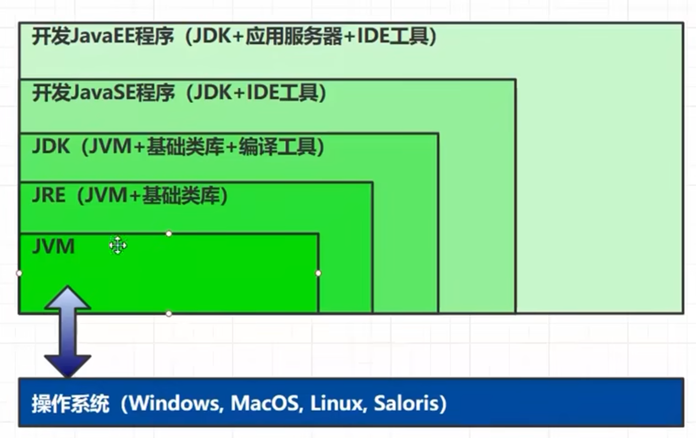
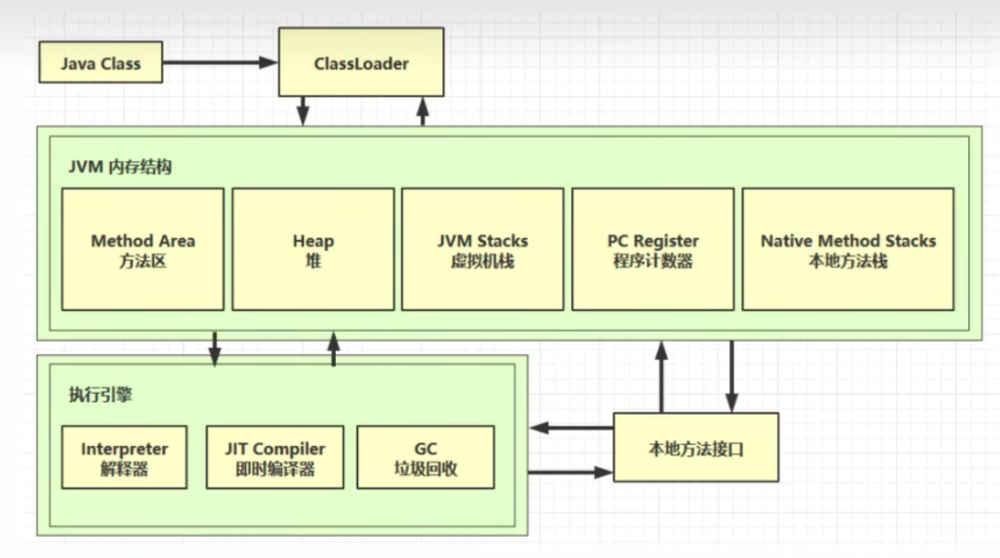
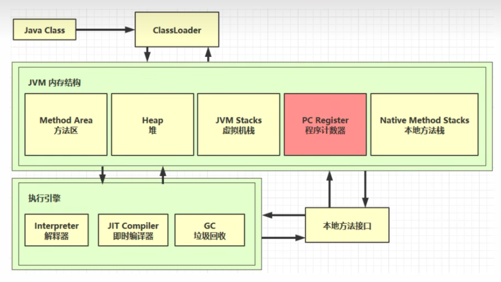
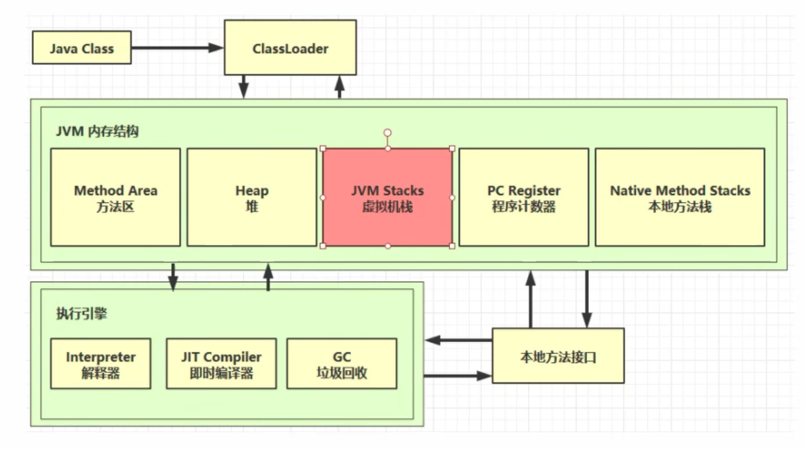
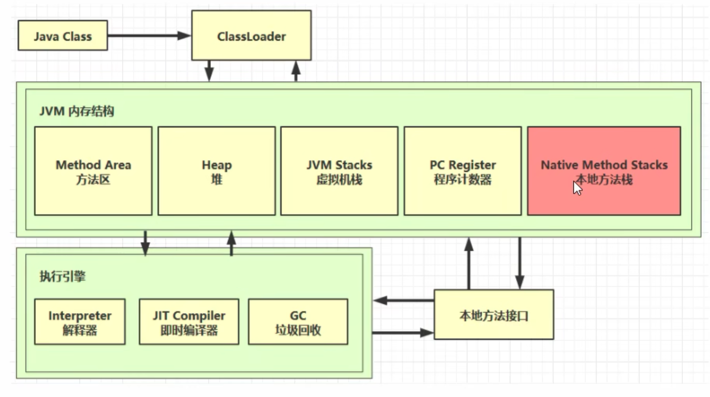
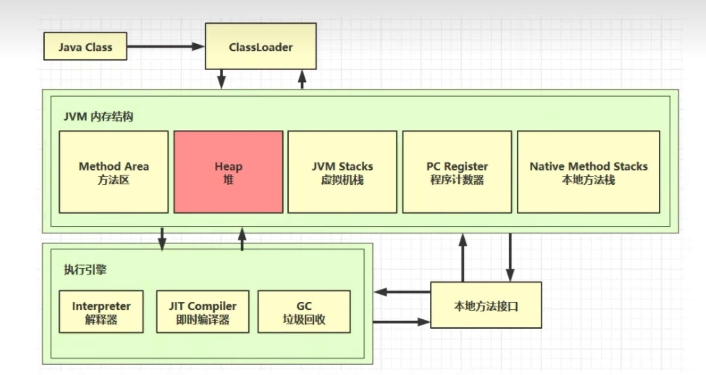
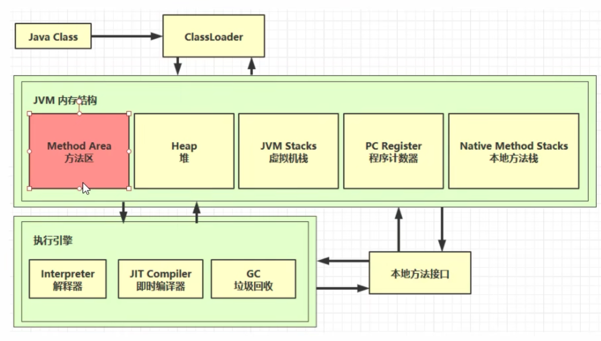

# 1. 什么是 JVM

定义：

Java Virtual Machine  -  java 程序的运行环境 （java  二进制字节码）

好处：

*   一次编译到处运行
*   自动内存管理，垃圾自动回收机制
*   数组下标越界检查
*   多态
*   ...

>   jvm jre jdk 



# 2. 学习JVM有什么作用？

*   面试
*   理解底层
*   高级程序员必备技能

# 3. 常见的JVM

​	JVM 是一套规范，遵从该规范可以自定义 JVM。

​	JVM组成：




# 内存结构

1.   程序计数器
2.   虚拟机栈
3.   本地方法栈
4.   堆

	5. 方法区


## 1. 程序计数器

 

### 1.1. 定义

Program Counter Register 程序计数器(寄存器)

*   作用：记住下一条jvm指令的执行地址
*   特点
    *   是线程私有的
    *   不会存在内存溢出

### 1.2. 作用

记住下一条jvm指令的执行地址。（寄存器实现）


## 2. 虚拟机栈



### 2.1. 定义

Java Virtual Machine Stacks (Java 虚拟机栈)

*   每个线程运行时所需要的内存，称为虚拟机栈
*   每个栈由多个栈帧(Frame) 组成，对应着每次方法调用时所占用的内存
*   每个线程只能有一个活动栈帧， 对应着当前正在执行的那个方法


JVM运行时指定栈(Stacks)大小命令

```shell
-Xss size  # 1m  1024k  1045234
```

[官方文档](https://docs.oracle.com/en/java/javase/11/tools/java.html)


问题辨析

1.   垃圾回收是否涉及栈内存? 

​			不会也不需要回收。

2.   栈内存分配越大越好吗?

​			不是，栈的大小不会影响程序运行速率。

3.   方法内的局部变量是否线程安全?

     *   如果方法内局部变量没有逃离方法的作用访问，它是线程安全的

     *   如果是局部变量引用了对象，并逃离方法的作用方法,需要考虑线程安全


### 2.2. 栈内存溢出

1.   栈针过多导致栈内存溢出

     ​	典型例子，递归方法。

2.   栈帧过大导致栈内存溢出

     ​	一般不会出现

### 2.3. 线程运行诊断

​	案例1:  cpu 占用过多

​		定位

*   用top定位哪个进程对cpu的占用过高
*   psH -eo pid,tid,%cpu | grep进程id (用ps命令进- 步定位是哪个线程引起的cpu占用过高)
*   jstack 进程id
*   可以根据线程id找到有问题的线程，进一步定位到问题代码的源码行号


​	案例2:  程序运行很长时间没有结果

​		线程死锁


##  3. 本地方法栈



```java
// 关键字 natvie 声明的方法表示调用本地方法（C、C++）

native
```


## 4. 堆



### 4.1. 定义

Heap堆

*   通过pew关键字，创建对象都会使用堆内存
*   特点
    *   它是<u>线程共享</u>的，堆中对象都需要考虑线程安全的问题
    *   有垃圾回收机制

### 4.2. 堆内存溢出

jvm 修改堆内存大小

```jvm
-Xmx8m
```


堆内存溢出异常：

```java
// java.lang.OutOfMemoryError: Java heap space
```


### 4.3. 堆内存诊断

1. jps工具
  查看当前系统中有哪些java 进程
2. jmap工具
  查看堆内存占用情况     -help  进程id
3. jconsole工具
  图形界面的，多功能的监测工具，可以连续监测


案例

*   垃圾回收后，内存占用仍然很高

​	

jvisualvm


## 5. 方法区



### 5.3. 内存溢出

*   1.8以前会导致永久代内存溢出

```jvm
演示永久代内存溢出java.lang.OutOfMemoryError: PermGen space

-XX:MaxPermSize=8m
```

*   1.8之后会导致元空间内存溢出

```jvm
演示元空间内存溢出java.lang.OutOfMemoryError: Metaspace

-XX:MaxMetaspaceSize=8m
```

### 5.4. 组成


[官方文档](https://docs.oracle.com/en/java/javase/11/tools/java.html)

### 5.5. 运行时常量池

*   常量池，就是一张表，虚拟机指令根据这张常量表找到要执行的类名、方法名、参数类型、字面量等信息
*   运行时常量池，常量池是*.class文件中的，当该类被加载，它的常量池信息就会放入运行时常量池，并
    把里面的符号地址变为真实地址

