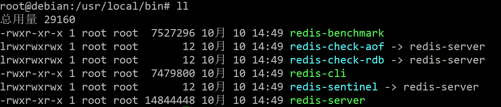
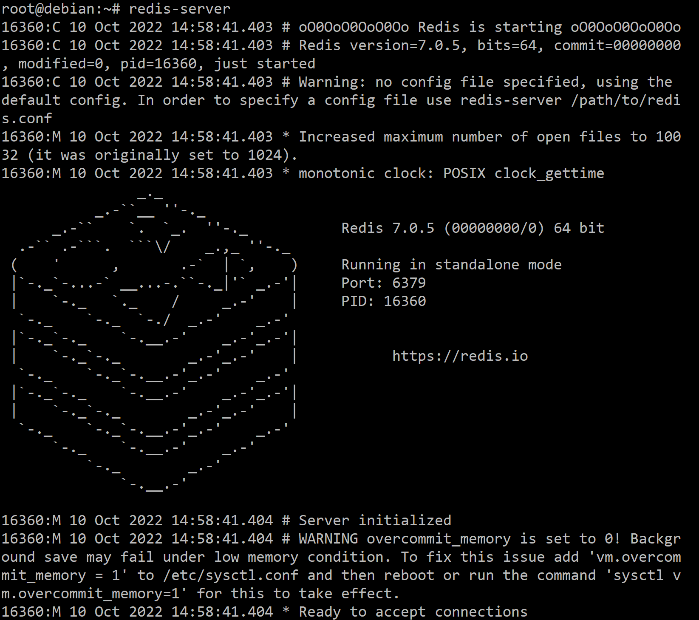
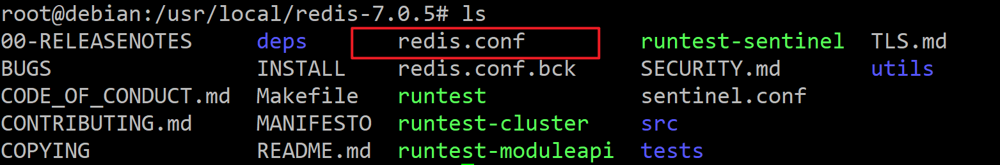
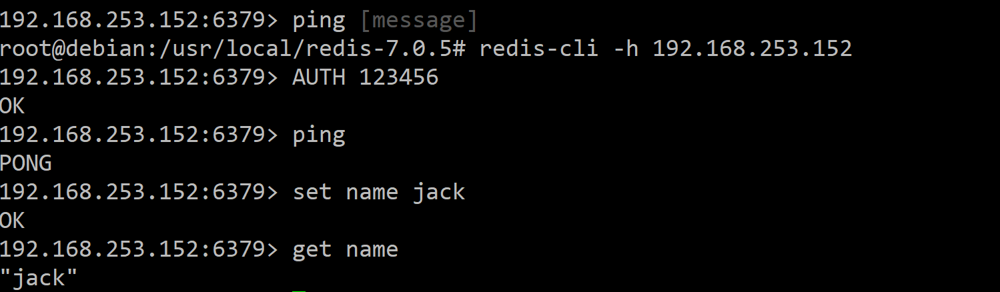

NoSQL   --->   非关系型数据库

NoSQL 查询语句不统一

Redis是一个基于内存的键值型NoSQL数据库。

特征：

*   键值
*   单线程，每个命令具备原子性
*   底延迟，速度快（基于内存、IO多路复用、良好的编码）
*   支持数据持久化
*   支持主从集群、分片集群
*   支持多语言客户端

# Redis安装

1.   在官网下载安装包

     https://redis.io/download/

     redis需要gcc作为依赖

2.   解压安装包

     ```bash
     tar -zxvf redis-7.0.5.tar.gz
     ```

3.   进入redis目录

     ```bash
     cd redis-7.0.5
     ```

4.   运行编译命令

     ```bash
     make && make install
     ```

     没有make命令可以先安装make命令

     在debain上如下：

     ```bash
     apt install make
     ```


如果没有出错标志安装成功。


默认安装路径/usr/local/bin/



[][..]

*   redis-cli：是redis提供的命令行客户端
*   redis-server：是redis服务端启动脚本
*   redis-sentinel：是redis的哨兵启动脚本


# 启动

命令行输入

```bash
redis-server
```

出现下面画面：




这种启动输入前台启动，会阻塞整个会话窗口，窗口关闭或按下`CTRL+C`则Redis停止。不推荐使用。

## 1.1. 指定配置启动

如果要让redis以后台方式启动，则必须修改redis.conf配置文件




在配置前先建立备份redis.conf.bck

```bash
cp redis.conf  redis.conf.bck
```


修改配置

```bash
# 访问地址，默认是127.0.0.1 只能本地访问，修改为0.0.0.0可以在任意IP访问，生产环境不要设置为0.0.0.0
bind 0.0.0.0
# 守护进程，修改为yes后即可后台运行
daemonize yes
# 密码，设置后访问Redis必须输入密码
requirepass 123456
```

其他常见配置

```bash
# 监听端口
port 6379
# 工作目录，默认为当前目录，也就是运行redis-server时命令，日志、持久化会保存在这个目录
dir .
# 数据库数量，设置为1，代表只使用1个库，默认为16个库，编号0~15
databases 1
# 设置redis能够使用的最大内存
maxmemory  512mb
# 日志文件，默认为空，不记录日志，可以指定日志文件名
logfile "redis.log"
```


启动redis:

```bash
# 进入安装目录
cd /usr/local/redis-7-7-7
# 启动
redis-server redis.conf
```


停止服务

```bash
kill -9 [redis 进程号]
```


# Redis客户端

Redis客户端，包括：

*   命令行客户端
*   图形化桌面客户端
*   编程客户端

## 1.1.Redis命令行客户端

Redis安装完成后自带了命令行客户端：redis-cli，使用方式如下：
```bash  
redis-cli [options] [commands]
```

常见的options有：

*   `-h 127.0.0.1`：指定需要连接的redis结点的IP地址，默认是127.0.0.1
*   `-p 6379  `：指定要连接的redis结点的端口，默认为6379
*   `-a 123456`：指定redis的访问密码

其中commands就是Redis的操作命令，例如：

*   `ping`：与redis服务端做心跳测试，服务端正常会返回`pong`



## 1.2. 图形化桌面客户端

Github上有人编写了Redis的图形化桌面客户端，地址：

https://github.com/lework/RedisDesktopManager-Windows


# Redis数据结构

Redis是一个key-value的数据库，key一般是String类型，不过value的类型多种多样：

>   基本类型

String								

Hash

List

Set

SortedSet

>   特殊类型

GEO

BitMap

HyperLog


其他类型...


# 通用命令

通用命令是不分数据类型的，都可以使用的命令，常见的有：

*   KEYS：查看符合模板的所有key,不建议在生产环境设备上使用
*   DEL：删除一个指定的key
*   EXISTS：判断key是否存在
*   EXPIRE：给一-个key设置有效期，有效期到期时该key会被自动删除
*   TTL：查看一个KEY的剩余有效期

# String类型

String类型的常见命令
String的常见命令有:

*   SET：添加或者修改已经存在的一个String类型的键值对
    公
*   GET：根据key获取String类型的value
*   MSET：批量添加多个String类型的键值对
*   MGET: 根据多个key获取多个String类型的value
*   INCR：让- -个整型的key自增1 
*   INCRBY：让- 个整型的key自增并指定步长，例如: incrby num 2让num值自增2
*   INCRBYFLOAT：让一个浮点类型的数字自增并指定步长
*   SETNX：添加一个String类型的键值对，前提是这个key不存在,否则不执行
*   SETEX：添加一个String类型的键值对，并且指定有效期


