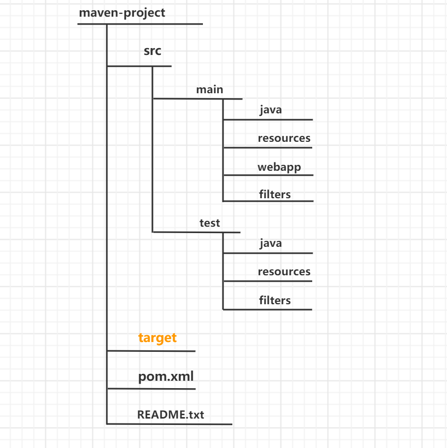

# Maven

## 1.Maven简介

### 1.1.简介

Maven项目对象模型(POM)，可以通过一小段描述信息来管理项目的构建，报告和文档软件。

Maven 除了以程序构建能力为特色之外，还提供高级项目管理工具。由于 Maven 的缺省构建规则有较高的可重用性，所以常常用两三行 Maven 构建脚本就可以构建简单的项目。由于 Maven 的面向项目的方法，许多 Apache Jakarta 项目发文时使用 Maven，而且公司项目采用 Maven 的比例在持续增长。

### 1.2.项目构建工具

**Maven**

**Gradle**

### 1.3.Maven四大特性

#### 1.3.1.依赖管理系统

**groupld**

​		定义当前Maven项目隶属的实际项目-公司名称。（jar包所在的仓库路径）由于Maven中模块的概念，因此一个实际的项目往往会被划分为很多模块。

**artfactld**

​		该元素定义实际项目中的一个Maven模块-项目名，推荐的做法是使用实际项目名称作为artfactld的前缀。

**version**

​		该元素定义Maven项目当前所处的版本。

#### 1.3.2.多模块构建

#### 1.3.3.一致的项目结构

#### 1.3.4.一致的构建模型和插件机制

## 2.Maven安装

### 2.1.Maven配置

下载

配置maven环境变量

终端查看maven版本

```SHELl
$ mvn -v
```

### 2.2.创建一个文件夹为项目根目录

目录结构

 

[官方解释](https://maven.apache.org/guides/introduction/introduction-to-the-standard-directory-layout.html)

```xml
<?xml version="1.0" encoding="UTF-8"?>
<project xmlns="http://maven.apache.org/POM/4.0.0"
         xmlns:xsi="http://www.w3.org/2001/XMLSchema-instance"
         xsi:schemaLocation="http://maven.apache.org/POM/4.0.0 https://maven.apache.org/xsd/maven-4.0.0.xsd">
    <modelVersion>4.0.0</modelVersion>

    <groupId>com.example</groupId>
    <artifactId>web</artifactId>
    <version>1.0-SNAPSHOT</version>
    <name>web</name>
    <packaging>war</packaging>

    <properties>
        <maven.compiler.target>1.8</maven.compiler.target>
        <maven.compiler.source>1.8</maven.compiler.source>
        <junit.version>5.7.1</junit.version>
    </properties>

    <dependencies>
        <dependency>
            <groupId>javax.servlet</groupId>
            <artifactId>javax.servlet-api</artifactId>
            <version>4.0.1</version>
            <scope>provided</scope>
        </dependency>
        <dependency>
            <groupId>org.junit.jupiter</groupId>
            <artifactId>junit-jupiter-api</artifactId>
            <version>${junit.version}</version>
            <scope>test</scope>
        </dependency>
        <dependency>
            <groupId>org.junit.jupiter</groupId>
            <artifactId>junit-jupiter-engine</artifactId>
            <version>${junit.version}</version>
            <scope>test</scope>
        </dependency>
    </dependencies>

    <build>
        <plugins>
            <plugin>
                <groupId>org.apache.maven.plugins</groupId>
                <artifactId>maven-war-plugin</artifactId>
                <version>3.3.1</version>
            </plugin>
        </plugins>
    </build>
</project>
```

### 2.3.编译

编译

根目录下执行

```shell
$ mvn compile
```

执行main方法

```shell
$ mvn exec:java -Dexec.mainClass="com.xxx.demo.Test"
```

## 3.Maven命令

### 3.1.常用命令

| 命令                   | 描述                                                         |
| ---------------------- | ------------------------------------------------------------ |
| mvn –version           | 显示版本信息                                                 |
| mvn clean              | 清理项目生产的临时文件,一般是模块下的target目录              |
| mvn compile            | 编译源代码，一般编译模块下的src/main/java目录                |
| mvn package            | 项目打包工具,会在模块下的target目录生成jar或war等文件        |
| mvn test               | 测试命令,或执行src/test/java/下junit的测试用例.              |
| mvn install            | 将打包的jar/war文件复制到你的本地仓库中,供其他模块使用       |
| mvn deploy             | 将打包的文件发布到远程参考,提供其他人员进行下载依赖          |
| mvn site               | 生成项目相关信息的网站                                       |
| mvn eclipse:eclipse    | 将项目转化为Eclipse项目                                      |
| mvn dependency:tree    | 打印出项目的整个依赖树                                       |
| mvn archetype:generate | 创建Maven的普通java项目                                      |
| mvn tomcat:run         | 在tomcat容器中运行web应用                                    |
| mvn jetty:run          | 调用 Jetty 插件的 Run 目标在 Jetty Servlet 容器中启动 web 应用 |

> 注意：运行maven命令的时候，首先需要定位到maven项目的目录，也就是项目的

### 3.2.命令参数

#### 3.2.1.  -D传入属性参数

比如：

```bash
$ mvn exec:java -Dexec.mainClass="com.xxx.demo.Test"
```

#### 3.2.2.  -P 使用指定的Profile配置

## 4.
